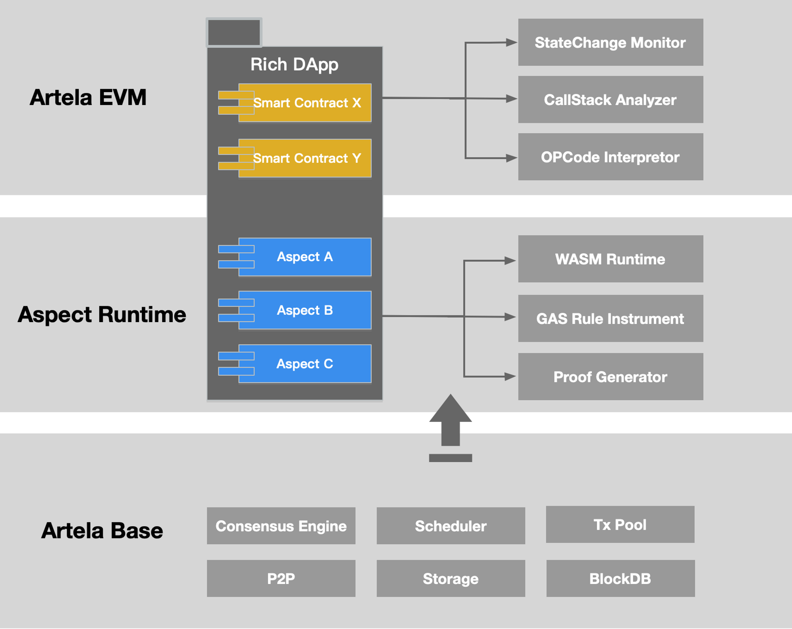
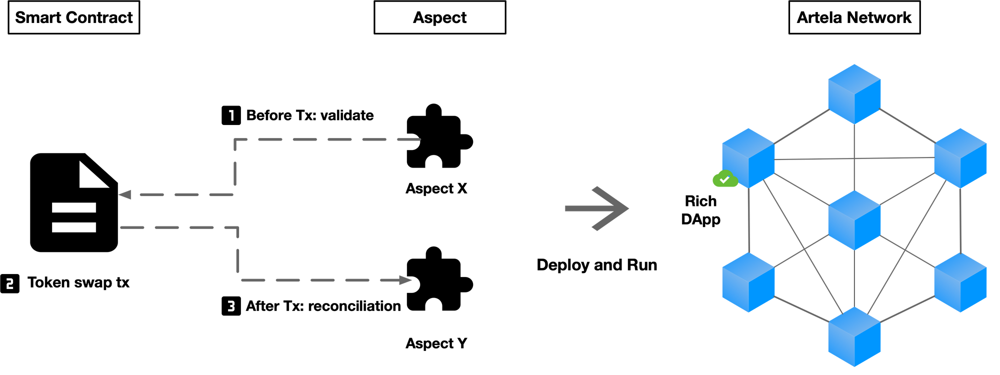

# Rich dApp

## 1. Introduction

At Artela Network, Rich dApp is a way to build dApps through Smart Contract and Aspect, which has more powerful functionality and extensibility compared to Lite dApp.

Rich dApp has the ability for deep customization which is comparable with those of App Chains, it allows developers to implement various customizations such as adding transaction processing flows, modifying transaction data structures and verification methods, transaction interception and more.

Additionally, Rich dApp can be built in a modular way, such as using Smart Contract to implement business logic, using Aspect to implement additional features, or using Smart Contract to implement core protocols and using Aspect for peripheral protocols. By utilizing modular design principles and the combination of Smart Contract and Aspect, Rich dApp has stronger extensibility and lower maintenance costs.

The principle of Rich dApp in Artela Network is shown in the following figure:

---

## 2. Use Case

Developers can build more powerful dApps by combining Smart Contracts and Aspects. The use of Aspects is not mandatory, but rather a decision made by developers based on their specific needs.

The security of funds in DeFi is crucial. DeFi protocols built on Rich dApp architecture can incorporate the protocol with security aspect to ensure fund security in a non-intrusive way.

Developers can build Aspect X with rick control algorithm to identify whether an account is on a blacklist maintained by the project owner or the community for risk control algorithms before executing a DeFi transaction. Additionally, developers can use Aspect Y to analyze the fund flow after the transaction is completed and determine whether it conforms to the abnormal fund flow rules defined by the project party during the lightning loan process. If the transaction is identified as suspicious, Aspect Y can revert the transaction. Fund security rules are defined and maintained by developers or the community and can be continuously adjusted in case of misjudgments or other security risks.

In this case, Aspect uses a non-intrusive way to incorporate with the core DeFi protocol, it acts as an external security protocol for the smart contract. In the meanwhile, the Aspect can also be  governed by the community. Moreover, because combination of Aspect and Smart Contract is non-intrusive, the interfaces and contract code of the protocol are not required to be modified, so it remains composability with other protocols.

By using smart contracts and Aspects, it is possible to build DeFi protocols with fund risk control abilities. This development pattern is called Rich dApp on the Artela Network, as shown below:

