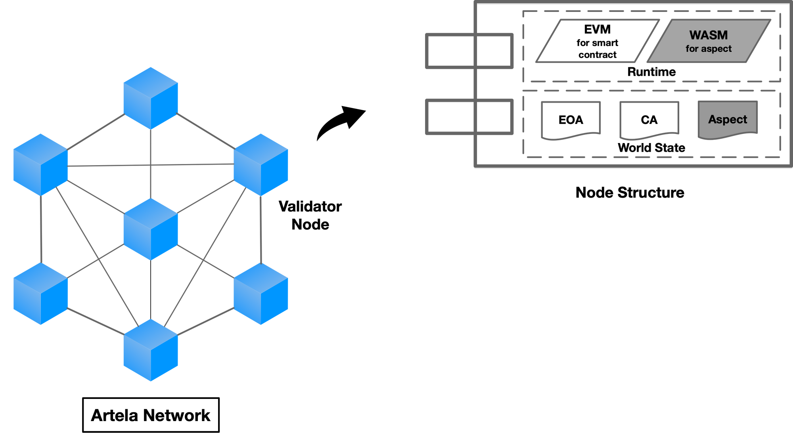
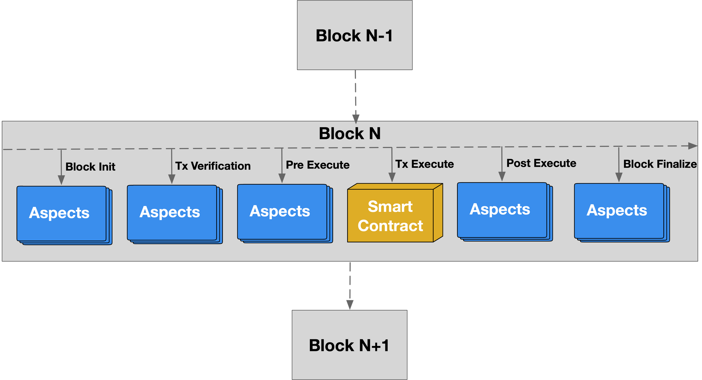
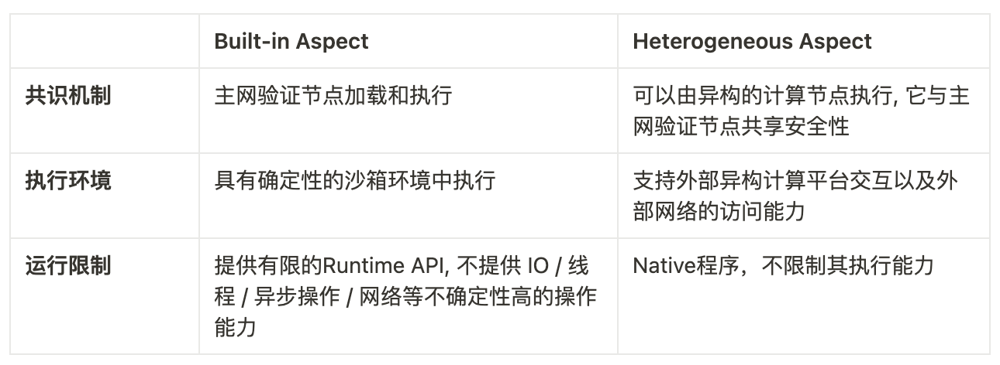

# Aspect Programming

> Aspect is an extensible component of blockchain mainnets, and Aspect Programming supports developers to develop and deploy the ability to enhance decentralized applications with Aspect.

Smart Contract, as an important part of blockchain technology, supports developers to build dApp with custom logic. However, with the continuous development of blockchain technology, Smart Contract has exposed many shortcomings in terms of upgradeability and extensibility. 

At the same time, Smart Contract is limited by the support of virtual machine execution environment instructions, making it difficult to handle non-functional requirements such as security checks and data verification.

Aspect Programming reduces code redundancy, enhances software modularity, and improves software security by horizontally separating different functional points of software. Aspect is a supplement to Smart Contract technology.

---

## 1. Aspect Definition

Aspect is a Native Extension on the Artela Network with security isolation and composability.

Security isolation is ensured by the sandbox environment of the extension layer, that is, all validation nodes have built-in WASM virtual machines, and the Aspect deployed by developers can only run in the WASM virtual machine environment.

Aspect can not only be combined with Smart Contracts to build decentralized applications, but also can be combined with other Aspects.

The operation principle of Aspect is shown in the figure:

The composability of Aspect can help developers build deeply customized decentralized applications, which is realized by arranging execution, that is, developers can customize the execution position of Aspect.

Artela Network supports the insertion of Aspect in the following ranges: Block Init, Tx Verification, Pre Execute, Post Execute, and Block Finalize.

The range of Aspect that can be orchestrated is shown in the figure:

The goal of Aspect is to help developers achieve richer functionality with Smart Contract, so there is a clear boundary between Aspect and Smart Contract, that is, Aspect cannot write/modify/delete Smart Contract's state data, create new Smart Contracts, or transfer/destroy/hold native tokens.

In order to further enhance the extension capability of Aspect, support off-chain computing, Artela Network plans to support Heterogeneous Aspects in the future, and the difference between the currently supported Built-in Aspects and Heterogeneous Aspects is shown in the table:

---

## 2. Aspect Abilities

As a specific technical implementation of blockchain scalability under the Chain-Native Pattern, Aspect is not a replacement for Smart Contract, but a supplement to Smart Contract technology.

Aspect brings application extension capabilities beyond Smart Contract to developers, and from a technical perspective, the specific capabilities of Aspect include but are not limited to:

- Custom transaction signature verification: Aspect supports developers to implement custom logic to verify the signature of all transactions.
- Custom account verification: Aspect supports developers to implement custom logic to verify accounts.
- Transaction insertion: Aspect supports developers to implement custom logic and insert execution before and after Smart Contract transactions.
- Transaction rollback: Aspect supports developers to implement transaction rollback for Smart Contract.
- Custom transaction fee strategy: Aspect supports developers to implement custom transaction fee payment logic.
- Asynchronous transaction: Aspect supports developers to implement asynchronous transaction transactions.
- Contract invocation (read-only): Aspect supports developers to call the read-only interface of Smart Contract to read the state of the target Smart Contract.
- Transaction pool interception: Aspect supports developers to implement custom logic to intercept transactions that do not meet expected criteria before entering the transaction pool.
- Pre- and post-execution read-write set acquisition: Aspect supports developers to obtain the pre- and post-execution read-write set data of Smart Contract transactions.
- Call stack acquisition during transaction execution: Aspect supports developers to obtain call stack information during Smart Contract transaction execution.
- World state reading: Aspect supports developers to read the WorldState data of the blockchain network.
- Event output: Aspect supports developers to output blockchain standard events (Event).
- Upgrades: Aspect supports developers to implement multi-versioning and version management control.

---

## 3. Aspect Benefits

Under the Chain-Native Pattern, by abstracting and encapsulating non-functional requirements of the blockchain system, the various modules of the system can be separated and independently maintained, thereby improving the maintainability and scalability of the system.

The Artela team combines the idea of aspect-oriented programming with the blockchain system, bringing the following advantages:

- Enhance the functionality of decentralized applications: Developers can easily implement the non-functional requirements of decentralized applications through Aspect, such as security checks/external data synchronization/reliable timing tasks, etc., supplementing the ability that Smart Contract alone cannot achieve, thereby enhancing the functionality of decentralized applications.
- Enhance the management ability of the transaction lifecycle: Artela provides rich extension points at the blockchain base layer, and Aspect can add custom processing logic to transactions before/after packaging, before/after execution, giving Aspect management control over the entire lifecycle of transactions.
- Reduce the code complexity of decentralized applications: For public processing logic such as risk transaction interception, developers can choose to host it in public Aspect, which can not only reduce the code complexity of decentralized applications, but also reduce bytecode size and save deployment costs.
- Increase the maintainability and scalability of decentralized applications: Developers can use Aspect to separate the functional and non-functional requirements of decentralized applications for separate management and logical decoupling, making it easier to maintain and expand decentralized applications.
- Improve the security of decentralized applications: Developers can implement more accurate and efficient security check strategies through Aspect: identifying risk transactions, pre- and post-execution verification of state data, and other functions, thereby improving the overall security of decentralized applications.
- Support customization while maintaining the composability of decentralized applications: Unlike AppChain, Aspect does not need to maintain the composability with other decentralized applications through cross-chain, and the in-chain composability has higher efficiency and accuracy, while developers can still deeply customize their decentralized applications.
