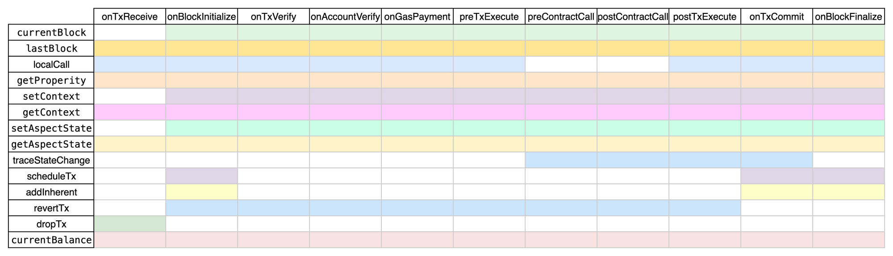
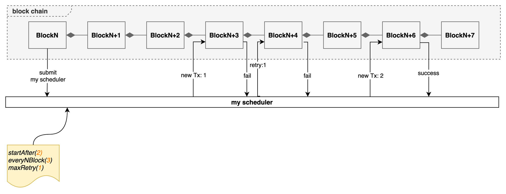
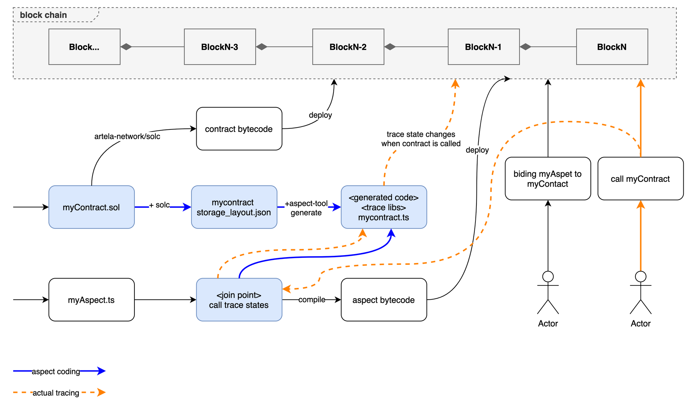

# Aspect Doc

Welcome to Aspect Doc where you can learn about Aspects and how they can assist you in various tasks on Artela network.

## High-level Overview

### What Is Aspect

Aspect is a native extension on Artela that provides security, composability, and enhanced functionality. Aspects are designed to manage the entire lifecycle of a transaction and interact with the base processing context. They can customize the transaction validation process, making them a powerful tool to create high-quality aspect-oriented code.

Aspects run in a secure sandbox environment (WASM runtime) that operates independently from the base layer. This isolation ensures that Aspects don't impact the security and availability of the base layer. Furthermore, Aspects are securely isolated from each other, so one Aspect's execution doesn't affect others.

Another essential feature of Aspects is composability. You can bind smart contracts with Aspects to add additional functionality. Transactions involving smart contracts pass through Aspects, offering additional processing capabilities. Aspects can be combined with multiple smart contracts seamlessly, making them flexible and powerful tools for developers.


In summary, Aspect is a valuable addition to the Artela Network, allowing you to create high-quality aspect-oriented code with lifecycle control, security isolation, and composability.

### How to Develop an Aspect

Aspects are designed to run on the WebAssembly (WASM) runtime, and you can use any language supported by WASM to develop an Aspect. 

Currently, [AssemblyScript](https://www.assemblyscript.org/getting-started.html) is supported for developing Aspects.

To implement the desired logic within an Aspect, define entry points in the following file:

```bash
${your-poject}/assembly/aspect/aspect.ts
```

Ensure that your code and package references adhere to AssemblyScript development guidelines for Aspect implementation.

<!-- 
- meaning of every join point
    
    [2.1 Join Points](https://www.notion.so/2-1-Join-Points-19abe60bffe748059fc05589802b5492?pvs=21) 
    
- available input parameter contents and supported functionalities
    
    [2.2.1 Input Ctx](https://www.notion.so/2-2-1-Input-Ctx-3139b0c5cac94f86a12c9249860d71b9?pvs=21) 
    
- definition of output parameters
    
    [2.2.2 AspOutput](https://www.notion.so/2-2-2-AspOutput-62b2034f58814875ac68c4aa7509496a?pvs=21) 
     -->

Compile and verify your code using npm commands:

```bash
# Build a release version
npm run asbuild:release
# Build a debug version
npm run asbuild:debug
```

## Core Concepts

### Join Points

Join Points are specific positions in the transaction processing lifecycle where an Aspect can be applied. Artela defines a set of Join Points for specifying when and where Aspects should execute during transaction processing. These include:


- `onTxReceive`
    
    Occurs when receiving transaction data from a broadcast.
    
- `onBlockInitialize`
    
    Occurs at the beginning of a new block, allowing for initialization tasks and state setup for the block.

- `preTxExecute`
    
    Occurs before transaction execution. 
    
- `preContractCall`
    
    Occurs before a contract call, allowing state change tracing of current transaction that cached in EVM.
    
- `postContractCall`
    
    Occurs after a contract call, enabling state change tracking within both the transaction and the contract call.
    
- `postTxExecute`
    
    Occurs after transaction execution, allowing querying of post-transaction data to  trigger an inherent transaction or revert the current transaction.
    
- `postTxCommit`
  
    Occurs after the successful execution and commitment of a transaction.
    
- `onBlockFinalize`
  
    Occurs after finalizing a block.

Here's an overview of what each of these functions, it defines how to customize the behavior of your Aspects at specific join points within the transaction processing lifecycle on Artela.

```tsx

export interface AspectBase {
  isOwner(sender: string): bool;
}

export interface IAspectBlock extends AspectBase {
  onBlockInitialize(ctx: OnBlockInitializeCtx): void;

  onBlockFinalize(ctx: OnBlockFinalizeCtx): void;
}

export interface IAspectTransaction extends AspectBase {
  onContractBinding(contractAddr: string): bool;

  filterTx(ctx: FilterTxCtx): bool;

  preTxExecute(ctx: PreTxExecuteCtx): void;

  preContractCall(ctx: PreContractCallCtx): void;

  postContractCall(ctx: PostContractCallCtx): void;

  postTxExecute(ctx: PostTxExecuteCtx): void;

  postTxCommit(ctx: PostTxCommitCtx): void;
}

export interface IAspectOperation {
  operation(ctx: OperationCtx, data: Uint8Array): Uint8Array;
}

```

Additionally, two methods, `isOwner` and `onContractBinding`, control **aspect upgrades** and **contract bindings**.

- `isOwner`
- `onContractBinding`

See “Authentication Management”

### Input & Output

#### Input Context(ctx)

- **blockHeight**: Current block height.
- **tx**: Current transaction.
- **methods**(`Hostapis`):
    
    Provides entry points for various functionalities along the call chain. Different join points are associated with different functionalities.  Refer to the diagram below for the available functionalities and the corresponding join point scopes.




- `currentBlock`
  
  Get the block header of current ethereum block.
  
  ```tsx
  let block = ctx.currentBlock();
  if (block) {
  	let header = block.header;
  	...
  }
  ```
  
- `lastBlock`
  
  Get the last ethereum block. Call lastBlock
  
  ```tsx
  let block = ctx.lastBlock();
  if (block) {
  	let header = block.header;
  	...
  }
  ```
  
- `localCall`
  
  Not supported at the moment.
  
- `getProperity`
  
  To retrieve the properties of an Aspect, pass the key associated with the Aspect, which is deployed together with it.
  
  e.g. Properties “*TargetAddr*”, “*ScheduleTo*”, “*Broker*”, “*binding*” and “*owner*” are deployed with Aspect like
  
  ```tsx
  let instance = aspect.deploy({
  	data: '0x' + aspectCode,
  	properties: [{ 'key': 'TargetAddr', 'value': targetAccount }, { 'key': 'ScheduleTo', 'value': brokerAddress }, { 'key': 'Broker', 'value': brokerDeployer }, { 'key': 'binding', 'value': brokerAddress }, { 'key': 'owner', 'value': AspectDeployer }]
  }).send({ from: AspectDeployer, nonce: nonceValAspectDeployer });
  ```
  
  Get the property of “ScheduleTo”
  
  ```tsx
  let scheduleToAddress = ctx.getProperity("ScheduleTo")
  ```
  
- `setContext`
  
  Store a key-value pair in the temporary space of memory and pass to other join points, the memory is binding to current tx. When the tx is completed, the space will be destroyed.
  
  ```tsx
  // balance = BigInt.fromUint64(100)
  ctx.setContext("balance-key", balance.toString(16))
  ```
  
- `getContext`
  
  Retrieve the key-value pair stored using `setContext`.
  
  ```tsx
  let stored = ctx.getAspectState("balance-key");
  let balance = BigInt.fromString(stored, 16);
  ```
  
- `setAspectState`
  
  Same with a setContext, store a key-value pair in the blockchain state, but not shared with other Aspects.
  
  e.g. Store balance of an account
  
  ```tsx
  // balance of 0xBC0E48f5d2A48350B74c81ECed3A42b35b532ef8 = BigInt.fromUint64(100)
  ctx.setAspectState("0xBC0E48f5d2A48350B74c81ECed3A42b35b532ef8", balance.toString(16))
  ```
  
- `getAspectState`
  
  Retrieve the key-value pair stored using `getAspectState`.
  
  Retrieve the balance corresponding to the stored account as shown below.
  
  ```tsx
  let stored = ctx.getAspectState("0xBC0E48f5d2A48350B74c81ECed3A42b35b532ef8");
  let balance = BigInt.fromString(stored, 16);
  ```
  
- `traceStateChange`
  
  Retrieve the process of changes for a variable that modified the state during transaction execution or after execution.
<!--   
  *This method is not recommended for direct usage. Instead, please refer to [2.3.2 Schedule An AdHoc Transaction](https://www.notion.so/2-3-2-Schedule-An-AdHoc-Transaction-b656e2a21bc54c4d893d08e9154e796c?pvs=21)  of the code generation tool that facilitates its invocation.*
   -->
- `scheduleTx`
  
  Schedule a transaction.
  
  <!-- *This method is not recommended for direct use. Please refer to [2.3 Scheduler](https://www.notion.so/2-3-Scheduler-faa2e2b9820d43508b9547627102a2ca?pvs=21)  to learn about the recommended approach for scheduling a transaction.* -->
  
- `addInherent`
  
  Not supported at the moment.
  
- `revertTx`
  
  This method is used for rolling back or reverting transactions. Once it is called, the WASM will immediately exit, and the remaining aspects will not be executed, also the current transaction will be marked as failed, and any changes it made to the state will not take effect.
  
  Reason for marking the transaction execution as failed can be passed as shown below.
  
  ```tsx
  ctx.revert("incorrect balance, transaction invalidated")
  ```
  
- `dropTx`
  
  Not supported at the moment.
  
  Works only for OnTxReceived. If this method is called, the currently received broadcast transaction will be deleted and will not be inserted into the mempool for on-chain submission.
  
- `currentBalance`
  
  currentBalance returns the balance of native tokens.
  
  If the block has not yet started, an attempt is made to query the balance from the last block. This behavior is intended to occur only at the `onTxReceive` join point.
  
  If a transaction is being processed, the cached balance is returned. This behavior is intended to occur at `preContractCall` and `preContractCall` .
  
  Otherwise, an attempt is made to retrieve the account balance using a current block query.  This intended to occur at other join points except `onTxReceive`, `preContractCall` and `preContractCall`.
  
  Passing the contract account address or EOA address allows for retrieving the balance.c
  
  ```tsx
  let balance = ctx.currentBalance("0xBC0E48f5d2A48350B74c81ECed3A42b35b532ef8");
  ```
    

#### Aspect Output (AspOutput)

To create a return value of AspOutput:

```tsx
let ret = new AspectOutput();
ret.success = false;
ret.message = "balance incorrect, transaction rollback";
return ret;
```

- success
    
Determines if the transaction execution revert or not. Unlike "revert", it continues executing other Aspect logics.

Unlike "revert," it does not immediately exit, but instead continues executing other aspect logics.
    
- message
    
If the transaction rollback is set (success = false), assign the transaction failure reason to the message. If the transaction is successful, keep the message empty.
    

### Scheduler

#### Schedule a Periodic Transaction

The scheduler works like:



To submit a scheduler in Aspect, for instance, we arrange periodic transaction calls to a on-chain contract method

`function transfer(address target,uint256 amount) public onlyOwner`

Scheduler can be set in the following way:

```tsx
import { Opts, PeriodicSchedule, Schedule,ScheduleTx } from "@artela/aspect-libs/scheduler";
import { ethereum } from "@artela/aspect-libs/abi";

...
private scheduleTx(ctx: ScheduleCtx, target: string, amount: u64): bool {
	// prepare the transfer parameters, and encode them to abi input.
	let addr = ethereum.Address.fromHexString(target);
	let num = ethereum.Number.fromU64(amount);
	let payload = ethereum.abiEncode('transfer', [addr, num]);

	debug.log(payload);

	// the scheduled transaction with params. Adjust the gas cap and other options
	// to your values.
	// the broker account is used to pay for the transaction fees associated with each scheduled transaction
	let broker = "0xBC0E48f5d2A48350B74c81ECed3A42b35b532ef8"
	// contract is the address which scheduled transactions calls to
	let contract = "0xA32576Bd17b4e9dDfFaD917068F80A4ff7b7409a";
	let tx = new ScheduleTx(contract).New(
		payload,
		new Opts(0, "200000000", "30000", broker))

	// params:
	// startAfter(3): the scheduled transaction will be trigger at the 3rd block after this method is called.
	// count(1000): total count of schedulex transaction is 1000.
	// everyNBlocks(5): execution at every 5th block since started.
	// maxRetry(2): Transaction confirmation on the blockchain is not guaranteed but rather determined by the gas fee.
	// If a transaction fails to be confirmed on the blockchain, it can be retried up to a maximum of two times.
	var periodicSch: Schedule = PeriodicSchedule
		.new(ctx, "myPeriodicSchedule")
		.startAfter(3)
		.count(1000)
		.everyNBlocks(5)
		.maxRetry(2);

	return periodicSch.submit(tx);
}
```

#### Schedule an AdHoc Transaction

Scheduling an ad-hoc transaction is similar to scheduling a periodic one:

```tsx
// build scheduleTx just as it is in periordic scheduler
tx := new ScheduleTx...

var adhocSch : Schedule = AdHocSchedule
	.new(ctx, "myAdhocSchedule")
	.nextNBlocks(5)
	.maxRetry(2);

adhocSch.submit(tx);
```

### Trace State Change

You can use aspect-tool to trace variables or directly call `getStateChanges` to obtain raw data. 

Two options are available:

#### Option 1: Trace Varibales with `aspect-tool` (Recommended)

**Tracing Progress**




Just as indicated by the blue boxes and blue lines shown above, to trace state changes in your contract, follow these steps:

1. **Identify the Contract:**
- Determine the specific contract you want to trace or a group of contracts with similar storage layouts and variables.
- Obtain the storage layout file for the chosen contract. You can generate this layout file using the following command:
    
```bash
solc --storage-layout myContract.sol -o myContract
```
    
2. **Install aspect-tool:**
- Install the aspect-tool utility, which is used to generate trace state files based on the contract's storage layout. You can install it globally with npm:
    
```bash
# install aspect-tool
npm install -g @artela/aspect-tool
```

3. **Generate Trace State File:**
- Use the aspect-tool to generate the trace state file by running the following command:
```bash
# generate trace file
aspect-tool generate
```

When prompted, provide the path to your storage layout file and the desired output path. For example:
```bash
# input your storage layout file path and output path, e.g.
> myContract/MyContract_storage.json
> myContract.ts
```
    
4. **Import and Use Trace State:**
- Now that you have generated the trace state file, you can import and use it in your Aspect code.
- For instance, if you want to monitor changes in a variable named `balance` of type `uint256` in a contract, you can access the change information like this:
    
```tsx
import {balance} from "./myContract"

...
postTxExecute(ctx: PostTxExecuteCtx): AspectOutput {
    ...
    // ctx: current ctx, If passing ctx is unavailable,
    //   then the tracing functionality at the current join point is not accessible.
    // ctx.tx!.to: contract address to track
    let balance = new myContract.balance(ctx, ctx.tx!.to);
    let originalBalance = balance.before();
    let lastestBalance = balance.lastest();
    let diff = balance.diff();
    let changes = balance.changes();
}
```

In the above code, `balance` is a trace object generated from the trace state file. You can access various properties of this trace object to monitor and analyze changes.

`State.account` in `changes` object refers to the account address that triggered the change in value.

`State.change` in `changes` object refers to the updated value after the change.


**Tracing a Mapping Variable**

If your contract has a mapping variable like `mapping(string => uint256) public accounts`;, you can trace changes in a specific key value like this:

```tsx
let accounts = new myContract.accounts(ctx, ctx.tx!.to);
let diff = balance.diff("acct1");
```

**Tracing a Complex Structure:**

If your contract involves more complex structures, such as a mapping with a user-defined struct like:

```tsx
mapping(address => Person) public persons;
struct Person {
	string id;
	uint256 balance;
}
```

You can trace changes as follows:

```tsx
let persons = new myContract.persons(ctx, ctx.tx!.to);
let tom_address = ethereum.Address.fromHexString('0xA32576Bd17b4e9dDfFaD917068F80A4ff7b7409a');
let tom_balance_latest = account.person(tom_address).balance().latest();
...
```


#### Option 2: Trace Variables by Directly Calling the Host Function  `getStateChanges`.

To trace variables, use the following command:

```go
let changes = ctx.getStateChanges({cotract address}, "{variable}", "{key}")
```

1. **Input Params:**
    - **Contract Address**: Specify the contract you want to trace. Use `tx.to!` to refer to the currently invoked contract in the transaction.
    - **Variable**: Define the variable you want to trace using the format `contract_name.vairable_name` , e.g. `HoneyPot.balance`.
    - **Key**:
        - For Primitive Variables like strings, uint256, bool, etc., use an empty uint8array: `new uint8array()`
        - For Complex Type
            - **Simple Map**, Use the uint8array of ABI-encoded map key, e.g. map key = “abc”, `uint8array(abiEncode(”abc”))`
            - **Nested Map**, Use the union of encoded key, e.g. `map[”abc”][123]`, `concat(uint8array(abiEncode(”abc”)), uint8array(abiEncode(”123”))`)
            - **User Defined Structure**, Use the uint8array of encoded filed name. e.g. `person.Name`, `uint8array(abiEncode(”Name”)`
            - **Mixed of Map and Structure**, Concat the ABI-encoded map keys and structure field names in order.
2. **Output:**
    
    The return value is a list of key-value pairs in the format of "address:change". Here, the "address" corresponds to the entity that made the changes, while the "value" represents an ABI-encoded value of your variable type.
    
    e.g. read returns for `balance: uint256`.
    
```go
let account = changes.all[0].account; // the account made the change
let valueHex = utils.uint8ArrayToHex(changes.all[0].value); // changed value, with a format of abi encode
let value = BigInt.fromString(valueHex, 16);
```


### Aspect Maintenance

#### Authentication Management

- **isOwner**
    
    The `isOwner` function is a key part of our authentication management system. It is primarily designed to control permissions for critical actions, such as upgrading the Aspect. This function acts as a join point triggered during the upgrade deployment process, allowing us to perform permission checks.

    The return value of the `isOwner` function has the following implications:
    
    - **True**: Permission check passed, allowing the upgrade.
    - **False**: Permission check failed, denying the upgrade.
    
    ```tsx
    isOwner(ctx: StateCtx, sender: string): bool {
        // Your permission verification logic here
    }
    ```
    
    **Example:**
    
    > One approach is to include administrator account and related information in the deployed property, such as deploying with a property of `owner`(Deploy details see [here](https://docs.artela.network/develop/web3js-guide).
    > 
    
    ```tsx
    instance = aspect.deploy({
    		data: '0x' + aspectCode,
    		properties: [{ 'key': 'owner', 'value': accounts[0] + "," + account[1] }] // <-- properity of aspect, k-v pairs
    }).send({ from: accounts[0], nonce: nonceVal });
    ```
    
    > The logic for performing permission checks can be implemented as follows:
    > 
    
    ```tsx
    isOwner(ctx: StateCtx, sender: string): bool {
    		let value = ctx.getProperty("owner");
        if (value.includes(sender)) {
    		    return true;
        }
        return false;
    }
    ```
    
- **onContractBinding**
    
    Similar to upgrade permission checks, the onContractBinding function(join point) is called during contract binding. It allows us to determine which contracts can be bound to this aspect.
    
    ```tsx
    onContractBinding(ctx: StateCtx, contractAddr: string): bool {
    
    }
    ```
    

## 3.2 Upgrade

To enhance a specific aspect, it is crucial to ensure that you possess the necessary permission for that aspect. Upgrade an Aspect using `@artela/web3.js` refers to [here](https://docs.artela.network/develop/web3js-guide).