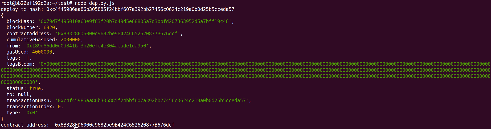

# Sending Ethereum Transactions to Artela Testnet

## 1. Create and top up your account

Skip this if you have already got an account of Artela Testnet.

To create and top up your account, refers to [Create Account of Artela Testnet]()

## 2. Deploy contract with your account

Write and compile your contract first, then run the script to deploy your contract to Artela Testnet.

Requires: `"@artela/web3": "^1.9.15"`

```jsx
const Web3 = require('@artela/web3');
const web3 = new Web3('http://172.16.10.2:8545');
const bytecode = fs.readFileSync("/root/test/contract/1_Storage.bin", "utf-8") // change the bin file to your own
const abidata = fs.readFileSync("/root/test/contract/1_Storage.abi.json", "utf-8") // change the abi json to your own
var abi = JSON.parse(abidata);

async function f() {
    // load local account from private key
    let privateFile = 'privateKey.txt'; // <-- your private key here, if not exist, create your account and send address to admin to charge it first
    let pk = fs.readFileSync(privateFile, 'utf-8');
    let account = web3.atl.accounts.privateKeyToAccount(pk);

    // add account to wallet
    web3.atl.accounts.wallet.add(account.privateKey);

    // retrieve current nonce
    let nonceVal = await web3.atl.getTransactionCount(account.address);

    // instantiate an instance of contract
    let contract = new web3.atl.Contract(abi);
    // deploy contract
    let deploy = contract.deploy({ data: bytecode });

    let tx = {
        from: account.address,
        data: deploy.encodeABI(),
        nonce: nonceVal,
        gas: 4000000
    }

    let signedTx = await web3.atl.accounts.signTransaction(tx, account.privateKey);
    console.log('deploy tx hash: ' + signedTx.transactionHash);

    await web3.atl.sendSignedTransaction(signedTx.rawTransaction)
        .on('receipt', receipt => {
            console.log(receipt);
            console.log("contract address: ", receipt.contractAddress);
        });

}

f().then();
```



## 3. Call contract

Call contract with your account.

```jsx
const fs = require('fs');
const Web3 = require('@artela/web3');
const web3 = new Web3('http://172.16.10.2:8545');

const bytecode = fs.readFileSync("/root/test/contract/1_Storage.bin", "utf-8") // change the bin file to your own
const abidata = fs.readFileSync("/root/test/contract/1_Storage.abi.json", "utf-8") // change the abi json to your own
var abi = JSON.parse(abidata)

async function f() {
    // load local account from private key
    let privateFile = 'privateKey.txt'; // <-- your private key here, if not exist, create your account and send address to admin to charge it first
    let pk = fs.readFileSync(privateFile, 'utf-8');
    let account = web3.atl.accounts.privateKeyToAccount(pk);

    // add account to wallet
    web3.atl.accounts.wallet.add(account.privateKey);

    // retrieve current nonce
    let nonceVal = await web3.atl.getTransactionCount(account.address);

    let contractAddress = "0x259d568dA162902Be9061377ea8DDD3d28b73585";

    // instantiate an instance of contract
    let contract = new web3.atl.Contract(abi, contractAddress);
    // contract method 'store'
    let store = contract.methods.store(100);

    let tx = {
        from: account.address,
        data: store.encodeABI(),
        nonce: nonceVal,
        gas: 4000000
    }
    let signedTx = await web3.atl.accounts.signTransaction(tx, account.privateKey);
    console.log('call contract tx hash: ' + signedTx.transactionHash);
    await web3.atl.sendSignedTransaction(signedTx.rawTransaction)
        .on('receipt', receipt => {
            console.log(receipt);
        });

}

f().then();
```

- contractAddress

  `0x259d568dA162902Be9061377ea8DDD3d28b73585`replace with your account address.


