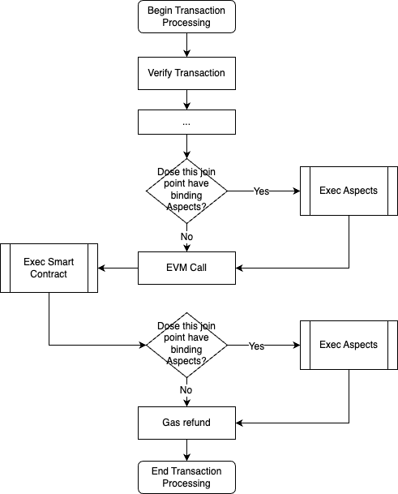

# Aspect Programming

Aspect Programming introduces a powerful paradigm built around the Join Point Model (JPM). This model centers on three pivotal components:

- **JoinPoint**: This denotes where the Aspect will be executed. It represents a specific moment in both transaction and block processing flows, serving as a hook to introduce additional functionalities.

- **Aspect**: This defines the code that will be executed at the join points. An Aspect can tap into the runtime context and execute system calls, which allows it to be an active participant in the transaction's lifecycle.

- **Binding**: This outlines when the Aspect will be executed. Smart contract creators can bind Aspects to certain join points within their smart contracts. When the transaction processing aligns with these points, the associated Aspects are activated.



To illustrate how aspect programming works, consider a smart contract that houses a vault with a substantial deposit. The aim is to safeguard the smart contract during runtime, shielding it from potential threats that might illicitly redirect deposits. An Aspect is architected to oversee and validate any alterations in the vault post the smart contract's execution. If an anomaly in fund movement is detected, this Aspect nullifies the questionable transaction. This Aspect's execution is initiated post the smart contract's execution when a transaction invokes the contract.

## Aspect and Join Points

An Aspect is designed as a class, an extension of the foundational Aspect interfaces. It contains methods indicative of join points, where added logic can be interwoven. Here’s a refined example:

```typescript
export class Aspect implements IAspectTransaction, IAspectBlock, IAspectOperation {
    /**
      * postTxExecute is a join-point invoked post the completion of transaction execution but prior to state commitment.
      *
      * @param ctx context of the designated join-point
      * @return outcome of the Aspect's execution
      */
    postTxExecute(ctx: PostTxExecuteCtx): void {
        if (ethereum.parseMethodSig(ctx.tx.content.data) == ethereum.computeMethodSig('withdraw')) {
            const withdrawAmount = ... // extract withdraw amount from calldata via context.tx.content.data
            const vaultBalance = new VauleState(ctx, ctx.tx.content.to).get('vauleBalance').current(); // state change wrapper class generated by aspect-tool
            if (vaultBalance != withdrawAmount) {
                sys.revert('Error: Balance discrepancy detected.');
            }
        }
    }
}
```

In the above example, the `postTxExecute` method acts as the gateway to the join point, coming into play once the EVM wraps up the transaction.

The `PostTxExecuteCtx` object signifies the runtime context, offering insights into the original transaction and its nuances at the current join point. It's passed on to the join point method, facilitating its interaction with the ongoing transaction.

The illustrated Aspect checks for the invocation of the smart contract's `withdraw` function during the transaction. If it's invoked, the expected withdrawal amount from the transaction parameters is cross-checked with the vault's real-time fund flow. Discrepancies, indicative of coding errors or malicious attacks, prompt the Aspect to activate the `revert()` function from the runtime context's transaction management object, thereby undoing the transaction.

## Deployment and Binding

To assimilate an Aspect into the blockchain, its bytecode is embedded in a deployment transaction. This transaction interacts with an Aspect system contract, lodging the Aspect’s bytecode within the blockchain's global state. This grants the validators access to the bytecode, permitting the execution of the Aspect's logic upon activation.

However, an Aspect only springs into action when bound to a particular smart contract. It requires the smart contract owner to sign a binding transaction using their externally owned account (EOA) - the one should bypass the examination of smart contract's `isOwner(address) returns (bool)` method. This transaction contains both the smart contract address and the Aspect ID, and involves the Aspect system contract upon execution, cementing the bond between the smart contract and the Aspect within the blockchain's global state. This ensures that only the smart contract's legitimate owner can bind Aspects, thwarting any unauthorized binding attempts.

Post the successful execution of both deployment and binding transactions, the Aspect is integrated into the blockchain and bound to the smart contract, amplifying the contract's functionalities and bolstering its security.

## Execution with Aspect

Whenever a smart contract is targeted by a transaction, the Aspect Programming framework runtime is activated. As the transaction commences, the Aspect runtime evaluates each join point, discerning any linked Aspects to the invoked smart contract. If a match is found, the Aspect is triggered post the transaction's execution.

To execute the Aspect, its bytecode is fetched from the blockchain's global state and introduced into a WebAssembly (WASM) runtime environment. A context object, detailing the transaction and its environment, is then constituted. This sets the stage for the Aspect runtime to call upon the Aspect's primary function, prompting the execution of its logic.

Consider, for instance, a `withdraw` function within a smart contract, designed to ensure that fund transfers consistently exceed the stipulated amount in the function parameters. If an Aspect is bound to the `postTxExecute` join point, it gets activated once the transaction wraps up. The Aspect runtime retrieves the bytecode, initiates it within the Wasm environment, creates a context object, and calls the Aspect's primary function. If any discrepancies in fund transfers are detected by the Aspect, it can flag a reversal through the join point context. The Aspect runtime, upon recognizing this flag, reverts the transaction, marking it as unsuccessful and providing a rationale stating that the transaction was overturned due to the linked Aspect.

## Summary

At the heart of the Aspect Programming framework lies the Join Point Model (JPM). This model offers strategic insertion points in the transaction and block processing sequences, paving the way for supplementary logic. Aspects, embodying this added logic, can tap into the runtime context and make system calls, weaving themselves into the transaction's lifecycle. Through the binding of Aspects to designated join points, smart contract proprietors can amplify the functionality and fortify the security of their contracts.

Subsequent sections will dive deeper into the intricate design of the Join Point Model and its implementation.
