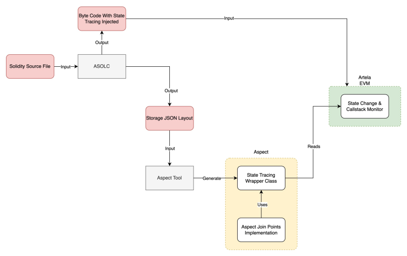

# Aspect

Aspect introduces a dynamic mechanism to implement system-level features on blockchain platforms. Essentially, an Aspect is akin to a system extension, executed in WebAssembly (WASM), which can be bound to any smart contract. This capability provides flexibility to augment the target contract's capabilities or to monitor its activities, initiating specific actions when predefined conditions are met.

## What is Aspect?

The power of Aspect is rooted in WebAssembly (WASM). On Artela, we've developed a dedicated WASM runtime, named [Aspect-Runtime](aspect-runtime), specifically for executing Aspects on the platform. The Aspect Runtime enables interactions between the Aspect and the core blockchain modules through a set of predefined host APIs. These APIs empower the Aspect with various abilities, such as reading the blockchain state, initiating calls to smart contracts, managing its own state, and more.

For those with a background in web development, the concept of "middleware" may be familiar. For newcomers, let's explore this concept further.

### Interceptor in Web Framework

Interceptor is code that can be integrated into a web server to extend its functionalities. Imagine using interceptor to add authentication or logging features to a web server, as shown below:



When an HTTP request is received, the web server's interceptor (or in some framework may be named as middleware) mechanism allows developers to create modules that process this incoming request, either before or after its main handling. For example, an authentication interceptor might validate a user's credentials before the request reaches the core logic. This design pattern decentralizes functionalities like authentication and logging, ensuring a more modular approach.

This interceptor setup also supports a shared context, enabling communication between different middlewares or route handlers. For instance, after authenticating a user, the relevant interceptor can store user data in the shared context. Subsequent interceptor or route handlers can then access this data without reloading it.

### Aspect in Artela

Drawing parallels, Aspect can be seen as a smart contract's interceptor. Imagine developing a decentralized exchange on Artela and integrating Aspects:



Just as interceptor enhance web frameworks, Aspects can also enhance your dApps. They enable modularization and foster inter-module communication via a shared context.

## How Does Aspect Work?

### Extension Layer

In Artela, we provide a built-in extension layer that sits in-between the application layer (which consists of smart contracts) and the base layer (core modules of a blockchain, e.g., consensus, mempool, P2P networking). This extension layer allows developers to develop chain-level extensions to customized transaction processing workflow to a specific smart contract.

<img width="480" height="320" alt="Layers" src="data:image/svg+xml;base64,PHN2ZyB3aWR0aD0iMTMwMiIgaGVpZ2h0PSIxMzE1IiB4bWxucz0iaHR0cDovL3d3dy53My5vcmcvMjAwMC9zdmciIHhtbG5zOnhsaW5rPSJodHRwOi8vd3d3LnczLm9yZy8xOTk5L3hsaW5rIiB4bWw6c3BhY2U9InByZXNlcnZlIiBvdmVyZmxvdz0iaGlkZGVuIj48ZyB0cmFuc2Zvcm09InRyYW5zbGF0ZSgtNDMwIC05MzUpIj48Zz48cGF0aCBkPSJNNDM2LjUgMTU4N0M0MzYuNSAxMjMwLjUgNzI1LjA1MyA5NDEuNSAxMDgxIDk0MS41IDE0MzYuOTUgOTQxLjUgMTcyNS41IDEyMzAuNSAxNzI1LjUgMTU4NyAxNzI1LjUgMTk0My41IDE0MzYuOTUgMjIzMi41IDEwODEgMjIzMi41IDcyNS4wNTMgMjIzMi41IDQzNi41IDE5NDMuNSA0MzYuNSAxNTg3WiIgc3Ryb2tlPSIjQ0VFNkZGIiBzdHJva2Utd2lkdGg9IjkuMTY2NjciIHN0cm9rZS1saW5lY2FwPSJidXR0IiBzdHJva2UtbGluZWpvaW49InJvdW5kIiBzdHJva2UtbWl0ZXJsaW1pdD0iMTAiIHN0cm9rZS1vcGFjaXR5PSIxIiBmaWxsPSIjQ0VFNkZGIiBmaWxsLXJ1bGU9ImV2ZW5vZGQiIGZpbGwtb3BhY2l0eT0iMSIvPjxwYXRoIGQ9Ik01NDAuNSAxNzI1LjVDNTQwLjUgMTQzOS40MiA3ODQuOTUyIDEyMDcuNSAxMDg2LjUgMTIwNy41IDEzODguMDUgMTIwNy41IDE2MzIuNSAxNDM5LjQyIDE2MzIuNSAxNzI1LjUgMTYzMi41IDIwMTEuNTggMTM4OC4wNSAyMjQzLjUgMTA4Ni41IDIyNDMuNSA3ODQuOTUyIDIyNDMuNSA1NDAuNSAyMDExLjU4IDU0MC41IDE3MjUuNVoiIHN0cm9rZT0iI0NFRTZGRiIgc3Ryb2tlLXdpZHRoPSI5LjE2NjY3IiBzdHJva2UtbGluZWNhcD0iYnV0dCIgc3Ryb2tlLWxpbmVqb2luPSJyb3VuZCIgc3Ryb2tlLW1pdGVybGltaXQ9IjEwIiBzdHJva2Utb3BhY2l0eT0iMSIgZmlsbD0iIzZCQjNGRSIgZmlsbC1ydWxlPSJldmVub2RkIiBmaWxsLW9wYWNpdHk9IjEiLz48cGF0aCBkPSJNNzM2IDE5MzIuNUM3MzYgMTc1OC44MSA4ODUuNzYxIDE2MTggMTA3MC41IDE2MTggMTI1NS4yNCAxNjE4IDE0MDUgMTc1OC44MSAxNDA1IDE5MzIuNSAxNDA1IDIxMDYuMTkgMTI1NS4yNCAyMjQ3IDEwNzAuNSAyMjQ3IDg4NS43NjEgMjI0NyA3MzYgMjEwNi4xOSA3MzYgMTkzMi41WiIgZmlsbD0iIzAxNjFDNCIgZmlsbC1ydWxlPSJldmVub2RkIiBmaWxsLW9wYWNpdHk9IjEiLz48dGV4dCBmaWxsPSIjMDAwMDAwIiBmaWxsLW9wYWNpdHk9IjEiIGZvbnQtZmFtaWx5PSJDYW1icmlhLENhbWJyaWFfTVNGb250U2VydmljZSxzYW5zLXNlcmlmIiBmb250LXN0eWxlPSJub3JtYWwiIGZvbnQtdmFyaWFudD0ibm9ybWFsIiBmb250LXdlaWdodD0iNzAwIiBmb250LXN0cmV0Y2g9Im5vcm1hbCIgZm9udC1zaXplPSI1NCIgdGV4dC1hbmNob3I9InN0YXJ0IiBkaXJlY3Rpb249Imx0ciIgd3JpdGluZy1tb2RlPSJsci10YiIgdW5pY29kZS1iaWRpPSJub3JtYWwiIHRleHQtZGVjb3JhdGlvbj0ibm9uZSIgdHJhbnNmb3JtPSJtYXRyaXgoMSAwIDAgMSA4NzguNTQzIDEzMTQpIj5FeHRlbnNpb248L3RleHQ+PHRleHQgZmlsbD0iIzAwMDAwMCIgZmlsbC1vcGFjaXR5PSIxIiBmb250LWZhbWlseT0iQ2FtYnJpYSxDYW1icmlhX01TRm9udFNlcnZpY2Usc2Fucy1zZXJpZiIgZm9udC1zdHlsZT0ibm9ybWFsIiBmb250LXZhcmlhbnQ9Im5vcm1hbCIgZm9udC13ZWlnaHQ9IjcwMCIgZm9udC1zdHJldGNoPSJub3JtYWwiIGZvbnQtc2l6ZT0iNTQiIHRleHQtYW5jaG9yPSJzdGFydCIgZGlyZWN0aW9uPSJsdHIiIHdyaXRpbmctbW9kZT0ibHItdGIiIHVuaWNvZGUtYmlkaT0ibm9ybWFsIiB0ZXh0LWRlY29yYXRpb249Im5vbmUiIHRyYW5zZm9ybT0ibWF0cml4KDEgMCAwIDEgMTE0MS41MSAxMzE0KSI+TGF5ZXI8L3RleHQ+PHRleHQgZmlsbD0iIzAwMDAwMCIgZmlsbC1vcGFjaXR5PSIxIiBmb250LWZhbWlseT0iQ2FtYnJpYSxDYW1icmlhX01TRm9udFNlcnZpY2Usc2Fucy1zZXJpZiIgZm9udC1zdHlsZT0ibm9ybWFsIiBmb250LXZhcmlhbnQ9Im5vcm1hbCIgZm9udC13ZWlnaHQ9IjcwMCIgZm9udC1zdHJldGNoPSJub3JtYWwiIGZvbnQtc2l6ZT0iNTQiIHRleHQtYW5jaG9yPSJzdGFydCIgZGlyZWN0aW9uPSJsdHIiIHdyaXRpbmctbW9kZT0ibHItdGIiIHVuaWNvZGUtYmlkaT0ibm9ybWFsIiB0ZXh0LWRlY29yYXRpb249Im5vbmUiIHRyYW5zZm9ybT0ibWF0cml4KDEgMCAwIDEgODQ4LjMzNSAxMDQxKSI+QXBwbGljYXRpb248L3RleHQ+PHRleHQgZmlsbD0iIzAwMDAwMCIgZmlsbC1vcGFjaXR5PSIxIiBmb250LWZhbWlseT0iQ2FtYnJpYSxDYW1icmlhX01TRm9udFNlcnZpY2Usc2Fucy1zZXJpZiIgZm9udC1zdHlsZT0ibm9ybWFsIiBmb250LXZhcmlhbnQ9Im5vcm1hbCIgZm9udC13ZWlnaHQ9IjcwMCIgZm9udC1zdHJldGNoPSJub3JtYWwiIGZvbnQtc2l6ZT0iNTQiIHRleHQtYW5jaG9yPSJzdGFydCIgZGlyZWN0aW9uPSJsdHIiIHdyaXRpbmctbW9kZT0ibHItdGIiIHVuaWNvZGUtYmlkaT0ibm9ybWFsIiB0ZXh0LWRlY29yYXRpb249Im5vbmUiIHRyYW5zZm9ybT0ibWF0cml4KDEgMCAwIDEgMTE1My4xMyAxMDQxKSI+TGF5ZXI8L3RleHQ+PHRleHQgZmlsbD0iI0ZGRkZGRiIgZmlsbC1vcGFjaXR5PSIxIiBmb250LWZhbWlseT0iQ2FtYnJpYSxDYW1icmlhX01TRm9udFNlcnZpY2Usc2Fucy1zZXJpZiIgZm9udC1zdHlsZT0ibm9ybWFsIiBmb250LXZhcmlhbnQ9Im5vcm1hbCIgZm9udC13ZWlnaHQ9IjcwMCIgZm9udC1zdHJldGNoPSJub3JtYWwiIGZvbnQtc2l6ZT0iNTQiIHRleHQtYW5jaG9yPSJzdGFydCIgZGlyZWN0aW9uPSJsdHIiIHdyaXRpbmctbW9kZT0ibHItdGIiIHVuaWNvZGUtYmlkaT0ibm9ybWFsIiB0ZXh0LWRlY29yYXRpb249Im5vbmUiIHRyYW5zZm9ybT0ibWF0cml4KDEgMCAwIDEgOTE5LjExNyAxNzQ3KSI+QmFzZTwvdGV4dD48dGV4dCBmaWxsPSIjRkZGRkZGIiBmaWxsLW9wYWNpdHk9IjEiIGZvbnQtZmFtaWx5PSJDYW1icmlhLENhbWJyaWFfTVNGb250U2VydmljZSxzYW5zLXNlcmlmIiBmb250LXN0eWxlPSJub3JtYWwiIGZvbnQtdmFyaWFudD0ibm9ybWFsIiBmb250LXdlaWdodD0iNzAwIiBmb250LXN0cmV0Y2g9Im5vcm1hbCIgZm9udC1zaXplPSI1NCIgdGV4dC1hbmNob3I9InN0YXJ0IiBkaXJlY3Rpb249Imx0ciIgd3JpdGluZy1tb2RlPSJsci10YiIgdW5pY29kZS1iaWRpPSJub3JtYWwiIHRleHQtZGVjb3JhdGlvbj0ibm9uZSIgdHJhbnNmb3JtPSJtYXRyaXgoMSAwIDAgMSAxMDU0LjMzIDE3NDcpIj5MYXllcjwvdGV4dD48dGV4dCBmaWxsPSIjRkZGRkZGIiBmaWxsLW9wYWNpdHk9IjEiIGZvbnQtZmFtaWx5PSJDYW1icmlhLENhbWJyaWFfTVNGb250U2VydmljZSxzYW5zLXNlcmlmIiBmb250LXN0eWxlPSJub3JtYWwiIGZvbnQtdmFyaWFudD0ibm9ybWFsIiBmb250LXdlaWdodD0iNzAwIiBmb250LXN0cmV0Y2g9Im5vcm1hbCIgZm9udC1zaXplPSIzOCIgdGV4dC1hbmNob3I9InN0YXJ0IiBkaXJlY3Rpb249Imx0ciIgd3JpdGluZy1tb2RlPSJsci10YiIgdW5pY29kZS1iaWRpPSJub3JtYWwiIHRleHQtZGVjb3JhdGlvbj0ibm9uZSIgdHJhbnNmb3JtPSJtYXRyaXgoMSAwIDAgMSA4NDcuMzk2IDE4OTApIj5NZW1wb29sPC90ZXh0Pjx0ZXh0IGZpbGw9IiNGRkZGRkYiIGZpbGwtb3BhY2l0eT0iMSIgZm9udC1mYW1pbHk9IkNhbWJyaWEsQ2FtYnJpYV9NU0ZvbnRTZXJ2aWNlLHNhbnMtc2VyaWYiIGZvbnQtc3R5bGU9Im5vcm1hbCIgZm9udC12YXJpYW50PSJub3JtYWwiIGZvbnQtd2VpZ2h0PSI3MDAiIGZvbnQtc3RyZXRjaD0ibm9ybWFsIiBmb250LXNpemU9IjM4IiB0ZXh0LWFuY2hvcj0ic3RhcnQiIGRpcmVjdGlvbj0ibHRyIiB3cml0aW5nLW1vZGU9ImxyLXRiIiB1bmljb2RlLWJpZGk9Im5vcm1hbCIgdGV4dC1kZWNvcmF0aW9uPSJub25lIiB0cmFuc2Zvcm09Im1hdHJpeCgxIDAgMCAxIDExNDAuMDUgMTkwMCkiPk5ldHdvcmtpbmc8L3RleHQ+PHRleHQgZmlsbD0iI0ZGRkZGRiIgZmlsbC1vcGFjaXR5PSIxIiBmb250LWZhbWlseT0iQ2FtYnJpYSxDYW1icmlhX01TRm9udFNlcnZpY2Usc2Fucy1zZXJpZiIgZm9udC1zdHlsZT0ibm9ybWFsIiBmb250LXZhcmlhbnQ9Im5vcm1hbCIgZm9udC13ZWlnaHQ9IjcwMCIgZm9udC1zdHJldGNoPSJub3JtYWwiIGZvbnQtc2l6ZT0iMzgiIHRleHQtYW5jaG9yPSJzdGFydCIgZGlyZWN0aW9uPSJsdHIiIHdyaXRpbmctbW9kZT0ibHItdGIiIHVuaWNvZGUtYmlkaT0ibm9ybWFsIiB0ZXh0LWRlY29yYXRpb249Im5vbmUiIHRyYW5zZm9ybT0ibWF0cml4KDEgMCAwIDEgOTA4Ljc4OCAyMDMzKSI+Vk08L3RleHQ+PHRleHQgZmlsbD0iI0ZGRkZGRiIgZmlsbC1vcGFjaXR5PSIxIiBmb250LWZhbWlseT0iQ2FtYnJpYSxDYW1icmlhX01TRm9udFNlcnZpY2Usc2Fucy1zZXJpZiIgZm9udC1zdHlsZT0ibm9ybWFsIiBmb250LXZhcmlhbnQ9Im5vcm1hbCIgZm9udC13ZWlnaHQ9IjcwMCIgZm9udC1zdHJldGNoPSJub3JtYWwiIGZvbnQtc2l6ZT0iMzgiIHRleHQtYW5jaG9yPSJzdGFydCIgZGlyZWN0aW9uPSJsdHIiIHdyaXRpbmctbW9kZT0ibHItdGIiIHVuaWNvZGUtYmlkaT0ibm9ybWFsIiB0ZXh0LWRlY29yYXRpb249Im5vbmUiIHRyYW5zZm9ybT0ibWF0cml4KDEgMCAwIDEgMTE1MC45NCAyMDM2KSI+Q29uc2Vuc3VzPC90ZXh0Pjx0ZXh0IGZpbGw9IiMwMDAwMDAiIGZpbGwtb3BhY2l0eT0iMSIgZm9udC1mYW1pbHk9IkNhbWJyaWEsQ2FtYnJpYV9NU0ZvbnRTZXJ2aWNlLHNhbnMtc2VyaWYiIGZvbnQtc3R5bGU9Im5vcm1hbCIgZm9udC12YXJpYW50PSJub3JtYWwiIGZvbnQtd2VpZ2h0PSI3MDAiIGZvbnQtc3RyZXRjaD0ibm9ybWFsIiBmb250LXNpemU9IjM4IiB0ZXh0LWFuY2hvcj0ic3RhcnQiIGRpcmVjdGlvbj0ibHRyIiB3cml0aW5nLW1vZGU9ImxyLXRiIiB1bmljb2RlLWJpZGk9Im5vcm1hbCIgdGV4dC1kZWNvcmF0aW9uPSJub25lIiB0cmFuc2Zvcm09Im1hdHJpeCgxIDAgMCAxIDY5NC43MzkgMTU2NSkiPlNlY3VyaXR5PC90ZXh0Pjx0ZXh0IGZpbGw9IiMwMDAwMDAiIGZpbGwtb3BhY2l0eT0iMSIgZm9udC1mYW1pbHk9IkNhbWJyaWEsQ2FtYnJpYV9NU0ZvbnRTZXJ2aWNlLHNhbnMtc2VyaWYiIGZvbnQtc3R5bGU9Im5vcm1hbCIgZm9udC12YXJpYW50PSJub3JtYWwiIGZvbnQtd2VpZ2h0PSI3MDAiIGZvbnQtc3RyZXRjaD0ibm9ybWFsIiBmb250LXNpemU9IjM4IiB0ZXh0LWFuY2hvcj0ic3RhcnQiIGRpcmVjdGlvbj0ibHRyIiB3cml0aW5nLW1vZGU9ImxyLXRiIiB1bmljb2RlLWJpZGk9Im5vcm1hbCIgdGV4dC1kZWNvcmF0aW9uPSJub25lIiB0cmFuc2Zvcm09Im1hdHJpeCgxIDAgMCAxIDY5OS41OTcgMTYzNykiPkFzcGVjdHM8L3RleHQ+PHRleHQgZmlsbD0iIzAwMDAwMCIgZmlsbC1vcGFjaXR5PSIxIiBmb250LWZhbWlseT0iQ2FtYnJpYSxDYW1icmlhX01TRm9udFNlcnZpY2Usc2Fucy1zZXJpZiIgZm9udC1zdHlsZT0ibm9ybWFsIiBmb250LXZhcmlhbnQ9Im5vcm1hbCIgZm9udC13ZWlnaHQ9IjcwMCIgZm9udC1zdHJldGNoPSJub3JtYWwiIGZvbnQtc2l6ZT0iMzgiIHRleHQtYW5jaG9yPSJzdGFydCIgZGlyZWN0aW9uPSJsdHIiIHdyaXRpbmctbW9kZT0ibHItdGIiIHVuaWNvZGUtYmlkaT0ibm9ybWFsIiB0ZXh0LWRlY29yYXRpb249Im5vbmUiIHRyYW5zZm9ybT0ibWF0cml4KDEgMCAwIDEgOTY4LjM2MSAxNDIyKSI+QXV0b21hdGlvbjwvdGV4dD48dGV4dCBmaWxsPSIjMDAwMDAwIiBmaWxsLW9wYWNpdHk9IjEiIGZvbnQtZmFtaWx5PSJDYW1icmlhLENhbWJyaWFfTVNGb250U2VydmljZSxzYW5zLXNlcmlmIiBmb250LXN0eWxlPSJub3JtYWwiIGZvbnQtdmFyaWFudD0ibm9ybWFsIiBmb250LXdlaWdodD0iNzAwIiBmb250LXN0cmV0Y2g9Im5vcm1hbCIgZm9udC1zaXplPSIzOCIgdGV4dC1hbmNob3I9InN0YXJ0IiBkaXJlY3Rpb249Imx0ciIgd3JpdGluZy1tb2RlPSJsci10YiIgdW5pY29kZS1iaWRpPSJub3JtYWwiIHRleHQtZGVjb3JhdGlvbj0ibm9uZSIgdHJhbnNmb3JtPSJtYXRyaXgoMSAwIDAgMSAxMDA0LjQ1IDE0NjcpIj5Bc3BlY3RzPC90ZXh0Pjx0ZXh0IGZpbGw9IiMwMDAwMDAiIGZpbGwtb3BhY2l0eT0iMSIgZm9udC1mYW1pbHk9IkNhbWJyaWEsQ2FtYnJpYV9NU0ZvbnRTZXJ2aWNlLHNhbnMtc2VyaWYiIGZvbnQtc3R5bGU9Im5vcm1hbCIgZm9udC12YXJpYW50PSJub3JtYWwiIGZvbnQtd2VpZ2h0PSI3MDAiIGZvbnQtc3RyZXRjaD0ibm9ybWFsIiBmb250LXNpemU9IjM4IiB0ZXh0LWFuY2hvcj0ic3RhcnQiIGRpcmVjdGlvbj0ibHRyIiB3cml0aW5nLW1vZGU9ImxyLXRiIiB1bmljb2RlLWJpZGk9Im5vcm1hbCIgdGV4dC1kZWNvcmF0aW9uPSJub25lIiB0cmFuc2Zvcm09Im1hdHJpeCgxIDAgMCAxIDEzNDcuMjggMTU1MSkiPlRYPC90ZXh0Pjx0ZXh0IGZpbGw9IiMwMDAwMDAiIGZpbGwtb3BhY2l0eT0iMSIgZm9udC1mYW1pbHk9IkNhbWJyaWEsQ2FtYnJpYV9NU0ZvbnRTZXJ2aWNlLHNhbnMtc2VyaWYiIGZvbnQtc3R5bGU9Im5vcm1hbCIgZm9udC12YXJpYW50PSJub3JtYWwiIGZvbnQtd2VpZ2h0PSI3MDAiIGZvbnQtc3RyZXRjaD0ibm9ybWFsIiBmb250LXNpemU9IjM4IiB0ZXh0LWFuY2hvcj0ic3RhcnQiIGRpcmVjdGlvbj0ibHRyIiB3cml0aW5nLW1vZGU9ImxyLXRiIiB1bmljb2RlLWJpZGk9Im5vcm1hbCIgdGV4dC1kZWNvcmF0aW9uPSJub25lIiB0cmFuc2Zvcm09Im1hdHJpeCgxIDAgMCAxIDEzMDQuNTkgMTYyMykiPkFzcGVjdHM8L3RleHQ+PHRleHQgZmlsbD0iIzAwMDAwMCIgZmlsbC1vcGFjaXR5PSIxIiBmb250LWZhbWlseT0iQ2FtYnJpYSxDYW1icmlhX01TRm9udFNlcnZpY2Usc2Fucy1zZXJpZiIgZm9udC1zdHlsZT0ibm9ybWFsIiBmb250LXZhcmlhbnQ9Im5vcm1hbCIgZm9udC13ZWlnaHQ9IjcwMCIgZm9udC1zdHJldGNoPSJub3JtYWwiIGZvbnQtc2l6ZT0iMzgiIHRleHQtYW5jaG9yPSJzdGFydCIgZGlyZWN0aW9uPSJsdHIiIHdyaXRpbmctbW9kZT0ibHItdGIiIHVuaWNvZGUtYmlkaT0ibm9ybWFsIiB0ZXh0LWRlY29yYXRpb249Im5vbmUiIHRyYW5zZm9ybT0ibWF0cml4KDEgMCAwIDEgMTAzNS42OSAxNTQ5KSI+TkZUPC90ZXh0Pjx0ZXh0IGZpbGw9IiMwMDAwMDAiIGZpbGwtb3BhY2l0eT0iMSIgZm9udC1mYW1pbHk9IkNhbWJyaWEsQ2FtYnJpYV9NU0ZvbnRTZXJ2aWNlLHNhbnMtc2VyaWYiIGZvbnQtc3R5bGU9Im5vcm1hbCIgZm9udC12YXJpYW50PSJub3JtYWwiIGZvbnQtd2VpZ2h0PSI3MDAiIGZvbnQtc3RyZXRjaD0ibm9ybWFsIiBmb250LXNpemU9IjM4IiB0ZXh0LWFuY2hvcj0ic3RhcnQiIGRpcmVjdGlvbj0ibHRyIiB3cml0aW5nLW1vZGU9ImxyLXRiIiB1bmljb2RlLWJpZGk9Im5vcm1hbCIgdGV4dC1kZWNvcmF0aW9uPSJub25lIiB0cmFuc2Zvcm09Im1hdHJpeCgxIDAgMCAxIDEwMDQuNDUgMTYyMSkiPkFzcGVjdHM8L3RleHQ+PHRleHQgZmlsbD0iIzAwMDAwMCIgZmlsbC1vcGFjaXR5PSIxIiBmb250LWZhbWlseT0iQ2FtYnJpYSxDYW1icmlhX01TRm9udFNlcnZpY2Usc2Fucy1zZXJpZiIgZm9udC1zdHlsZT0ibm9ybWFsIiBmb250LXZhcmlhbnQ9Im5vcm1hbCIgZm9udC13ZWlnaHQ9IjcwMCIgZm9udC1zdHJldGNoPSJub3JtYWwiIGZvbnQtc2l6ZT0iMzgiIHRleHQtYW5jaG9yPSJzdGFydCIgZGlyZWN0aW9uPSJsdHIiIHdyaXRpbmctbW9kZT0ibHItdGIiIHVuaWNvZGUtYmlkaT0ibm9ybWFsIiB0ZXh0LWRlY29yYXRpb249Im5vbmUiIHRyYW5zZm9ybT0ibWF0cml4KDEgMCAwIDEgOTI3LjQ4IDExNDApIj5TbWFydDwvdGV4dD48dGV4dCBmaWxsPSIjMDAwMDAwIiBmaWxsLW9wYWNpdHk9IjEiIGZvbnQtZmFtaWx5PSJDYW1icmlhLENhbWJyaWFfTVNGb250U2VydmljZSxzYW5zLXNlcmlmIiBmb250LXN0eWxlPSJub3JtYWwiIGZvbnQtdmFyaWFudD0ibm9ybWFsIiBmb250LXdlaWdodD0iNzAwIiBmb250LXN0cmV0Y2g9Im5vcm1hbCIgZm9udC1zaXplPSIzOCIgdGV4dC1hbmNob3I9InN0YXJ0IiBkaXJlY3Rpb249Imx0ciIgd3JpdGluZy1tb2RlPSJsci10YiIgdW5pY29kZS1iaWRpPSJub3JtYWwiIHRleHQtZGVjb3JhdGlvbj0ibm9uZSIgdHJhbnNmb3JtPSJtYXRyaXgoMSAwIDAgMSAxMDQzLjc4IDExNDApIj5Db250cmFjdDwvdGV4dD48L2c+PC9nPjwvc3ZnPgo=" />

### Aspect Core

The Aspect Core is a system module that manages the [lifecycles of Aspects](lifecycle), including deployment, execution, binding, upgrading, and destruction. It is also exposed as a system contract deployed at `0x0000000000000000000000000000000000A27E14`, which can be invoked with an EVM contract call. The implementation of Aspect Core is written in native code to reduce the overhead of VM bootstrap.


### Aspect Lifecycle

The lifecycle of an Aspect is managed by Aspect Core. It consists of the following stages:

- **Compilation**: The Aspect is compiled into WASM bytecode by the Aspect Compiler.
- **Deployment**: The compiled WASM bytecode can be deployed to the blockchain and initialized with certain properties.
- **Binding**: To be triggered at join points, the Aspect must be bound to a Smart Contract. This binding process is done by calling the `bind` method of Aspect Core.
- **Execution**: The execution of an Aspect can be triggered either at predefined join points or by making a direct call to the Aspect's `operation` interface.

For more details about the lifecycle of an Aspect, please refer to the documentation [here](lifecycle).

## What Can Aspect Do?

### Insert a 'Just-in-Time' Call

A Just-in-Time (JIT) call is a type of call that can be inserted into the current EVM call stack at Contract Call Level Join Points. For a detailed explanation of the JIT call concept, please refer to the documentation [here](jit-call).

### Sharing information with other Aspects and Smart Contracts

Although Aspect and Smart Contract execution environments are distinct (WASM vs. EVM), they are not completely isolated. Information can be shared between Aspects and Smart Contracts in with **Aspect Context**. Aspect Context is essentially a transient storage whose lifecycle is only current transaction. The Aspect Context can be used to enables two-way communication between Aspect and Smart Contract.

For more details on this topic, please read the documentation [here](communication#aspect-context).

### Query from EVM Smart Contract

Aspect can make read-only calls to EVM smart contract with latest state (historical state currently is not allowed). In some cases, like if you are building a price feed oracle Aspect, you can utilize this feature to query the latest price from the oracle contract and save it to the Aspect Context and share it with Smart Contract.
For more details on this topic, please read the documentation [here](communication#evm-static-caller).

### State Change Tracing

Aspects can trace the changes of a Smart Contract's state. For instance, an Aspect can check if the committing state of a Smart Contract is as expected, based on the input parameters.

This tracing is facilitated by extra opcodes and IR methods generated by the ASOLC compiler:



For more information on this topic, please refer to the ASOLC documentation [here](asolc).

### Maintain State Like Smart Contracts

Similar to a smart contract, Aspect is also stateful. Each Aspect maintain its own state that will be persisted in the world state. Currently the Aspect only provides a simple key-value storage, a better storage binding will provided in a later version.
To persist data into the blockchain world state, you can use the following way:

```typescript
// read & write state
let state = sys.aspect.mutableState(ctx).get<string>('state-key');
let unwrapped = state.unwrap();
state.set('state-value');
```

### Processing Calls

An Aspect can also operate independently. It can process external transactions or calls with its bytes-in-bytes-out `operation` method:

```typescript
operation(ctx: OperationCtx, data: Uint8Array): Uint8Array {
    // handle incoming request and echo it back
    return data;
}
```

:::note
Please note the operation method is only a bytes-in-bytes-out entrypoint, if there is any sensitive data in the Aspect, make sure you are making the authentication correctly.
:::

## More to know

The initial version of Artela Aspect is built using [AssemblyScript](https://www.assemblyscript.org/) (a subset of TypeScript, with strict typing). To facilitate easier development of Aspects, we've also created the [Aspect Tooling](https://github.com/artela-network/aspect-tooling), a library and toolset for developers to interact with our lower-level host APIs. For more details, you can check out our repos.
