# Binding

Binding is a crucial process in Aspect-based development. An Aspect can only be triggered at certain join points when it is bound to a specific smart contract.

## Steps

1. **Initiating Binding**: The smart contract owner initiates the binding process by signing a binding transaction using their Externally Owned Account (EOA).
2. **Contract Ownership Verification**: The Aspect Core system contract invokes the `isOwner(address) returns (bool)` method of the smart contract to verify the sender's address. If the validation fails (e.g., due to an unimplemented validation method or address verification failure), the binding transaction will be reverted.
3. **Aspect Allowance Check**: Upon successful contract ownership verification, the `onContractBinding(address) bool` method of the given Aspect is called. This checks if the current smart contract can bind with the given Aspect. If this validation fails, the transaction will be reverted.
4. **Finalizing Binding**: If all checks pass, the Aspect Core system contract saves the relationship in the global state. Subsequently, the Aspect will be triggered at the designated join points when the smart contract is invoked.

:::note
The binding relationship can only be established when both the given version of the Aspect and the smart contract are deployed. You cannot bind with a non-existent Aspect or smart contract.
:::

## Contract Ownership Verification

To support binding with an Aspect, the smart contract must implement the `isOwner(address) returns (bool)` method. This method is essential for verifying the ownership of the smart contract. If the method fails to invoke or returns false, the binding transaction will not succeed. Implementing custom logic in this method allows for more complex ownership verification, such as multi-signature verification.

## Contract Address Validation

Aspects have the ability to reject binding from certain contracts. The `onContractBinding(address) bool` hook is invoked when a smart contract attempts to bind with the Aspect. The binding transaction will fail if this method returns false or is not implemented. To restrict your Aspect to certain contracts, you can implement a whitelist check in this method. Alternatively, for public accessibility, simply return true.

## Priority

The priority in a binding request is an unsigned 8-bit integer. It determines the order of Aspect execution, with the Aspect having the lowest priority number being executed first. If multiple Aspects have the same priority, the one with the earliest binding time is executed first.

