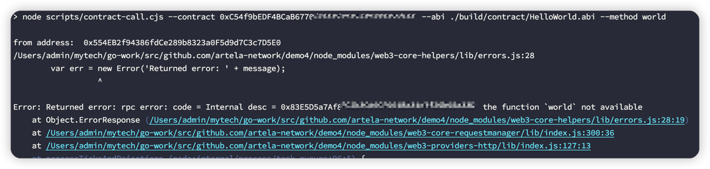

# Develop an Aspect

This section guides you in building a dApp on Artela with a sample Aspect. 
This Aspect functions as a native extension, coprocess with smart contract, and can be injected throughout the transaction lifecycle. In this example, we'll show how Aspect can identify and revert a specific transaction.

**Pre-requisites:**
* [Node.js](https://nodejs.org/)
* [solc](https://docs.soliditylang.org/en/v0.8.20/installing-solidity.html)


# 1.Setting up a new project
Make sure you have a recent version of [Node.js](https://nodejs.org/) and npm installed,
Start by installing the `aspect-tool`:

```bash
npm install -g @artela/aspect-tool
```

**Project Initialization**, to kick off your project with `aspect-tool`, follow these steps:

```bash
# Create a new directory and navigate into it
mkdir my-first-aspect && cd my-first-aspect

# Set up the npm project with aspect-tool 
aspect-tool init

# Install the necessary dependencies
npm install
```

This will create a project directory with the following structure:

```
.
├── README.md
├── asconfig.json
├── assembly
│   ├── aspect                 <-- Your aspect code resides here
│   │   └── aspect.ts          <-- Entry functions for the aspect
│   └── index.ts
├── contracts                  <-- Place your smart contracts here
├── scripts                    <-- Utilitity scripts, including deploying, binding and etc.
│   ├── aspect-deploy.cjs
│   ├── bind.cjs
│   ├── contract-call.cjs
│   └── contract-deploy.cjs
... [other directories and files]
```


## 2. Deploy a smart contract

### 2.1. Add a Smart Contract

Within the `contracts` directory of your project, create your smart contract source files with a `.sol` extension.

For example, create a `HelloWorld.sol` file:

```solidity
// SPDX-License-Identifier: GPL-3.0
pragma solidity >=0.8.2 <0.9.0;

contract HelloWorld {
    address private owner;
    constructor() {
        owner = msg.sender;
    }
    function isOwner(address user) external view returns (bool result) {
        return user == owner;
    }
    
    // print hello message
    function hello() public pure  returns (string memory ) {
        return "hello";
    }
    
    // print world message
    function world() public pure returns (string memory) {
        return "world";
    }
}
```


### 2.2. Compile the Smart Contract

This step relies on `solc`, first check if [solc](https://docs.soliditylang.org/en/v0.8.20/installing-solidity.html) is installed correctly

```bash
 solc --version
```

Compile your contract using:

```bash
npm run contract:build
```

> ✅ Successful compilation will generate `HelloWorld.abi` and `HelloWorld.bin` files in the `build/contract` directory.

### 2.3. Deploy the Smart Contract

#### 2.3.1 Update project.config.json
Update the `project.config.json` in the root directory with the appropriate network configuration:
```json
{
  "node": "https://testnet-rpc1.artela.network"
}
```
:::note 💡
For more details regarding development environment setup, please refer to [artela devnet](/develop/node/access-testnet)
:::

#### 2.3.2 Create a blockchain account (optional). 

Execute the following command under the `my-first-aspect` folder to create an account if you haven't already done so:

```bash
npm run account:create -- --pkfile {privateKey-path}
```

> * --pkfile : privateKey path for sender. (optional, default value: `./privateKey.txt`).

If your account lacks test tokens, join [Discord](https://discord.com/invite/artela)，and request some in `testnet-faucet` channel.


#### 2.3.4  Deploy your contract 

Execute the following command within the `my-first-aspect` folder, using the provided script:

```bash
npm run contract:deploy -- --pkfile {privateKey-path} \                        
                           --abi ./build/contract/HelloWorld.abi \                          
                           --bytecode ./build/contract/HelloWorld.bin \     
                           --args [..] \                     
                           --gas 200000 
                           
```
> * --pkfile : privateKey path for sender. (optional,default value `./privateKey.txt`).
> * --abi : contract abi path.
> * --bytecode:  contract bytecode path.
> * --args : If your contract's constructor requires input parameters, use `--args '[1, "a"]'` (optional).
> * --gas : e.g., `200000` (optional,default value `7000000`).

Upon successful deployment, the terminal will display the contract address.

### 2.4 Call Contract
Execute the following command within the `my-first-aspect` folder, call the Contract

#### 2.4.1 call `hello` method

```bash
npm run contract:call -- --pkfile {privateKey-path}    \     
                         --contract {smart-contract-address}  \                         
                         --abi ./build/contract/HelloWorld.abi   \                                    
                         --method hello  \                                               
                         --gas 200000 
```
> * --pkfile : privateKey path for sender. (optional,default value `./privateKey.txt`).
> * --contract:  smart contract address.
> * --abi : contract abi path.
> * --method:  method name .
> * --gas : like `200000`,(optional,default value `7000000`).


#### 2.4.2 call `world` method

```bash
npm run contract:call -- --pkfile {privateKey-path}    \     
                         --contract {smart-contract-address}  \                         
                         --abi ./build/contract/HelloWorld.abi   \                                    
                         --method world  \   
                         --gas 200000 
```
> * --pkfile : privateKey path for sender. (optional,default value `./privateKey.txt`).
> * --contract:  smart contract address.
> * --abi : contract abi path.
> * --method:  method name .
> * --args : if your contract's constructor requires input parameters, use `--args '[1, "a"]'` (optional).
> * --gas : e.g., `200000` (optional,default value `7000000`).

If the `hello` string is returned, it means that we have successfully deployed the `HelloWorld` contract.


## 3. Add and compile your Aspect

### 3.1. Implement an Aspect

The Aspect source files can be found in `assembly/aspect/aspect.ts`.

For example, to add logic after a smart contract call execution, open `aspect.ts`, locate the `postContractCall` function, and insert your logic:

```typescript
 preTxExecute(ctx: PreTxExecuteCtx): void  {
    // Insert your logic here
 }
```

:::note 💡
 For detailed instructions, refer to the [Aspect Doc](/develop/core-concepts/aspect-programming).
:::

### 3.2. Access State Changes of Smart Contract in Aspect

To integrate the state  of the `HelloWord` contract with your Aspect, follow these steps:

In `assembly/aspect`, add your Aspect to check the transaction, if `world` function is called, then revert:

```typescript
    // Import the generated state tracer

    import {  sys } from '@artela/aspect-libs';

    preTxExecute(ctx: PreTxExecuteCtx): void {

        let txData = sys.utils.uint8ArrayToHex(ctx.tx.content.unwrap().input);
        // if call world function then revert
        if (txData.startsWith('30b67baa')) {
            sys.revert("the function `world` not available")
        }
    }
    
```


### 3.3. Compile the Aspect

Build your Aspect:

```bash
npm run aspect:build 
```

The resulting `release.wasm` in the `build` folder contains the necessary WASM bytecode.

### 3.4. Deploy the Aspect

Deploy your compiled Aspect:

```bash

npm run aspect:deploy -- --pkfile {privateKey-path} \                                                
                         --wasm ./build/release.wasm \
                         --gas 200000  
```
> * --pkfile : privateKey path for sender. (optional,default value `./privateKey.txt`).
> * --wasm : wasm path.
> * --gas : like `200000`,(optional,default value `7000000`).


### 3.5. Bind the Smart Contract and Aspect

Deploying the Aspect doesn't automatically activate it. To make it functional, bind it to a smart contract:

```bash
npm run contract:bind -- --pkfile {privateKey-path} \                          
                         --contract {smart-contract-address} \
                         --abi ./build/contract/HelloWorld.abi \                        
                         --aspectId {aspect-Id} \                          
                         --gas 200000 
```
> * --pkfile : privateKey path for sender. (optional,default value `./privateKey.txt`).
> * --abi : contract abi path.
> * --contract:  smart contract address.
> * --aspectId:  aspect id.
> * --gas : like `200000`,(optional,default value `7000000`).

### 3.6. Test the Smart Contract and Aspect Integration

Now that the `HelloWorld` contract and Aspect are bound, call `world` to test, due to Aspect interception, the transaction is reverted.

```bash
npm run contract:call -- --pkfile {privateKey-path}    \     
                         --contract {smart-contract-address}  \                         
                         --abi ./build/contract/HelloWorld.abi   \                                    
                         --method world  \   
                         --gas 200000 
```



Congratulations! You've learned the basics of Aspect development. For a deeper dive, refer to our comprehensive [Aspect Doc](https://docs.artela.network/develop/aspect-tools/aspect-docs).
