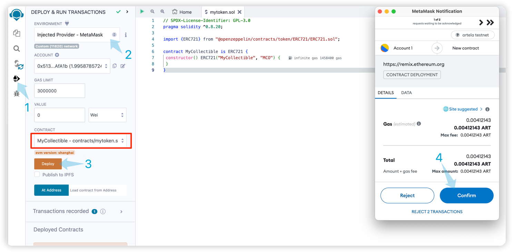

# Develop a Smart Contract

In this tutorial, we'll walk you through the process of creating and deploying a smart contract on Artela Testnet using Remix and MetaMask.

## Pre-requisites
* [Metamask](https://metamask.io/)
* [Remix](https://remix.ethereum.org/)


## 1. Connect MetaMask to Artela Testnet

If you're new to MetaMask, follow this guide on [How Add a Custom Network RPC](https://support.metamask.io/hc/en-us/articles/360043227612-How-to-add-a-custom-network-RPC) for detailed instructions.

1. Open MetaMask 
2. chick  `Networks` > `Add a network` > `Add a network manually`

```
Network Name : artela testnet
New RPC URL : https://testnet-rpc1.artela.network
ChainID (optional): 11820
Symbol (optional) : ART
Block Explorer URL (optional): https://testnet-scan.artela.network/
```

For more info about the new RPC URL configuration, refer to [artela testnet](develop/node/access-testnet).

Ensure all fields are correctly filled:


## 2. Access TestNet Faucet

Join Artela [Discord server](https://discord.com/invite/artela) to access the Testnet ART faucet. Request access and obtain Testnet ART with your wallet address. 

## 3. Write a Smart Contract in Remix

Launch Remix. Configure Remix for Solidity development by selecting `SOLIDITY` under `Featured Plugins` on the main page. Navigate to `File Explorers` to manage your files.

1. Open "contracts" folder.
2. Create new contract file.
3. Enter the file name as "mytoken.sol".
4. Copy the contract mytoken.sol code.
5. Click "solidity compiler", and make sure the compilation is successful.


**solidity compiler :**


**mytoken.sol :**

```solidity
// SPDX-License-Identifier: GPL-3.0
pragma solidity ^0.8.20;

import {ERC721} from "@openzeppelin/contracts/token/ERC721/ERC721.sol";

contract MyCollectible is ERC721 {
 constructor() ERC721("MyCollectible", "MCO") {
 }
}
```

## 4.Remix: Connect to Artela Testnet and Deploy

Ensure the `artela testnet` network is selected on Metamask. Select `Injected Provider - MetaMask` as environment.

At Remix, on the left side

1. Click the button `Deploy and run transactions`
2. Set up the ENVIRONMENT is `Injected Provider - MetaMask` 
3. Click `Deploy`,After that the metamask confirmation window will pop up
4. Click `Confirm` to start deploying the contract.



## 5.Block Explorer

Confirm the successful deployment on Artela Testnet [blockchain explorer](https://testnet-scan.artela.network/) using `transaction hash` in output.


Congratulations! You've successfully created and deployed a smart contract on Artela Testnet. Happy coding!