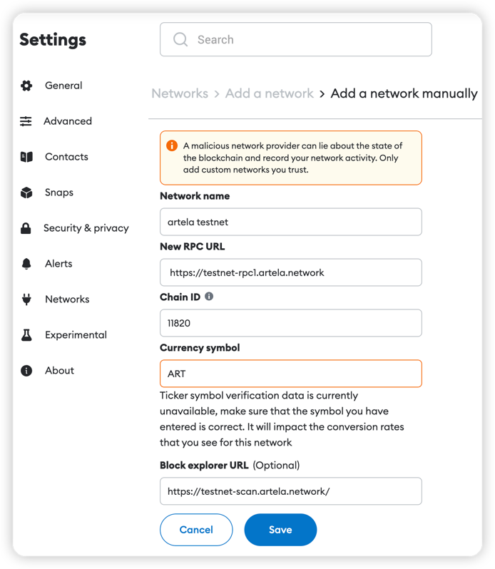
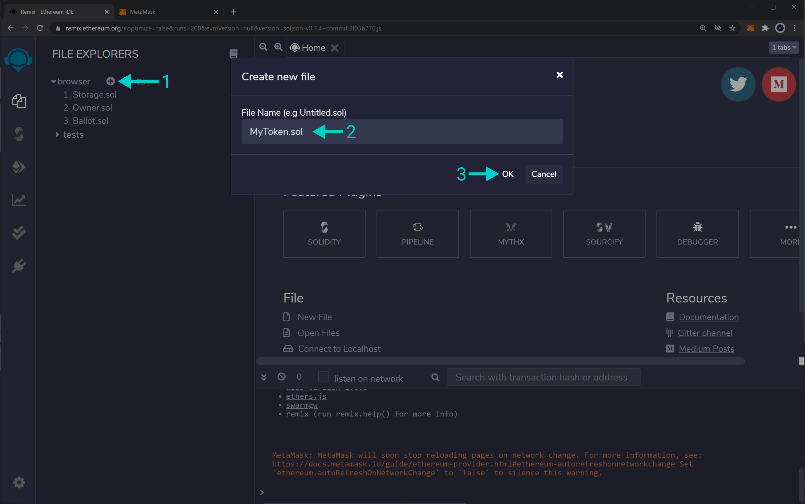
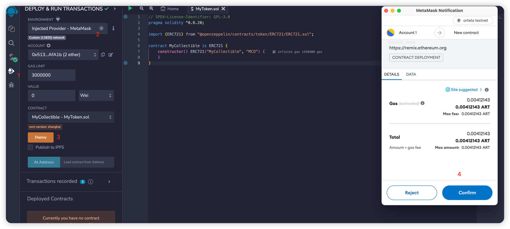

# Develop a Smart Contract

In this tutorial will show you step by step how to create and deploy a smart contract use Remix and Metamask, which are tools that were originally built for Ethereum, to create and deploy a simple smart contract on Artela Testnet.


## Requirements
* [Metamask](https://metamask.io/)
* [Remix](https://remix.ethereum.org/)


## 1. Connect Metamask to Artela testnet

If you haven't used Metamask, you can take a look at this guide, [How Add a Custom Network RPC](https://support.metamask.io/hc/en-us/articles/360043227612-How-to-add-a-custom-network-RPC)

1. Open Metamask 
2. chick  `Networks` > `Add a network` > `Add a network manually`

```
Network Name : artela testnet
New RPC URL : https://testnet-rpc1.artela.network
ChainID (optional): 11820
Symbol (optional) : ART
Block Explorer URL (optional): https://testnet-scan.artela.network/
```

Take a look in all fields:



## 2. TestNet Faucet

You can join [our discard](https://discord.com/invite/artela) for get some Testnet ART in the faucet
 please and request access to the testnet faucet.


Copy your address from Metamask.

## 3. Write a smart contract in Remix
launch the application. Under "Featured Plugins" on the main page, select "SOLIDITY" to configure Remix for Solidity development, then navigate to "File Explorers" to view your files.


You'll need to create a new file to save your Solidity smart contract. Click the '+' button below "File Explorers" and, in the pop-up, enter the file name as "MyToken.sol."



MyToken.sol:

```solidity
// SPDX-License-Identifier: GPL-3.0
pragma solidity ^0.8.20;

import {ERC721} from "@openzeppelin/contracts/token/ERC721/ERC721.sol";

contract MyCollectible is ERC721 {
 constructor() ERC721("MyCollectible", "MCO") {
 }
}
```

## 4.Remix connect Artela Testnet and Deploy

With the `artela testnet` network selected at Metamask...

At Remix, on the left side, locate the button Deploy and run transactions. After that, the metamask confirmation window will pop up。



## 5.Block Explorer

We can confirm whether the deployment is successful on our [blockchain explorer](https://testnet-scan.artela.network/) through the deployed txHash.

