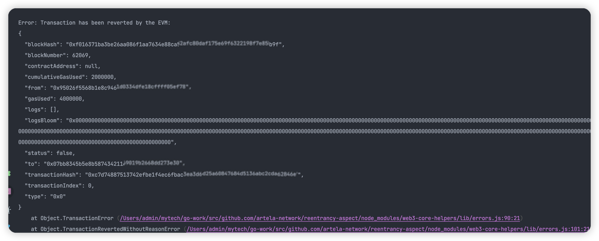

# Reentrancy Guard By Aspect

## Intro

This sample Aspect can prevent hacks similar to
the [reentrant attack happened to Curve.fi on 2023.07](https://fortune.com/crypto/2023/07/31/curve-finance-52-million-hack-hacker-helps-return-funds/).

### Attack Scenario:

1. The attacked Curve.fi pool was written in Vyper (a smart contract language compiled into EVM bytecode).
2. The Vyper version used (0.2.15) had a known reentrant lock issue in the compiler.
3. The attacker bypassed the reentrancy lock by calling `add_liquidity` from `remove_liquidity` through the fallback function, exploiting the vulnerability.

To delve into the attack details, you can check out the attack
transaction [here](https://explorer.phalcon.xyz/tx/eth/0xa84aa065ce61dbb1eb50ab6ae67fc31a9da50dd2c74eefd561661bfce2f1620c).


Learn more from our blog: 

[How does Aspect Programming prevent reentrancy attacks through on-chain runtime protection](https://github.com/artela-network/example/blob/main/curve_reentrance/README.md).

## Pre-requisites

To reproduce the attack, install `solc` and a specific version of `vyper` with the reentrant lock bug:

```bash
pip install vyper==0.2.16
```

## 1. Init Aspect dApp

```bash
   npm install -g @artela/aspect-tool
   
   mkdir reentrancy-aspect && cd reentrancy-aspect
   
   aspect-tool init
   
   npm install
   
```

## 2. Create blockchain accounts (optional).

Execute the following command under project folder to create two accounts, if you don't already have one.

```bash
npm run account:create -- --skfile ./curve_accounts.txt
npm run account:create -- --skfile ./attack_accounts.txt

```

If you don't have a test token in your account, please join [our discard](https://discord.com/invite/artela)
，require testnet faucet.

If you lack test tokens, request some in our [Discord]((https://discord.com/invite/artela)) testnet-faucet channel.

## 3. Create Smart Contracts

#### 3.1 contracts/curve.vy

This is a simplified version of Curve smart contract implemented with vyper. Similar to the Curve pool, it has two
methods: `add_liquidity` and `remove_liquidity`. Both are guarded by the same reentrant lock. `AddLiquidity` and
`RemoveLiquidity` events will be emitted when corresponding method are called.

``` python
event AddLiquidity:
    excuted: uint256

event RemoveLiquidity:
    excuted: uint256

deployer: address

@external
def __init__():
    self.deployer = msg.sender

@external
@view
def isOwner(user: address) -> bool:
    return user == self.deployer

@external
@nonreentrant('lock')
def add_liquidity():
    log AddLiquidity(1)

@external
@nonreentrant('lock')
def remove_liquidity():
    raw_call(msg.sender, b"")
    log RemoveLiquidity(1)
```

#### 3.2 contracts/attack.sol

This is a simplified version of attack contract implemented in solidity. It will try to start a reentrant attack through
the `remove_liquidity` with its fallback function.

```solidity
// SPDX-License-Identifier: GPL-3.0
pragma solidity >=0.8.2 <0.9.0;

interface CurveContract {
    function add_liquidity() external;

    function remove_liquidity() external;
}

contract Attack {
    CurveContract public curve;

    constructor(address _curveContract) {
        curve = CurveContract(_curveContract);
    }

    function attack() external payable {
        curve.remove_liquidity();
    }

    fallback() external {
        curve.add_liquidity();
    }
}

```

#### 3.3 Deploy Curve Contract

```shell

mkdir -p ./build/contract

## build curve contract
vyper -f abi ./contracts/curve.vy > build/contract/CurveContract.abi && vyper ./contracts/curve.vy > build/contract/CurveContract.bin
 
## deploy contract
npm run contract:deploy -- --abi ./build/contract/CurveContract.abi  --bytecode ./build/contract/CurveContract.bin  --skfile ./curve_accounts.txt
```

The result of the execution can be obtained from the contract address, for example

```shell
...
--contractAccount 0xaa19F4957C890518b577205c41C706F1c07fa0cc --contractAddress 0xFe4b65F17554B45eF7D146B86E030da7A4e250bb
```

#### 3.4 Deploy Attack Contract

When deploying an attack contract, replace '{curveAddress}' with the real Curve contract address

```shell

## build attack contract
npm run contract:build

## deploy contract
npm run contract:deploy -- --abi ./build/contract/Attack.abi  --bytecode ./build/contract/Attack.bin --args '["{curveAddress}"]'  --skfile ./attack_accounts.txt
```

The result of the execution can be obtained from the contract address, for example:

```shell
...
--contractAccount 0xaa19F4957C890518b577205c41C706F1c07fa0bb --contractAddress 0xFe4b65F17554B45eF7D146B86E030da7A4e250ee
```

#### 3.5 Attack

```shell
npm run contract:send -- --contract '["{attackAddress}"]'    --abi ./build/contract/Attack.abi   --skfile ./attack_accounts.txt  --method attack  --gas 200000
```

If the reentrant attack succeeded, you will see both `AddLiquidity` and `RemoveLiquidity` events logged.

## 4. Create Aspect

Next, we deploy an Aspect code to stop the attack happening.

#### 4.1 add intercept logic in 'assembly/aspect/aspect.ts' method 'preContractCall':

```shell
   import {
     ...
       ethereum,
       sys,
   } from "@artela/aspect-libs";


  preContractCall(ctx: PreContractCallCtx): void {
        // Get the method of currently called contract.
        const currentCallMethod = ethereum.parseMethodSig(ctx.currentCall.data);

        // Define functions that are not allowed to be reentered.
        const noReentrantMethods : Array<string> = [
            ethereum.computeMethodSig('add_liquidity()'),
            ethereum.computeMethodSig('remove_liquidity()')
        ];

        // Verify if the current method is within the scope of functions that are not susceptible to reentrancy.
        if (noReentrantMethods.includes(currentCallMethod)) {
            // Check if there already exists a non-reentrant method on the current call path.
            let parentIndex = ctx.currentCall.parentIndex;
            // Retrieve the call stack from the context, which refers to
            // all contract calls along the path of the current contract method invocation.
            while (parentIndex >= 0) {
                const parentCall = ctx.trace.findCall(parentIndex)!;
                const parentCallMethod = ethereum.parseMethodSig(parentCall.data);
                if (noReentrantMethods.includes(parentCallMethod)) {
                    // If yes, revert the transaction.
                    sys.revert(`illegal transaction: method reentered from ${currentCallMethod} to ${parentCallMethod}`);
                }
                parentIndex = parentCall.parentIndex;
            }
        }
    }
```

#### 4.2 Compile the Aspect

Build your Aspect:

```shell
npm run aspect:build
```

The resulting `release.wasm` in the build folder contains the necessary WASM bytecode.

#### 4.3 Deploy the Aspect

Deploy your compiled Aspect:

```shell
 npm run aspect:deploy -- --wasm ./build/release.wasm  \ 
                          --joinPoints PreContractCall \ 
                          --skfile ./curve_accounts.txt
```

> ✅ Upon successful execution, the terminal will display the `Aspect address`. It is essential to make a note of this
> address as it will be useful later on.

:::note 💡
For more detailed usage information about this command, please refer to
the [deploy-aspect command](/develop/reference/aspect-tool/deploy-aspect) documentation.
:::

#### 4.4 Bind the Curve Contract and Aspect

Deploying the Aspect doesn't automatically activate it. To make it functional, bind it to a smart contract:

```shell
   npm run contract:bind -- --skfile ./curve_accounts.txt \                          
   --contract {curveAddress} \
   --abi ./build/contract/CurveContract.abi \                        
   --aspectId {aspect-Id} \                          
   --gas 200000
```
you will see `== aspect bind success == `

## 5. Re-entrant attack Test

Execute the re-entrant attack on the simplified Curve contract with Aspect protection, and watch the output. 

```shell
 npm run contract:send -- --contract {attackAddress} \   
                          --abi ./build/contract/Attack.abi  \ 
                          --skfile ./attack_accounts.txt  
                          --method attack  \
                          --gas 200000 
```

If the protection succeeded, you will see the transaction reverted.


 