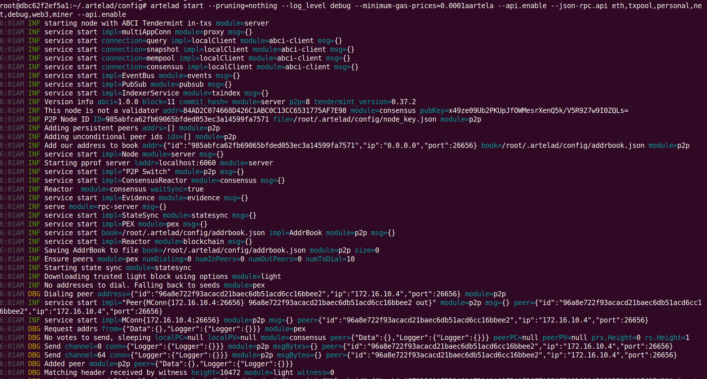

# Setup a Full Node

This document provides an introduction to joining the Artela Testnet as a full node.

## 1. Prepare Artelad

You can start with install artelad or build source code

### Option 1: Build the source.

### 1). Prepare the development tools

**Skip** this if you have already got your go development environment.

```bash
sudo apt-get update
sudo apt-get install -y make gcc
wget https://go.dev/dl/go1.20.3.linux-amd64.tar.gz
sudo rm -rf /usr/local/go && sudo tar -C /usr/local -xzf go1.20.3.linux-amd64.tar.gz
export PATH=$PATH:/usr/local/go/bin
```

### 2). Clone and build the code

```bash
cd $GOPATH/src
git clone https://github.com/artela-network/artela
git clone https://github.com/artela-network/artela-cosmos-sdk
git clone https://github.com/artela-network/artela-cometbft
cd artela

git checkout main
make clean && make
cp ./build/artelad $HOME/go/bin/.
export PATH=$PATH:$HOME/go/bin
```

### Option 2: Download and Install Artelad

Ask admin of Artela Testnet for the download link.

Uninstall and copy the binaray `artelad` to `/usr/local/bin`.

## 2. Init node

**1). Init**

```bash
artelad init <custom_moniker> # e.g artelad init test111
```

**2). Copy genesis from [1. Genesis](./access-testnet#public-information-on-testnet) , copy the the home directory.**

```bash
mv genesis.json $HOME/.artelad/config/genesis.json
```

**3). Configure**

Get presistent seeds from [2. Presistent nodes](./access-testnet#public-information-on-testnet)

Add two of them to `seeds` in `app.toml`

```bash
cd $HOME/.artelad/config
sed -i 's/minimum-gas-prices = ""/minimum-gas-prices = "0.0025stake"/' app.toml
# e.g sed -i 's/seeds = ""/seeds = "ef1777650f2a5f96cfbf2b1b21feb45ef09bbaa4@172.16.10.2:26656,96a8e722f93acacd21baec6db51acd6cc16bbee2@172.16.10.4:26656"/' config.toml
sed -i 's/seeds = ""/seeds = "<node-id-1@node-1-ip:port>,<node-id-2@node-2-ip:port>"/' config.toml
```

## 3. Set state sync

```bash
cd $HOME/.artelad/config
sed -i 's/enable = false/enable = true/' config.toml
sed -i 's/trust_height = 0/trust_height = <BLOCK_HEIGHT>/' config.toml
sed -i 's/trust_hash = ""/trust_hash = "<BLOCK_HASH>"/' config.toml

# e.g sed -i 's/rpc_servers = ""/rpc_servers = "172.16.10.2:26657,172.16.10.4:26657"/' config.toml
sed -i 's/rpc_servers = ""/rpc_servers = "node-1-ip:port,node-2-ip:port"/' config.toml
```

Get `BLOCK_HEIGHT` and `BLOCK_HASH` from [3. Trust block and height](./access-testnet#public-information-on-testnet)

Get `rpc_servers` from [4. RPC servers](./access-testnet#public-information-on-testnet)

### 4. Run Artela node

```bash
artelad start --pruning=nothing --log_level debug --minimum-gas-prices=0.0001aartela --api.enable --json-rpc.api eth,txpool,personal,net,debug,web3,miner --api.enable
```

**Optional:  Run Artela node as a background service**

- Create or open service file using the following command:

```bash
vim /etc/systemd/system/artelad.service
```

- Fill it with the following contents:

```bash
[Unit]
Description=artela service
After=network-online.target

[Service]
User=root
ExecStart=<your_GOPATH_dir>/bin/artelad start --pruning=nothing --log_level debug --minimum-gas-prices=0.0001aartela --api.enable --json-rpc.api eth,txpool,personal,net,debug,web3,miner --api.enable
Restart=no
LimitNOFILE=4096

[Install]
WantedBy=multi-user.target
```

- Enable and start the service

```bash
systemctl daemon-reload
systemctl restart systemd-journald
systemctl enable artelad.service
systemctl start artelad.service
```

- Check the log of the service

```bash
journalctl -fu artelad
```

### 5. Output



When it syncs with all blocks, the output looks like:


