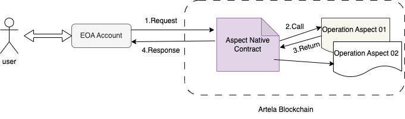

# Operation Aspect

## Introduction

The Operation Aspect, akin to a smart contract, exclusively responds to transactions initiated by externally owned
accounts (EOAs). This includes transactions triggered by contract interactions. Notably, these Join Points are also
activated in the case of cross-contract interactions.



## How to Create

To implement a Operation Aspect, you can implement the `IAspectOperation` interface

```typescript

import {
    allocate,
    entryPoint,
    execute,
    IAspectOperation,
    OperationInput,
    stringToUint8Array,
    sys,
} from '@artela/aspect-libs';

class AspectTest implements IAspectOperation {
    operation(input: OperationInput): Uint8Array {
        sys.require(input.callData.length > 0, 'data is lost');
        sys.aspect.mutableState.get<string>("k2").set<string>("v2")
        const val = sys.aspect.mutableState.get<string>("k2").unwrap()!
        sys.require(val == "v2", val + "mutableState get fail")
        return stringToUint8Array('success');
    }
}

// 2.register aspect Instance
const aspect = new AspectTest();
// Note: This is very important and requires set to work.
entryPoint.setOperationAspect(aspect);

// 3.must export it
export {execute, allocate};


```

## Programming

There are two programming modes that can be used in this method:

1. By utilizing the 'input' input argument, it provides essential insights into transactions and block processing. see [how to use input](#how-to-use-input).

2. Using the 'sys' namespace, it provides both hight level API and low-level API access to system data and contextual information generated during blockchain runtime, including details about the environment, blocks, transactions, and utility classes such as crypto and ABI encoding/decoding. see [more details](#how-to-use-apis).

## How to use input

Explore the available information from the class diagram below.


**Parameters:**
- `input.block.number`: current block number.
- `input.tx.from`: caller of the transaction.
- `input.tx.to`: to address of the transaction.
- `input.tx.hash`: hash of the transaction.

Utilize the fields as indicated below:

<!-- @formatter:off -->
```typescript

let blockNumer = input.block!.number;
let txFrom = input.tx!.from;
let txTo = input.tx!.to;
let txHash = input.tx!.hash;

// use blockNumber, txFrom, txTo, txHash
...

```
<!-- @formatter:on -->


## How to use APIs

For a comprehensive overview of all APIs and their usage
see [API References](/develop/reference/aspect-lib/components/overview).

Each breakpoint has access to different host APIs, and the host APIs available within the current breakpoint can be
found at the following table.

| System APIs                                                                                                                 | Availability | Description                                                                                                                                                                            |
|-----------------------------------------------------------------------------------------------------------------------------|--------------|----------------------------------------------------------------------------------------------------------------------------------------------------------------------------------------|
| [sys.revert](/develop/reference/aspect-lib/components/sys#1-revert)                                                         | ✅            | Forces the current transaction to fail.                                                                                                                                                |
| [sys.require](/develop/reference/aspect-lib/components/sys#2-require)                                                       | ✅            | Checks if certain conditions are met; if not, forces the entire transaction to fail.                                                                                                   |
| [sys.log](/develop/reference/aspect-lib/components/sys#3-log)                                                               | ✅            | A wrapper for `sys.hostApi.util.log`, prints log messages to Artela output for debugging on the localnet.                                                                              |
| [sys.aspect.id](/develop/reference/aspect-lib/components/sys-aspect#1-sysaspectid)                                          | ✅            | Retrieves the ID of the aspect.                                                                                                                                                        |
| [sys.aspect.version ](/develop/reference/aspect-lib/components/sys-aspect#2-sysaspectversion)                               | ✅            | Retrieves the version of the aspect.                                                                                                                                                   |
| [sys.aspect.mutableState](/develop/reference/aspect-lib/components/sys-aspect#4-sysaspectmutablestate)                      | ✅            | A wrapper for `sys.hostApi.aspectState` that facilitates easier reading or writing of values of a specified type to aspect state.                                                      |
| [sys.aspect.property](/develop/reference/aspect-lib/components/sys-aspect#5-sysaspectproperty)                              | ✅            | A wrapper for `sys.hostApi.aspectProperty` that facilitates easier reading of values of a specified type from aspect property.                                                         |
| [sys.aspect.readonlyState](/develop/reference/aspect-lib/components/sys-aspect#3-sysaspectreadonlystate)                    | ✅            | A wrapper for `sys.hostApi.aspectState` that facilitates easier reading of values of a specified type from aspect state.                                                               |
| [sys.aspect.transientStorage](/develop/reference/aspect-lib/components/sys-aspect#6-sysaspecttransientstorage)              | ❌            | A wrapper for `sys.hostApi.aspectTransientStorage` that facilitates easier reading or writing of values of a specified type to aspect transient storage.                               |
| [sys.hostApi.aspectProperty](/develop/reference/aspect-lib/components/sys-hostapi#syshostapiaspectproperty)                 | ✅            | Retrieves the property of the aspect as written in aspect deployment.                                                                                                                  |
| [sys.hostApi.aspectState](/develop/reference/aspect-lib/components/sys-hostapi#syshostapiaspectstate)                       | ✅            | Retrieves or writes the state of the aspect.                                                                                                                                           |
| [sys.hostApi.aspectTransientStorage](/develop/reference/aspect-lib/components/sys-hostapi#syshostapiaspecttransientstorage) | ❌            | Retrieves or writes to the transient storage of the aspect. This storage is only valid within the current transaction lifecycle.                                                       |
| [sys.hostApi.crypto.ecRecover](/develop/reference/aspect-lib/components/sys-hostapi#4-ecrecover)                            | ✅            | Calls crypto methods `ecRecover`.                                                                                                                                                      |
| [sys.hostApi.crypto.keccak](/develop/reference/aspect-lib/components/sys-hostapi#1-keccak)                                  | ✅            | Calls crypto methods `keccak`.                                                                                                                                                         |
| [sys.hostApi.crypto.ripemd160](/develop/reference/aspect-lib/components/sys-hostapi#3-ripemd160)                            | ✅            | Calls crypto methods `ripemd160`.                                                                                                                                                      |
| [sys.hostApi.crypto.sha256](/develop/reference/aspect-lib/components/sys-hostapi#2-sha256)                                  | ✅            | Calls crypto methods `sha256`.                                                                                                                                                         |
| [sys.hostApi.runtimeContext](/develop/reference/aspect-lib/components/sys-hostapi#1-get-context)                            | ✅            | Retrieves runtime context by the key.  Refer to the [Context Keys](/develop/reference/aspect-lib/components/context-keys) to see which keys can be accessed by the current join point. |
| [sys.hostApi.stateDb.balance](/develop/reference/aspect-lib/components/sys-hostapi#1-balance)                               | ✅            | Gets the balance of the specified address from the EVM state database.                                                                                                                 |
| [sys.hostApi.stateDb.codeHash](/develop/reference/aspect-lib/components/sys-hostapi#4-codehash)                             | ✅            | Gets the hash of the code from the EVM state database.                                                                                                                                 |
| [sys.hostApi.stateDb.codeSize](/develop/reference/aspect-lib/components/sys-hostapi#6-codesize)                             | ✅            | Gets the size of the code from the EVM state database.                                                                                                                                 |
| [sys.hostApi.stateDb.hasSuicided](/develop/reference/aspect-lib/components/sys-hostapi#3-hassuicided)                       | ✅            | Gets the codehash from the EVM state database.                                                                                                                                         |
| [sys.hostApi.stateDb.nonce](/develop/reference/aspect-lib/components/sys-hostapi#5-nonce)                                   | ✅            | Checks if the contract at the specified address is suicided in the current transactions.                                                                                               |
| [sys.hostApi.stateDb.stateAt](/develop/reference/aspect-lib/components/sys-hostapi#2-stateat)                               | ✅            | Gets the state at a specific point.                                                                                                                                                    |
| [sys.hostApi.evmCall.jitCall](/develop/reference/aspect-lib/components/sys-hostapi#2-jitcall)                               | ❌            | Creates a contract call and executes it immediately.                                                                                                                                   |
| [sys.hostApi.evmCall.staticCall](/develop/reference/aspect-lib/components/sys-hostapi#1-staticcall)                         | ✅            | Creates a static call and executes it immediately.                                                                                                                                     |
| [sys.hostApi.trace.queryCallTree](/develop/reference/aspect-lib/components/sys-hostapi#2-querycalltree )                    | ❌            | Returns the call tree of EVM execution.                                                                                                                                                |
| [sys.hostApi.trace.queryStateChange](/develop/reference/aspect-lib/components/sys-hostapi#1-querystatechange)               | ❌            | Returns the state change in EVM execution for the specified key.                                                                                                                       |
