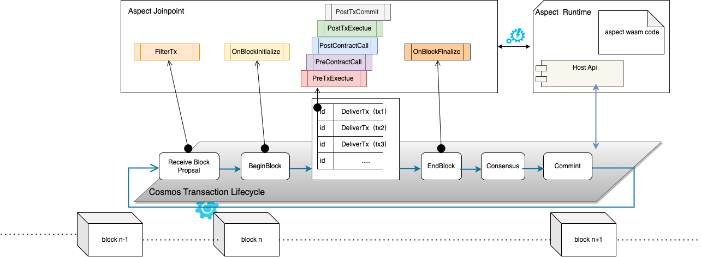

# PreTxExecute


## Introduction

The PreTxExecute join point occurs during the `DeliverTx` phase of the [Transaction lifecycle](https://docs.cosmos.network/v0.47/learn/beginner/tx-lifecycle). 
This join point is invoked before the transaction execution. Below is call graph:

* `ApplyTransaction`
  * ⮕ `ApplyMessageWithConfig`
    * ⚙ [PreTxExecute join point](/develop/reference/aspect-lib/tx-level-aspect/pre-tx-execute)
    * ⮕ `evm.Call`
      * ⮕ `loop opCodes`
        * | `evm.Interpreter.Run 0`
        * | `evm.Interpreter.Run 1`
        * ....
  * ⮕ `RefundGas`

At this stage, the account state remains pristine, allowing Aspect to preload information as necessary.



## Example

```typescript
  preTxExecute(ctx:PreTxExecuteCtx):void {
      let value = "value"
      ctx.aspect.transientStorage<string>("key").set<string>(value);
      let get = ctx.aspect.transientStorage<string>("key").unwrap();
      sys.require(get == value, "Not equal")
  }
```
## Programming

There are two programming modes that can be used in this method:
1. Using the 'sys' namespace, it provides low-level API access to system data and contextual information generated during blockchain runtime, including details about the environment, blocks, transactions, and utility classes such as crypto and ABI encoding/decoding. see [more details](/develop/reference/aspect-lib/components/overview).
2. By utilizing the 'ctx' input argument, it provides essential insights into transactions and block processing, encompassing smart contract state updates, logged events, and raw transaction data. see [how to use ctx](#how-to-use-ctx).

whatever,the two methods can be used interchangeably. 

**Important point**: Since the join point is in the EVM execution process, using [sys.revert()](/develop/reference/aspect-lib/components/sys#1-revert), [sys.require()](/develop/reference/aspect-lib/components/sys#3-require) in this join point will actually revert the transaction.

## How to use `ctx`

### 1. get transaction
> Get the currently executed transaction.
> 
<!-- @formatter:off -->
```typescript
    let transaction = ctx.tx.content.unwrap()!
```
<!-- @formatter:on -->

* Return 
  * <a href="/api/docs/classes/proto.EthTransaction.html" target="_blank">EthTransaction</a>

### 2. get transaction properties

> Get transaction extension properties

<!-- @formatter:off -->
```typescript
    let popVal = ctx.tx.extProperties.property.get("xx");
```
<!-- @formatter:on -->

* Parameter
  * key: Properties keys, default key list:
    * `txIndex` get transaction index in block.
* Return
  * string

### 3. get transaction gas meter
> Get transaction gas meter
> 
<!-- @formatter:off -->
```typescript
    let gasMeter = ctx.tx.gasMeter.unwrap()!
```
<!-- @formatter:on -->

* Return
  * <a href="/api/docs/classes/proto.GasMeter.html" target="_blank">GasMeter</a>

### 4. get block gas meter

>Get block gas meter

<!-- @formatter:off -->
```typescript
    let meter = ctx.block.gasMeter.unwrap();
```
<!-- @formatter:on -->

* Return 
  * <a href="/api/docs/classes/proto.GasMeter.html" target="_blank">GasMeter</a>

### 5. get block header

> Get the block header.

<!-- @formatter:off -->
```typescript
    let header = ctx.block.header.unwrap();
```
<!-- @formatter:on -->

* Return
  * <a href="/api/docs/classes/proto.EthBlockHeader.html" target="_blank">EthBlockHeader</a>

### 6. get block min gas price

> Get the block min gas price.

<!-- @formatter:off -->
```typescript
    let minGasPrice = ctx.block.minGasPrice.unwrap();
```
<!-- @formatter:on -->

* Returns
  * <a href="/api/docs/classes/proto.MinGasPrice.html" target="_blank">MinGasPrice</a>

### 7. get block last commit

> Get the block last commit info.

<!-- @formatter:off -->
```typescript
    let lastCommit = ctx.block.lastCommit.unwrap();
```
<!-- @formatter:on -->

* Returns
  * <a href="/api/docs/classes/proto.LastCommitInfo.html" target="_blank">LastCommitInfo</a>

### 8. get block partial tx

> Get partial body that have same tx.To

<!-- @formatter:off -->
```typescript
    let txs = ctx.block.partialBody.unwrap();
```
<!-- @formatter:on -->

* Returns
  * <a href="/api/docs/classes/proto.EthTxArray.html" target="_blank">EthTxArray</a>

### 9. get environment

> Get environment content.

<!-- @formatter:off -->
```typescript
   let envContent = ctx.env.baseFee.unwrap();
```
<!-- @formatter:on -->

* Returns
  * <a href="/api/docs/classes/proto.EnvContent.html" target="_blank">EnvContent</a>

### 10. get chain config

> Get chain config

<!-- @formatter:off -->
```typescript
   let chainConfig = ctx.env.chainConfig.unwrap();
```
<!-- @formatter:on -->

* Returns
  * <a href="/api/docs/classes/proto.ChainConfig.html" target="_blank">ChainConfig</a>

### 11. get evm params

> Get evm params

<!-- @formatter:off -->
```typescript
    let evmParams = ctx.env.evmParams.unwrap();
```
<!-- @formatter:on -->

* Returns
  * <a href="/api/docs/classes/proto.EvmParams.html" target="_blank">EvmParams</a>

### 12. get consensus params

> Get consensus params

<!-- @formatter:off -->
```typescript
    let ConsParams = ctx.env.consensusParams.unwrap();
```
<!-- @formatter:on -->

* Returns
  * <a href="/api/docs/classes/proto.ConsParams.html" target="_blank">ConsParams</a>

### 13. get balance

> Retrieves the balance from the given address or 0 if object not found

<!-- @formatter:off -->
```typescript
     let balance = ctx.stateDB.balance("0x111222333444555666");
```
<!-- @formatter:on -->

* Parameter
  * string: account address hex string.
* Return
  * string: balance value,big int string.

### 14. get nonce

> Returns the nonce of account, 0 if not exists.

<!-- @formatter:off -->
```typescript
    let nonce = ctx.stateDB.nonce("0x111222333444555666");
```
<!-- @formatter:on -->

* Parameter
  * address: account address
* Return
  * (i64): nonce value

### 15. get state

> Retrieves a value from the given account's storage trie.

<!-- @formatter:off -->
```typescript
    let state = ctx.stateDB.stateAt("0x111222333444555666", "0x9999988888xxx");
```
<!-- @formatter:on -->

* Parameter
  * address: account address
  * hash:  one key, hash hex string
* Return
  * (string): state , hash hex string

### 16. get refund

> Returns the current value of the refund counter.

<!-- @formatter:off -->
```typescript
    let refund = ctx.stateDB.refund();
```
<!-- @formatter:on -->

* Return
  * (i64): the current value of the refund counter

### 17. get codeHash

> Returns the code hash of account.

<!-- @formatter:off -->
```typescript
   let codeHash = ctx.stateDB.codeHash("0x111222333444555666");
```
<!-- @formatter:on -->

* Parameter
  * addr: address hash hex string
* Return
  * (i64): the current value of the refund counter


### 18. get transient storage

> Get aspect transientStorage value

<!-- @formatter:off -->
```typescript
   let value = ctx.aspect.transientStorage<string>("key").unwrap();
```
<!-- @formatter:on -->

* Return 
  * T : generics type value

### 19. set transient storage

> Set aspect transientStorage value

<!-- @formatter:off -->
```typescript
   let isSuccess: bool = ctx.aspect.transientStorage<string>("key").set<string>("value");
```
<!-- @formatter:on -->

* Return
  * bool ：set success

### 20. set Aspect state

> Set value to Aspect state

<!-- @formatter:off -->
```typescript
   ctx.mutableState.get<string>("key").set<string>("value")
```
<!-- @formatter:on -->

* Parameter
  * key: generics type key
  * value: generics type value

### 21. get Aspect state

> Get value from Aspect state

<!-- @formatter:off -->
```typescript
   let value = ctx.mutableState.get<string>("key").unwrap();
```
<!-- @formatter:on -->

* Parameter
  * key: generics type key
* Return
  * T：generics type value


### 22. get property

> Get property value

<!-- @formatter:off -->
```typescript
   let value = ctx.property.get<string>("key");
```
<!-- @formatter:on -->

* Parameter
  * key: generics type key
* Return
  * T：generics type value

### 23. evm static call

> Executes a new message call immediately, without creating a transaction on the blockchain.

<!-- @formatter:off -->
```typescript
    let ethMessage = new EthMessage( );
    let result = ctx.staticCall.submit(ethMessage)
```
<!-- @formatter:on -->

* Parameter
  * <a href="/api/docs/classes/proto.EthMessage.html" target="_blank">EthMessage</a>
* Return
  * <a href="/api/docs/classes/proto.EthMessageCallResult.html" target="_blank">EthMessageCallResult</a>

