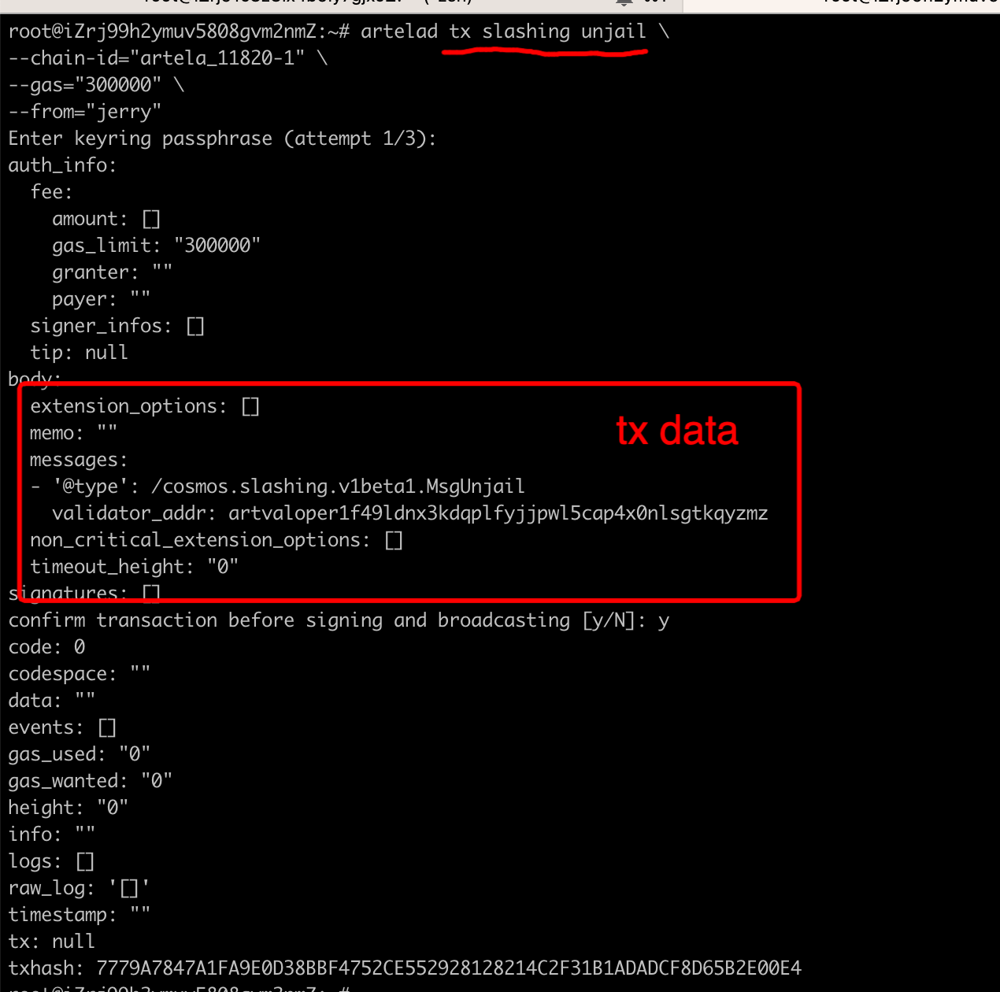

# Validator Guide

:::warning
Before setting up a validator node, make sure to have completed the [Run a Full Node](../node/run-full-node) guide.
:::

## Step1: Create Your Validator Operator Account
```bash
artelad keys add <account_name>
```


## Step2: Get BetaNet Token
You could get ART BetaNet Native Token from Discord. 
You could get your account address like this:

```bash
artelad keys show <account_name>
```


## Step3: Create Your Validator

```bash
artelad tx staking create-validator \
--amount="1000000art" \
--pubkey=$(artelad tendermint show-validator) \
--moniker="choose a moniker" \
--commission-rate="0.10" \
--commission-max-rate="0.20" \
--commission-max-change-rate="0.01" \
--min-self-delegation="1" \
--gas="200000" \
--chain-id=<chain_id> \
--from=<key_name>
```
* **amount:** how much ART you want to self delegate.
* **moniker:** your validator name, maybe your team name.
* **commission-rate:** commission your validator get from delegator.
* **from:** your validator operator account name.


## Step4: Confirm Your Validator is Running

Your validator is active if the following command returns anything:

```bash
artelad query tendermint-validator-set | grep "$(artelad tendermint show-address)"
```


---

## Appendix

### 1.Query all validators
```bash
artelad query staking validators
```


### 2.Query validator through operator address

```bash
artelad query staking validator <operator_address>
```


### 3.Convert bech32 address to hex format

```bash
artelad debug addr <address>
```


### 4.Query all local accounts

```bash
artelad keys list
```


### 5.Query account through address

```bash
artelad query account <account_name>
```


### 6.Query tx trough tx_hash

```bash
artelad query tx <tx_hash>
```


### 7.Unjail validator

```bash
artelad tx slashing unjail \
--gas="300000" \
--chain-id=<chain_id> \
--from=<account_name>
```




