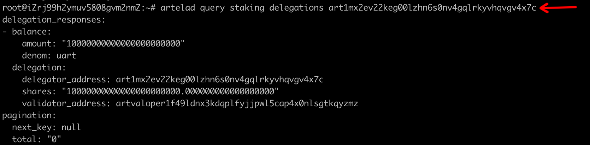
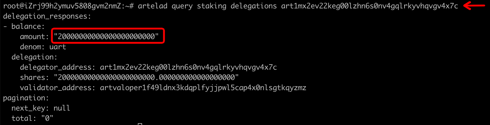
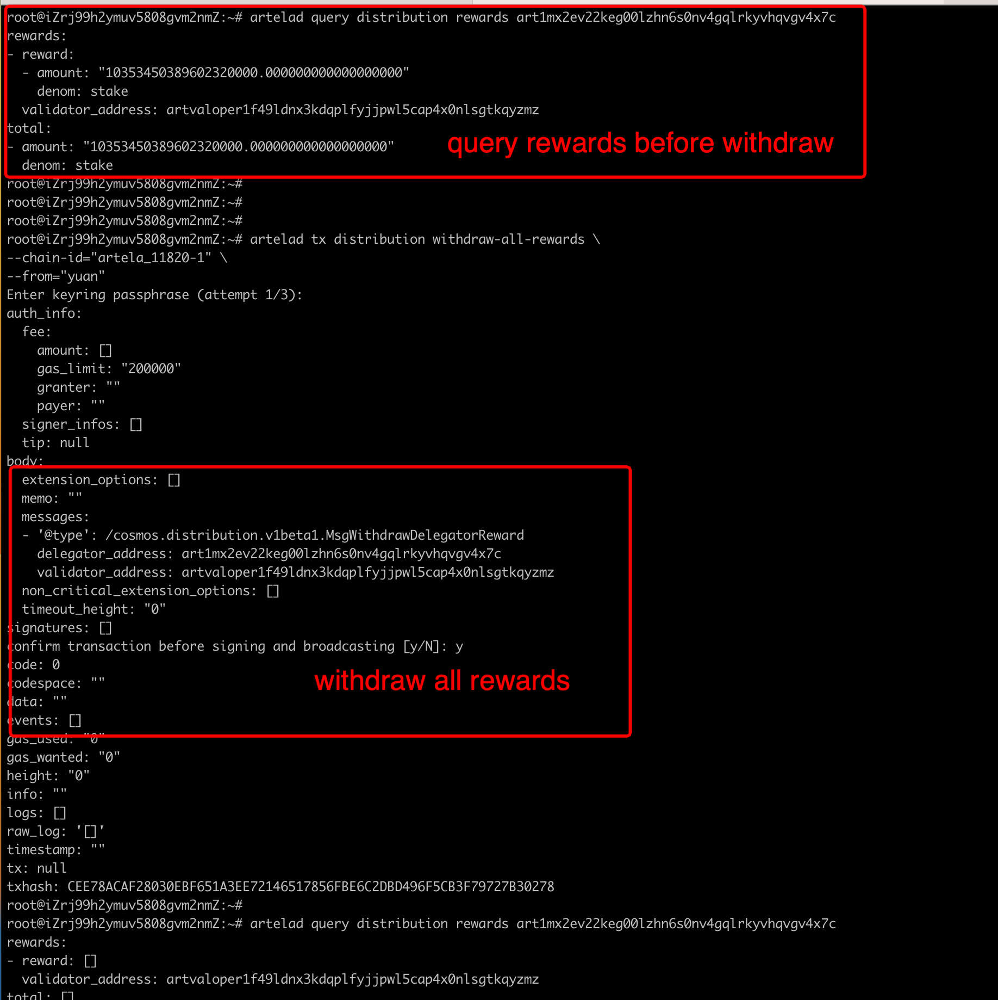
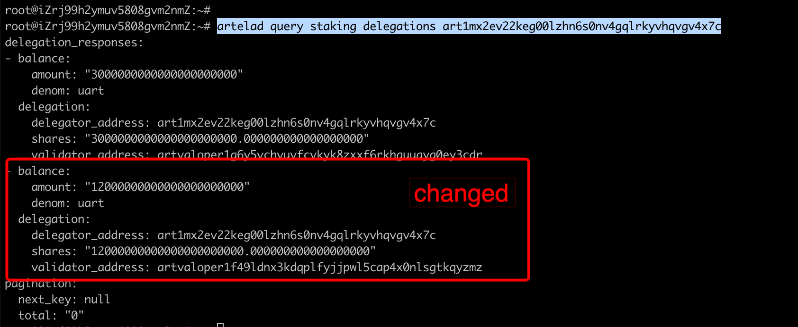

# Delegator Guide

This document contains all the necessary information for delegators to interact with the Artela Network through the Command-Line Interface (CLI).

It also contains instructions on how to manage accounts, restore accounts from the fundraiser and use a ledger nano device.

## Installing `artelad`

`artelad`: This is the command-line interface to interact with a `artelad` full-node.

[**Download the binaries**]
Not available yet.

[**Install from source**](../getting-started/installation.md)

`artelad` is used from a terminal. To open the terminal, follow these steps:

- **Windows**: `Start` > `All Programs` > `Accessories` > `Command Prompt`
- **MacOS**: `Finder` > `Applications` > `Utilities` > `Terminal`
- **Linux**: `Ctrl` + `Alt` + `T`

## Cosmos Accounts

At the core of every Cosmos account, there is a seed, which takes the form of a 12 or 24-words mnemonic. From this mnemonic, it is possible to create any number of Cosmos accounts, i.e. pairs of private key/public key. This is called an HD wallet (see [BIP32](https://github.com/bitcoin/bips/blob/master/bip-0032.mediawiki) for more information on the HD wallet specification).

The funds stored in an account are controlled by the private key. This private key is generated using a one-way function from the mnemonic. If you lose the private key, you can retrieve it using the mnemonic. However, if you lose the mnemonic, you will lose access to all the derived private keys. Likewise, if someone gains access to your mnemonic, they gain access to all the associated accounts.

The address is a public string with a human-readable prefix (e.g. `cosmos10snjt8dmpr5my0h76xj48ty80uzwhraqalu4eg`) that identifies your account. When someone wants to send you funds, they send it to your address. It is computationally infeasible to find the private key associated with a given address.

### Restoring an Account from the Fundraiser

If you participated in the fundraiser, you should be in possession of a 12-words mnemonic. Newly generated mnemonics use 24 words, but 12-word mnemonics are also compatible with all the Cosmos tools.

#### On a Computer

To restore an account using a fundraiser mnemonic and store the associated encrypted private key on a computer, use the following command:

```bash
artelad keys add <yourKeyName> --recover
```

- `<yourKeyName>` is the name of the account. It is a reference to the account number used to derive the key pair from the mnemonic. You will use this name to identify your account when you want to send a transaction.
- You can add the optional `--account` flag to specify the path (`0`, `1`, `2`, ...) you want to use to generate your account. By default, account `0` is generated.

The private key of account `0` will be saved in your operating system's credentials storage.
Each time you want to send a transaction, you will need to unlock your system's credentials store.
If you lose access to your credentials storage, you can always recover the private key with the
mnemonic.

### Creating an Account

To create an account, you just need to have `artelad` installed. Before creating it, you need to know where you intend to store and interact with your private keys. The best options are to store them in an offline dedicated computer or a ledger device. Storing them on your regular online computer involves more risk, since anyone who infiltrates your computer through the internet could exfiltrate your private keys and steal your funds.

#### Using a Computer

To generate an account, just use the following command:

```bash
artelad keys add <yourKeyName>
```

The command will generate a 24-words mnemonic and save the private and public keys for account `0`
at the same time.
Each time you want to send a transaction, you will need to unlock your system's credentials store.
If you lose access to your credentials storage, you can always recover the private key with the
mnemonic.

```bash
history -c
rm ~/.bash_history
```

- `<yourKeyName>` is the name of the account. It is a reference to the account number used to derive the key pair from the mnemonic. You will use this name to identify your account when you want to send a transaction.
- You can add the optional `--account` flag to specify the path (`0`, `1`, `2`, ...) you want to use to generate your account. By default, account `0` is generated.

You can generate more accounts from the same mnemonic using the following command:

```bash
artelad keys add <yourKeyName> --recover --account 1
```

This command will prompt you to input a passphrase as well as your mnemonic. Change the account number to generate a different account.

## Accessing the Artela Network Network

In order to query the state and send transactions, you need a way to access the network. To do so, you can either run your own full-node, or connect to someone else's.

### Running Your Own Full-Node

This is the most secure option, but comes with relatively high resource requirements. In order to run your own full-node, you need good bandwidth and at least 1TB of disk space.

You will find the tutorial on how to install `artelad` [here](../getting-started/installation.md), and the guide to run a full-node [here](../hub-tutorials/join-mainnet.md).

### Connecting to a Remote Full-Node

If you do not want or cannot run your own node, you can connect to someone else's full-node. You should pick an operator you trust, because a malicious operator could return  incorrect query results or censor your transactions. However, they will never be able to steal your funds, as your private keys are stored locally on your computer or ledger device. Possible options of full-node operators include validators, wallet providers or exchanges.

In order to connect to the full-node, you will need an address of the following form: `https://77.87.106.33:26657` (*Note: This is a placeholder*). This address has to be communicated by the full-node operator you choose to trust. You will use this address in the [following section](#setting-up-artelad).

## Setting Up `artelad`

`artelad` is the tool that enables you to interact with the node that runs on the Artela Network network, whether you run it yourself or not. Let us set it up properly.

In order to set up `artelad`, use the following command:

```bash
artelad config <flag> <value>
```

It allows you to set a default value for each given flag.

First, set up the address of the full-node you want to connect to:

```bash
artelad config node <host>:<port

// example: artelad config node https://77.87.106.33:26657 (note: this is a placeholder)
```

If you run your own full-node, just use `tcp://localhost:26657` as the address.

Finally, let us set the `chain-id` of the blockchain we want to interact with:

```bash
artelad config chain-id artela_11820-1
```

## Querying the State

`artelad` lets you query all relevant information from the blockchain, like account balances, amount of bonded tokens, outstanding rewards, governance proposals and more. Next is a list of the most useful commands for delegator.

```bash
// query account balances and other account-related information
artelad query account <yourAddress>

// query the list of validators
artelad query staking validators

// query the information of a validator given their address (e.g. cosmosvaloper1n5pepvmgsfd3p2tqqgvt505jvymmstf6s9gw27)
artelad query staking validator <validatorAddress>

// query all delegations made from a delegator given their address (e.g. cosmos10snjt8dmpr5my0h76xj48ty80uzwhraqalu4eg)
artelad query staking delegations <delegatorAddress>

// query a specific delegation made from a delegator (e.g. cosmos10snjt8dmpr5my0h76xj48ty80uzwhraqalu4eg) to a validator (e.g. cosmosvaloper1n5pepvmgsfd3p2tqqgvt505jvymmstf6s9gw27) given their addresses
artelad query staking delegation <delegatorAddress> <validatorAddress>

// query the rewards of a delegator given a delegator address (e.g. cosmos10snjt8dmpr5my0h76xj48ty80uzwhraqalu4eg)
artelad query distribution rewards <delegatorAddress>

// query all proposals currently open for depositing
artelad query gov proposals --status deposit_period

// query all proposals currently open for voting
artelad query gov proposals --status voting_period

// query a proposal given its proposalID
artelad query gov proposal <proposalID>
```

For more commands, just type:

```bash
artelad query
```

For each command, you can use the `-h` or `--help` flag to get more information.

## Sending Transactions

### A Note on Gas and Fees

Transactions on the Artela Network network need to include a transaction fee in order to be processed. This fee pays for the gas required to run the transaction. The formula is the following:

```
fees = ceil(gas * gasPrices)
```

The `gas` is dependent on the transaction. Different transaction require different amount of `gas`. The `gas` amount for a transaction is calculated as it is being processed, but there is a way to estimate it beforehand by using the `auto` value for the `gas` flag. Of course, this only gives an estimate. You can adjust this estimate with the flag `--gas-adjustment` (default `1.0`) if you want to be sure you provide enough `gas` for the transaction. For the remainder of this tutorial, we will use a `--gas-adjustment` of `1.5`.

The `gasPrice` is the price of each unit of `gas`. Each validator sets a `min-gas-price` value, and will only include transactions that have a `gasPrice` greater than their `min-gas-price`.

The transaction `fees` are the product of `gas` and `gasPrice`. As a user, you have to input 2 out of 3. The higher the `gasPrice`/`fees`, the higher the chance that your transaction will get included in a block.

### Sending Tokens

```bash
// Send a certain amount of tokens to an address
// Ex value for parameters (do not actually use these values in your tx!!): <to_address>=cosmos16m93fezfiezhvnjajzrfyszml8qm92a0w67ntjhd3d0 <amount>=1000000uatom
// Ex value for flags: <gasPrice>=0.0025uatom

artelad tx bank send [from_key_or_address] [to_address] [amount] [flags]
```

### Bonding Atoms and Withdrawing Rewards

```bash
// Bond a certain amount of Atoms to a given validator
// ex value for flags: <validatorAddress>=cosmosvaloper18thamkhnj9wz8pa4nhnp9rldprgant57pk2m8s, <amountToBound>=10000000uatom, <gasPrice>=0.0025uatom

artelad tx staking delegate <validatorAddress> <amountToBond> --from <delegatorKeyName> --gas auto --gas-adjustment 1.5 --gas-prices <gasPrice>


// Redelegate a certain amount of Atoms from a validator to another
// Can only be used if already bonded to a validator
// Redelegation takes effect immediately, there is no waiting period to redelegate
// After a redelegation, no other redelegation can be made from the account for the next 3 weeks
// ex value for flags: <stcValidatorAddress>=cosmosvaloper18thamkhnj9wz8pa4nhnp9rldprgant57pk2m8s, <amountToRedelegate>=100000000uatom, <gasPrice>=0.0025uatom

artelad tx staking redelegate <srcValidatorAddress> <destValidatorAddress> <amountToRedelegate> --from <delegatorKeyName> --gas auto --gas-adjustment 1.5 --gas-prices <gasPrice>

// Withdraw all rewards
// ex value for flag: <gasPrice>=0.0025uatom

artelad tx distribution withdraw-all-rewards --from <delegatorKeyName> --gas auto --gas-adjustment 1.5 --gas-prices <gasPrice>


// Unbond a certain amount of Arts from a given validator
// You will have to wait 3 weeks before your Arts are fully unbonded and transferrable
// ex value for flags: <validatorAddress>=cosmosvaloper18thamkhnj9wz8pa4nhnp9rldprgant57pk2m8s, <amountToUnbound>=10000000uatom, <gasPrice>=0.0025uatom

artelad tx staking unbond <validatorAddress> <amountToUnbond> --from <delegatorKeyName> --gas auto --gas-adjustment 1.5 --gas-prices <gasPrice>
```

To confirm that your transaction went through, you can use the following queries:

```bash
// your balance should change after you bond Arts or withdraw rewards
artelad query account

// you should have delegations after you bond Atom
artelad query staking delegations <delegatorAddress>

// this returns your tx if it has been included
// use the tx hash that was displayed when you created the tx
artelad query tx <txHash>

```

Double check with a block explorer if you interact with the network through a trusted full-node.

## Participating in Governance

#### Primer on Governance

The Artela Network has a built-in governance system that lets bonded Atom holders vote on proposals. There are three types of proposal:

- `Text Proposals`: These are the most basic type of proposals. They can be used to get the opinion of the network on a given topic.
- `Parameter Proposals`: These are used to update the value of an existing parameter.
- `Software Upgrade Proposal`: These are used to propose an upgrade of the Hub's software.

Any Atom holder can submit a proposal. In order for the proposal to be open for voting, it needs to come with a `deposit` that is greater than a parameter called `minDeposit`. The `deposit` need not be provided in its entirety by the submitter. If the initial proposer's `deposit` is not sufficient, the proposal enters the `deposit_period` status. Then, any Atom holder can increase the deposit by sending a `depositTx`.

Once the `deposit` reaches `minDeposit`, the proposal enters the `voting_period`, which lasts 2 weeks. Any **bonded** Atom holder can then cast a vote on this proposal. The options are `Yes`, `No`, `NoWithVeto` and `Abstain`. The weight of the vote is based on the amount of bonded Arts of the sender. If they don't vote, delegator inherit the vote of their validator. However, delegators can override their validator's vote by sending a vote themselves.

At the end of the voting period, the proposal is accepted if there are more than 50% `Yes` votes (excluding `Abstain` votes) and less than 33.33% of `NoWithVeto` votes (excluding `Abstain` votes).

#### In Practice

```bash
// Submit a Proposal
// <type>=text/parameter_change/software_upgrade
// ex value for flag: <gasPrice>=0.0025uatom

artelad tx gov submit-proposal --title "Test Proposal" --description "My awesome proposal" --type <type> --deposit=10000000uatom --gas auto --gas-adjustment 1.5 --gas-prices <gasPrice> --from <delegatorKeyName>

// Increase deposit of a proposal
// Retrieve proposalID from $artelad query gov proposals --status deposit_period
// ex value for parameter: <deposit>=10000000uatom

artelad tx gov deposit <proposalID> <deposit> --gas auto --gas-adjustment 1.5 --gas-prices <gasPrice> --from <delegatorKeyName>

// Vote on a proposal
// Retrieve proposalID from $artelad query gov proposals --status voting_period
// <option>=yes/no/no_with_veto/abstain

artelad tx gov vote <proposalID> <option> --gas auto --gas-adjustment 1.5 --gas-prices <gasPrice> --from <delegatorKeyName>
```

### Signing Transactions From an Offline Computer

If you do not have a ledger device and want to interact with your private key on an offline computer, you can use the following procedure. First, generate an unsigned transaction on an **online computer** with the following command (example with a bonding transaction):

```bash
// Bond Arts
// ex value for flags: <amountToBound>=10000000uatom, <bech32AddressOfValidator>=cosmosvaloper18thamkhnj9wz8pa4nhnp9rldprgant57pk2m8s, <gasPrice>=0.0025uatom, <delegatorAddress>=cosmos10snjt8dmpr5my0h76xj48ty80uzwhraqalu4eg

artelad tx staking delegate <validatorAddress> <amountToBond> --from <delegatorAddress> --gas auto --gas-adjustment 1.5 --gas-prices <gasPrice> --generate-only > unsignedTX.json
```

In order to sign, you will also need the `chain-id`, `account-number` and `sequence`. The `chain-id` is a unique identifier for the blockchain on which you are submitting the transaction. The `account-number` is an identifier generated when your account first receives funds. The `sequence` number is used to keep track of the number of transactions you have sent and prevent replay attacks.

Get the chain-id from the genesis file (`artela_11820-1`), and the two other fields using the account query:

```bash
artelad query account <yourAddress> --chain-id artela_11820-1
```

Then, copy `unsignedTx.json` and transfer it (e.g. via USB) to the offline computer. If it is not done already, [create an account on the offline computer](#using-a-computer). For additional security, you can double check the parameters of your transaction before signing it using the following command:

```bash
cat unsignedTx.json
```

Now, sign the transaction using the following command. You will need the `chain-id`, `sequence` and `account-number` obtained earlier:

```bash
artelad tx sign unsignedTx.json --from <delegatorKeyName> --offline --chain-id artela_11820-1 --sequence <sequence> --account-number <account-number> > signedTx.json
```

Copy `signedTx.json` and transfer it back to the online computer. Finally, use the following command to broadcast the transaction:

```bash
artelad tx broadcast signedTx.json
```









