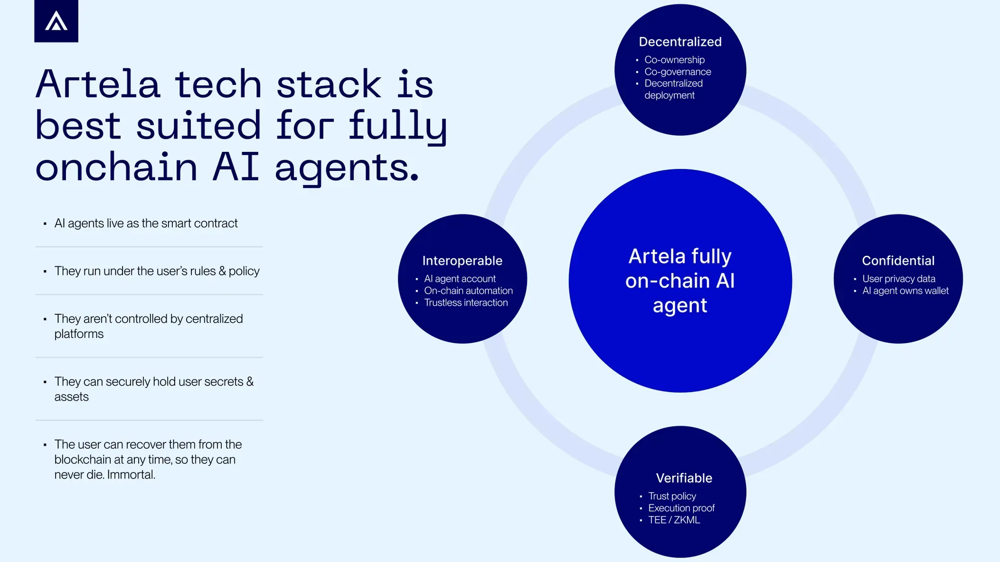

# Overview

Artela is the first blockchain to enable the development of **fully on-chain, autonomous, self-sovereign AI agents**. 

AI Agents, capable of independently sensing their environment, making decisions, and executing tasks, represent the future of AI applications. However, the centralized LLMs, where algorithms, data, and computing power are controlled by a few, still present challenges in terms of AI Agents' autonomy, privacy, and trust.

Blockchain’s inherent trustlessness and verifiability make it perfect for unleashing the potential of AI Agents as independent entities. There are promising attempts to individualize AI Agents by giving them "human-like" traits: AI16Z's Eliza - gives agents characters and knowledge; Virtuals - gives agents financial capabilities; and Ayery - gives AI Agents ideologies.

However, all these individualization efforts are still semi-automated, being controlled by centralized servers.

**It is difficult to determine whether these individualizing attempts represent the will of AI Agents or simply the will of the centralized entities behind them.**

At Artela, we believe that **truly decentralized autonomous AI agents** will be game changer for **crypto AND AI** industry.

**We need an architecture to achieve the "Read, Write, Own" future for AI Agents.**

## Key Highlights

The native extension mechanism of Artela L1 provides all the technical prerequisites needed for  AI Agents to achieve "full autonomy” and “full decentralization”.

**Decentralized**

Through co-ownership and co-governance, Artela enables the decentralized deployment and governance of AI Agents, ensuring they are no longer dependent on a single hosting entity, but rather exist as independent entities.

**Confidential**

Artela provides confidential privacy for AI Agents, ensuring AI Agents own and manage wallets independently, preventing their data and assets from being controlled by centralized entities.

**Verifiable**

With **Trusted Execution Environments (TEE)** and **Zero-Knowledge Machine Learning (ZKML)**, Artela provides a trustless, verifiable execution environment for AI Agents.

**Interoperable**

Artela supports **AI Agent Accounts** that integrate with decentralized identities (DID), autonomously handling Agents interoperability autonomously without human intervention.

**Artela makes it possible for fully decentralized, fully autonomous on-chain AI Agents, unlocking their potential as truly independent entities.**
