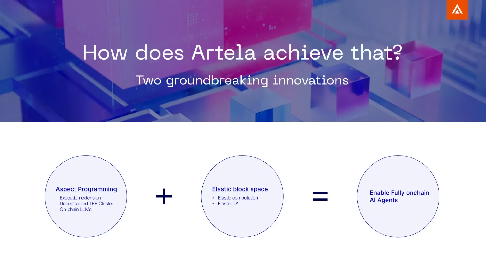

# Key Innovation

With Artela's unique innovations—**Aspect Programming** and **Elastic Block Space**, it has made **truly autonomous on-chain AI Agents** a reality: efficient on-chain intelligence, verifiable confidential privacy and elastic computing for predictable performance.

Artela allows Agents to deployed in a sandbox runtime on-chain, fundamentally removing dependency on centralized entities, with data and assets fully controlled and managed by the AI Agent.

## Aspect Programming for AI Agent trustless execution

[**Aspect Programming**](https://docs.artela.network/main/Aspect-Programming) is a native execution extension mechanism of Layer 1 blokchain that supports the dynamic creation of executable extension module(Aspect) for blockchain at runtime.

[**Aspect**](https://docs.artela.network/main/Aspect-Programming/Aspect) provides a fully on-chain runtime for AI Agents:

- **Execution Extension**
    
    Artela’s native extension mechanism adds heterogeneous computing nodes to the L1 network, interoperable with EVM. LLMs and AI Agents can be deployed on blockchain nodes, allowing them to interact freely on-chain.
    
- **Decentralized TEE Cluster**
    
    Trusted Execution Environments (TEEs) on AI Agent nodes ensure data privacy and execution verifiability. Decentralized TEE nodes cluster enables AI Agents to operate in a decentralized manner, free from the control of any centralized entity.
    
- **On-chain LLMs**
    
    LLMs can be directly deployed on-chain, enabling AI Agents to make intelligent decisions and verifiable actions based on on-chain data, without relying on centralized model deployments.
    

## Elastic Block Space for predictable performance

Inspired by [elastic computing](https://en.wikipedia.org/wiki/Elasticity_(computing)), **Elastic Block Space** maximize on-chain resource efficiency for AI Agent:

- **Elastic Computation**:
    
    On-chain resources auto-adjusted for AI Agents to optimize efficiency and provide predictable performance and gas fees.
    
- **Elastic Data Availability (Elastic DA)**:
    
    Ensures efficient and reliable on-chain data availability for AI Agent operations.
