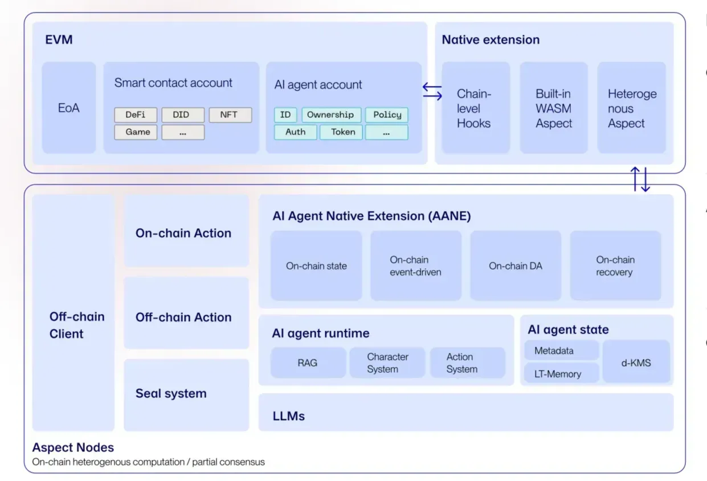

# Aspect Architecture

Artela’s **Aspect architecture** allows AI Agents to run fully on-chain by providing all the necessary components:

- **AANE (Aspect Agent Native Extension)**:
    
    The core extension module for AI Agents, enabling real-time state synchronization on-chain, event-driven actions based on on-chain data, data availability (DA) and recovery modules.
    
- **AI Agent Runtime**:
    
    AI Agents can operate directly on the blockchain in the Aspect runtime, including essential modules such as character system, RAG (Retrieval-Augmented Generation), and Action System.
    
- **On-Chain LLMs**:
    
    AI Agents can use Ollama-based LLMs deployed directly in the Aspect Nodes, eliminating the need for centralized model deployment.
    
- **State Management & Decentralized KMS**:
    
    AI Agents have their own **state** on-chain, including meta-information about the agent's identity, long-term memory to store experiences and learn over time, assets and wallets securely managed with a decentralized Key Management System (KMS).
    
## Features
Artela **Aspect architecture** maximizes the  “AI x Crypto” potential for AI Agents

- **Truly Autonomous**:
    - Verifiable On-chain LLMs
    - Privacy Protection
    - One-stop Autonomy
    - Trustless Interaction
- **AI Features**:
    - Multi-Agent
    - Character System
    - Advanced RAG Features
    - AI16Z Eliza Compatibility
- **Crypto Features**:
    - Co-own/co-gov
    - Tokenization
    - AI Wallet
    - Full On-chain Automation
    - User-Policy