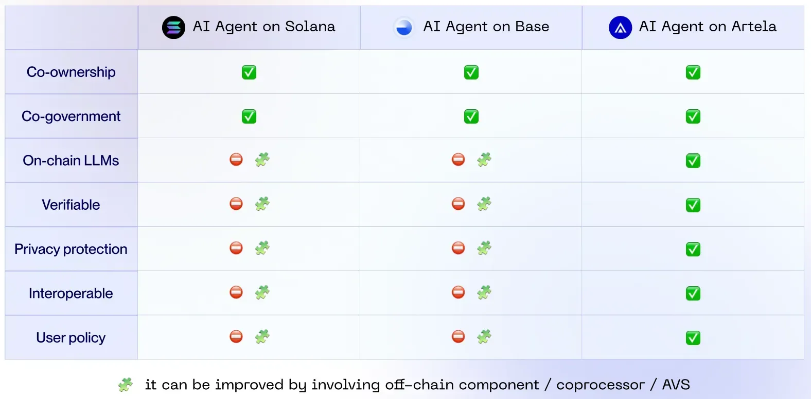
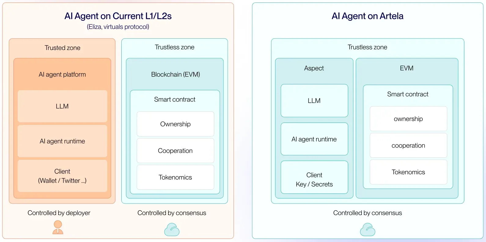
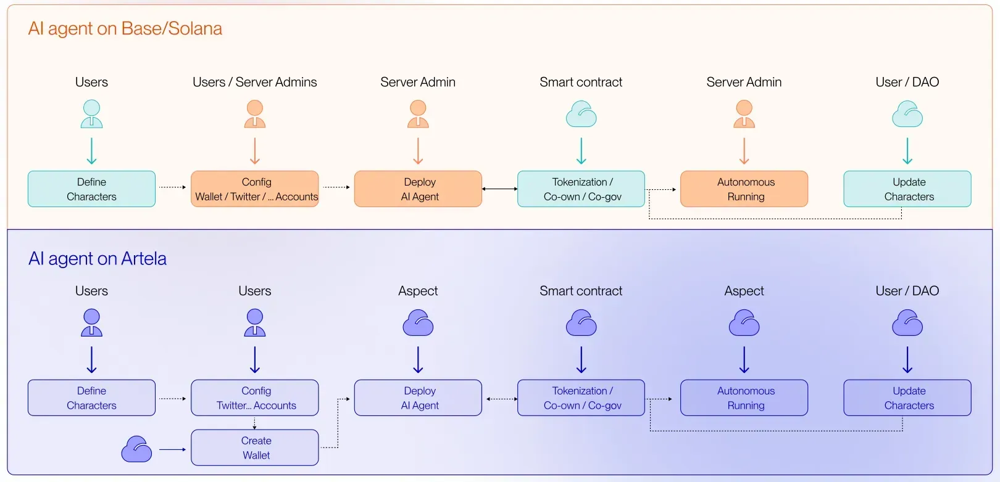

# Why Artela?

Compared to **Solana** and **Base**, Artela **natively supports on-chain LLMs** and key features like **verifiability, confidential privacy, interoperability, and user policy customization** without requiring off-chain co-processors or AVS. This gives Artela a clear advantage in making **fully autonomous on-chain AI Agents** possible.

Unlike current AI Agent infrastructure, Artela provides a **full-stack trustless solution**, eliminating the need for centralized LLM execution, deployment, or client accounts. By encapsulating AI Agents within **dedicated on-chain sandbox runtime**, Artela ensures that every Agent’s execution process is **trustless** and **verifiable**.

Current AI Agent individualization attempts still rely on centralized administrators to configure wallets, deploy programs, and execute on centralized servers. Artela guarantees **autonomy**, **decentralization**, and **true independence** of ****on-chain ****AI Agents,