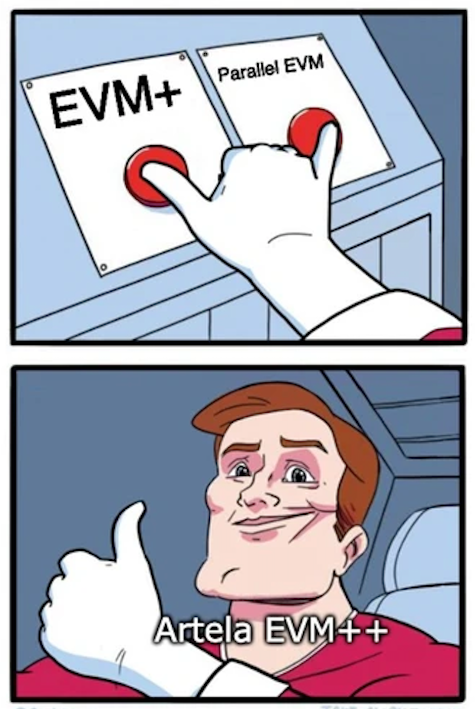
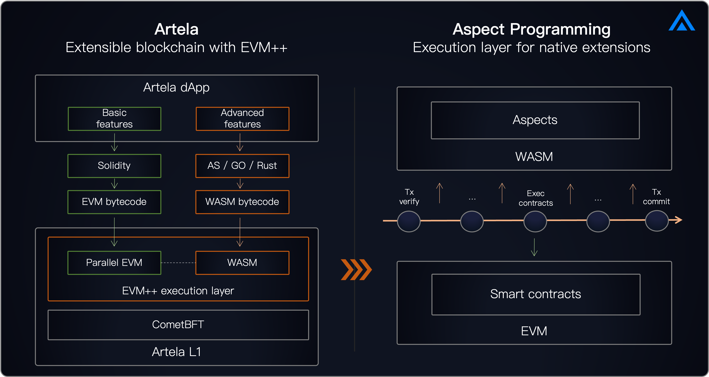

## Introduction

EVM++ is the next-generation Ethereum Virtual Machine (EVM) execution layer. It enhances blockchain extensibility through native on-chain extensions utilizing EVM+WASM, and supports parallel execution to ensure scalable blockchain performance.

EVM++ is designed to push the boundaries of traditional EVM capabilities to adapt to the evolving crypto world. As web2 productivity and innovation integrate, and as technologies like AI, DePIN, and DeFi Security are increasingly incorporated, EVM++ serves as a seamless connector of EVM assets, protocols, and infrastructures. This integration facilitates broader adoption of crypto applications and bridges the gap with mainstream applications.

## Unlock extensibility with Aspect programming

EVM++ enables a highly extensible EVM network. By integrating a WASM virtual machine within an EVM-compatible network, the Artela blockchain supports dynamic additions and executions of on-chain extension programs with [Aspect programming](/main/Aspect-Programming/Aspect). This capability allows developers to create high-performance protocols, modular dApps, and customize features for specific scenarios.

During the DevNet and Public Testnet phases, Artela's community of developers explored EVM++'s potential, leading to innovative use cases:

- Utilizing WASM as an [on-chain co-processor](https://www.odaily.news/en/post/5191903) to facilitate the execution of AI algorithms and other high-performance modules directly on the blockchain, while ensuring seamless interoperability with the EVM system.
- [On-chain AI agents](https://github.com/cellulalifegame/Pac-Man-Artela-Aspect) that participate in the autonomous worlds and enable truly programmable [on-chain NPCs](https://artela.network/blog/aspect-case-on-chain-npc-for-autonomous-world-game) that can interact with users.
- Opt-in [on-chain security](https://artela.network/blog/eliminate-reentrancy-attacks-with-on-chain-runtime-protection) modules that can execute in real-time, allowing DeFi protocols to identify and revert suspicious transactions instantly.

## Unlock scalability with parallel and elastic execution

The Artela network extends beyond basic parallel EVM operations, addressing the challenges of parallel execution under the EVM + Aspect framework, which includes extension programs running on the WASM virtual machine during transaction lifecycles.

Artela also enhances network efficiency by combining parallel features with elastic computing to support an elastic block space model. This model allows dApps to optimize the benefits of parallel execution.

### **Parallel Execution** in a nutshell

Artela's horizontally scalable architecture is designed to support parallel execution, ensuring network node computing power is scalable through elastic computing, ultimately achieving elastic block space.

- **Parallel Execution:** Transactions on Artela are executed concurrently, grouped based on transaction dependency conflict analysis.
- **Elastic Computing:** Validator nodes feature horizontal scaling, automatically adjusting computation nodes based on the current network load or demand. An elastic protocol coordinates this process to ensure a sufficient number of computation nodes in the consensus network.
- **Elastic Block Space:** Leveraging elastic computing, the network not only expands the public block space but also enables large-scale dApps to request dedicated elastic block space.

## Learn more

- [Aspect programming](/main/Aspect-Programming/Aspect)
- [Parallel execution](/main/Artela-Blockchain/Parallel%20execution)
- [Elastic block space](/main/Artela-Blockchain/Elastic%20Block%20Space)
