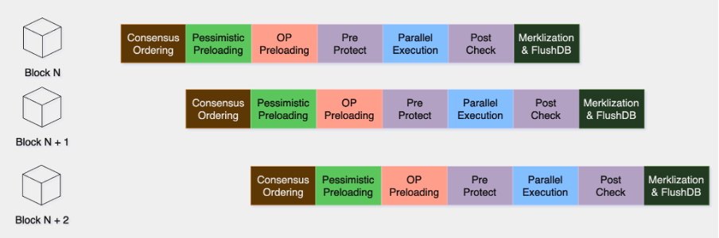

## Design Background

Artela Network's parallel execution solution is **designed for performance-first EVM-based dApps.**

Drawing an analogy from software development: develop a program in C doesn't inherently guarantee high-performance. Developers must understand advanced programming models like multithreading and asynchronous I/O to fully leverage its capabilities. Similarly, in blockchain programming, even with parallel EVM capabilities, unoptimized smart contracts may not deliver faster execution. Historically, unoptimized contracts on parallel EVMs have achieved only a 2-4x increase in parallelism. The Artela Network aims higher, enabling optimally optimized contracts to achieve significantly greater performance improvements.

Key differentiators for Artela include predictable parallel execution algorithms and elastic block spaces, enabling developers to:

- Craft high-performance contracts tailored for parallel execution.
- Achieve predictable execution performance through elastic block spaces.

## Focus on Solving Problems

Because the introduction of [EVM++](/main/Artela-Blockchain/EVM++) does not increase conflict rates, it does not conflict with existing parallel EVM solutions. Although existing Parallel EVM solutions are efficient, there are still several issues under Artela's goals:

The introduction of [EVM++](/main/Artela-Blockchain/EVM++) aligns with existing parallel EVM solutions without increasing conflict rates. However, under Artela's ambitious goals, existing solutions exhibit several inefficiencies:

1. **Optimistic Execution Drawbacks:** High optimistic parallelism can lead to numerous transactions being rolled back due to high conflict rates. This necessitates an intelligent prediction algorithm to foresee conflicting transactions based on historical execution data, rather than relying solely on optimistic execution.
2. **Suboptimal Core Utilization:** Even with up to 500 parallel transactions, a 32-core machine can face execution bottlenecks due to inadequate elastic scalability.
3. **Merkle Tree and I/O Bottlenecks:** Even if transactions are fully parallelized, bottlenecks can occur druing Merklization and disk I/O, making them the shortest stave in the barrel theory, thus affecting overall performance.
4. **Unpredictable Performance:** Parallel execution can still encounter block space competition due to conflicting transactions within a block, compromising the predictability of performance.

## Key Design

Artela’s scale-out architecture integrates parallel execution and elastic computing.

### Parallel Execution

1. **Pre-predictive optimistic grouping execution**: This method uses the LightDAG algorithm to anticipate transaction conflicts based on code analysis, conflict data sets, and historical execution patterns, optimizing for low conflict probability and high parallelism.
2. **Double Preloading**: Deterministic read-write sets are preloaded pessimistically, and in resource-rich environments, potential read-write sets are optimistically preloaded to minimize group execution times with cached memory I/O.
   
3. **Pipelining**: This approach converts synchronous waiting of concensus stages in the blockchain system to parallel asynchronous execution. For instance, block execution starts during consensus voting rather than post-vote, enhancing throughput.
   
4. **Art-IAVL**: Artela is developed based on Cosmos SDK, with state based on IAVL implementation. Art-IAVL features fast persistence and is an optimized version for Merklization and I/O. The core achieves fast persistence through memory submission, WAL, and asynchronous flushing.

### Elastic computing

1. **Elastic Computing**: Validator nodes horizontally scale based on real-time network load, with an elastic protocol coordinating the adjustment to ensure adequate computational resources in the consensus network.
2. **Elastic Block Space**: Elastic computing facilitates not only the expansion of public block space but also allows for the allocation of dedicated spaces for large-scale dApps with specific block space needs.

## Learn more

- [Elastic block space](/main/Artela-Blockchain/Elastic%20Block%20Space)
