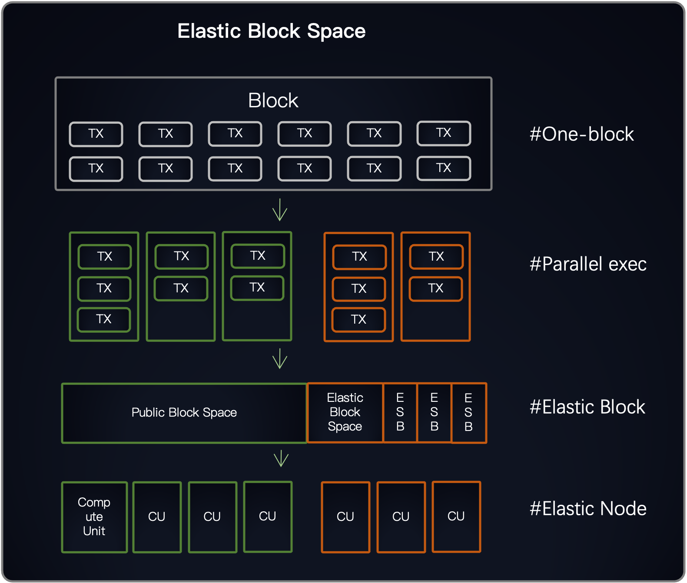

## Introduction

This proposal delineates a comprehensive strategy for implementing an **Elastic Block Space** (EBS) system within the Artela blockchain ecosystem. EBS refers to a dynamically scalable block space that provides independent and protocol-guaranteed block space for dApps with high transaction throughput needs, ensuring predictable performance. By introducing EBS, Artela endeavors to overcome the constraints of fixed block space capacity, enabling seamless scalability while maintaining predictable performance and efficient resource utilization.

Typically, a monolithic blockchain or an execution layer has only one shared block space available for all dApps, which may lead to the competition between different dApps causing unpredictable gas fee and performance. For dApps with high traffic and a high number of on-chain interactions, competition for block space greatly damages user experience. Opting for app chains or rollups to obtain independent block space introduces significant development burdens and a loss of composability. In Artela, EBS provide a solution to address this dilemma. When a dApps needs more performance predictability, it can apply for dedicated block space. This additional space is integrated into the block and is exclusively used for the dApp's transactions. As block space increases, validators must scale "up" by adding elastic execution nodes to handle the enhanced processing load.

Elastic block space is a pivotal blockchain scaling mechanism, facilitating limitless scalability while ensuring interoperability. Unlike other scalable networks such as sharded blockchains, app chain networks, and Layer 2 solutions—which provide independent block spaces but suffer from isolation and unsynchronized block generation—elastic block space enables dApps with dedicated block spaces to conduct synchronous interactions through atomic transactions within the same block, circumventing the complexities of asynchronous cross-chain communications.

When a dApp in the Artela network demands high scalability, it can subscribe to elastic block space to manage the increase in transaction volume. This functionality, combined with native extensions, grants dApps on Artela enhanced scalability and customization potential.

### Block Space Type

**Public Block Space.** Traditionally, blockchain blocks have been restricted by a fixed public block space (PBS) capacity. Transactions within PBS must vie for block space using gas fees, potentially leading to congestion and heightened transaction fees during periods of high network activity.

**Elastic Block Space.** Elastic Block Space introduces a dynamic block space allocation mechanism enabling dApps to request dedicated block space as necessary. This additional space is seamlessly integrated into the block and exclusively reserved for the transactions of the requesting dApp.

### Elastic Block Space

When a dApp in the Artela network requires high scalability, it can opt for elastic block space to manage the increase in transaction volume.

Elastic Block Space provides dApps with dedicated and protocol-guaranteed block space tailored to their transaction throughput requirements. This mechanism confers several key advantages:

- **Subscription Model:** DApps can sign transactions to dynamically subscribe to the elastic block space services. This implementation allows dapps to utilize chain-level independent block space without any additional development related to blockchain infrastructure.
- **Independent Block Space:** dApps can request additional block space to accommodate high transaction volumes, dedicated for its own usage. Validators scale up by adding elastic execution nodes to manage the augmented load. Independent block space is limited by gas but measured by execution time; the better parallelization the contract can achieve, the larger gas limit this block space will have.
- **Interoperability:** In contrast to sharded blockchains or app chain networks, which often encounter challenges with asynchronous cross-chain communications, elastic block space enables synchronous interactions via atomic transactions within the same block. This ensures seamless integration and native composability for dApps operating within the same blockchain.

### Elastic Node

Artela's validator nodes are structured as an Elastic Cluster, supporting dynamic scaling through the addition or removal of execution nodes as required. Each EBS will be allocated a dedicated CU to execute its transactions. This cluster architecture is underpinned by the following core concepts:

- **Compute Unit (CU):** This serves as a fundamental execution module with a fixed number of CPU cores, capable of parallel computation with predictable transaction processing throughput (TPS). Each CU can manage multiple parallel execution groups.
- **Basic CUs:** These constitute the minimum configuration for an Artela validator node, ensuring a baseline level of TPS for the network.
- **Stepwise Scaling:** The network can dynamically scale by adding or removing CUs based on average load. For instance, if the load exceeds 125% of the current capacity, a proposal can be initiated to increase the number of CUs. Once the proposal is approved, the network can scale up and reduce the overhead. Conversely, if the load drops below 25%, a proposal can also be made to reduce CUs. Scaling decisions are governed by consensus among nodes.
- **Subscription Scaling:** As supplementary to stepwise scaling, CUs can also be dynamically scaled upon EBS subscription. When a new EBS is subscribed to, a dedicated CU will be assigned for executing the transactions within the given EBS.

### Predictable Performance of EBS

Artela's **Elastic Block Space** ensures predictable performance for decentralized applications (dApps) by providing dedicated block space and elastic computing power that scales according to demand. The gas mechanism, initially proposed by Ethereum as an innovative way to measure the resource consumption of smart contracts, can be expressed through the following equation:

$$
G \equiv C(x) + M(y) + S(z)
$$

Here, $G$ represents the gas cost, $C$ denotes the conversion function for CPU time to gas, $M$ represents the conversion function for memory usage to gas, and $S$ stands for the conversion function for storage usage to gas.

However, this approach is not applicable to EBS with parallel execution enabled. For EBS + parallel execution, a new measuring model will be applied, which is:

$$
t_\text{pbs} \equiv F(g_\text{pbs})
$$

$$
g_\text{ebs} \equiv G(t_\text{pbs} \times P)
$$

$g_\text{ebs}$ represents the gas limit of the EBS. A function $F$ will convert the gas limit of PBS ($g_\text{pbs}$) to the execution time $t_\text{pbs}$, multiplied by the parallelism of the given dApp $P$ to obtain the maximum allowed execution time of this EBS. After that, by applying a conversion function $G$, the given execution time will be converted to the gas limit of EBS.

Initially, the parallelism $P$ of the given dApp cannot be determined, so the initial $g_\text{ebs}$ will be set to a fixed value $t_\text{block} / 1000000$ (assuming 1 second of CPU execution equals to 10 million gas, the same assumption as Ethereum’s). This value is for the worst-case scenario, meaning if a dApp cannot be parallel executed at all, at least the EBS can have this much gas limit (without affecting the execution time of the entire block). As more transactions are executed, the parallelism $P$ will be better estimated. The estimation of $P$ will be determined by the following equation:

$$
U \equiv g_\text{used} / g_\text{ebs}
$$

$$
I \equiv (t_\text{pbs} - t_\text{ebs}) / t_\text{pbs} \times U
$$

$$
P_\text{new} \equiv P_\text{old} * (1 + I)
$$

Here, $U$ represents the usage level of the EBS. $I$ represents the change of parallelism from the last block, calculated from the execution time differences between PBS and EBS with gas usage level applied for a relatively accurate change in parallelism from the block. By continually adjusting the parallelism parameter, the gas limit of EBS can converge to an optimal value, thereby making its execution time more predictable and maximizing the computing power usage of the CU.

### Governance and Scaling

The operational framework of the elastic block space relies on governance mechanisms and dynamic scaling strategies aimed at optimizing resource allocation and ensuring network efficiency. To ensure the scalability of resources for the elastic block space at the protocol level, the following methodologies will be employed:

- **Staking Scaling:** Access to virtual block space necessitates dApps to stake a specific quantity of tokens. This action initiates node expansion, thereby furnishing dedicated resources for the dApp’s smart contracts. An auction mechanism with low entry barriers ensures equitable access and allocation of resources.
- **Dynamic Node Management:** The elastic node architecture facilitates dynamic scaling, which is governed by network consensus protocols. This mechanism empowers validators to scale resources up or down in response to real-time demand, thereby upholding optimal performance and resource utilization.

In summary, Artela's Elastic Block Space and Elastic Cluster offer a robust framework for scalable and predictable blockchain performance, ensuring that dApps can operate efficiently and effectively irrespective of transaction volume. This innovative approach amalgamates dynamic scaling with dedicated resources, providing a flexible and potent solution for the evolving needs of blockchain applications.
