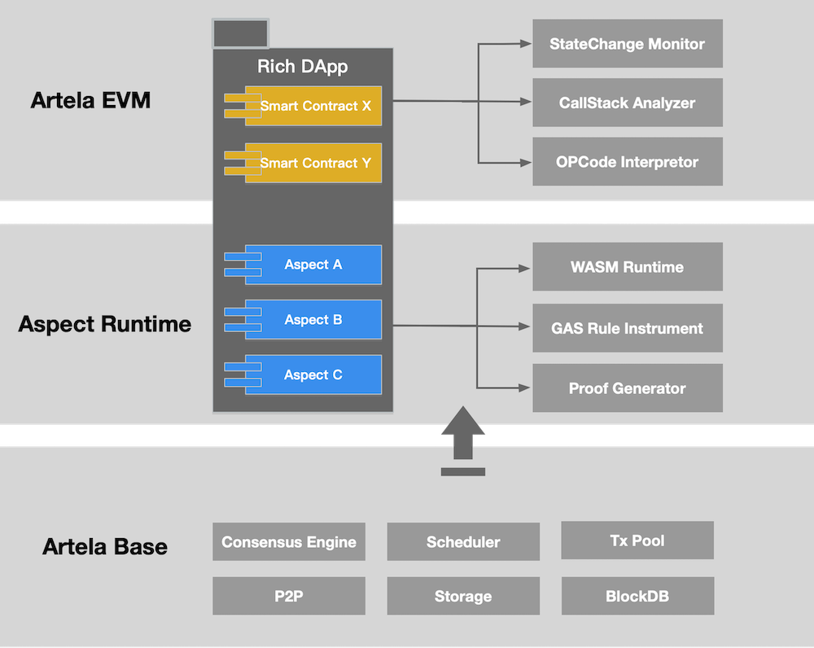

# Rich dApp

## Introduction

> **Rich dApp consists of the smart contract and Aspect. It enables customized functionality compared to Lite dApp.**

Rich dApp incorporates Incorporate application-specific functionality by utilizing a combination of smart contracts and Aspects. Developers can implement basic logic in smart contracts and additional features in Aspects, enabling feature-rich dApps beyond EVM equivalence. Smart contracts are executed in EVM environments. Aspects are executed in WASM environment. 

In a modular manner, DApp is no longer a monolithic, tightly coupled codebase. Promising improvements in flexibility, reusability, and extensibility can be achieved simply by assembling Aspects.

The principle of Rich dApp:

<!-- 

 -->

---

## Use Case

<!-- 1. High-Performance Orderbook
    
    Aspect makes a high-performance fully on-chain orderbook possible, unlocking DEX potentials.
    
    By binding multiple Aspects to a single smart contract, anonymity and various compliance requirements can be achieved simultaneously within one CLOB. 
    
    Aspects can preprocess transactions for smart contracts. The customized matching engine enables stronger capabilities than smart contracts.

 -->

1. Utility NFT Mapping
    
  With Aspect, NFT can be mapped into other utility NFT tokens to fulfill specific scenarios’ needs and become programmable.

  

  Aspects are implemented to monitor the global states of NFTs and manage the relationship between the master NFTs and utility NFTs. Master NFTs need not be collateralized to generate utility NFTs. The balance between liquidity and utility can be optimized.

  
      
  Without Aspect, the original NFT token standard must be forked to support structural NFTs like this; Once the structure of certain NFT is finalized, there will be no room for modification unless redeployment.

  With Aspect, NFTs can remain in their original state, while enabling unprecedented flexibility, programmability, and composability.

2. Efficient Rollup through Aspect

  Severe limitations of effectively verifying proofs of rollup on EVM:

    - For OP: Bloats the bytecode size of some contracts, requires a lot more gas
    - For ZK: Fixed pairing curves and hashing algorithms

  Aspect makes proof verification much easier to implement. Developers can run core protocol off-chain and proofs verification in Aspect.

    - For OP: An “evm-in-wasm” mode can be built to achieve effective single-round non-interactive proof.
    - For ZK: Various pairing curves and hashing algorithms could be implemented in Aspect.

<!-- 

 -->

 