# Customized Transaction Verification

Aspect offers a novel approach for customizing the transaction verification process for an Externally Owned Account (EoA). This feature extends beyond traditional ECDSA verification, allowing transaction validation data to encompass a wide range, including Zero-Knowledge (ZK) proofs. Let's explore how this works.

## Overview

To employ a customized transaction verification process, both the sender's EoA and the recipient's Smart Contract must be linked with the same transaction verifier Aspect. This dual binding ensures mutual trust in the verification method provided by the Aspect between the EoA and the dApp.

:::warning
Exercise caution and thoroughly review the transaction verifier Aspect before binding. Improper usage could potentially circumvent the standard ECDSA signature verification.
:::

When an EoA sends a transaction lacking a valid ECDSA signature, the `onTxVerify` method of the transaction verifier Aspect is triggered with the transaction validation data. This data, contained within the transaction's `data` field, diverges from the conventional call data format defined by Ethereum. Instead, it adopts the format `abi.encode(validationData, callData)`. As the transaction is verified and executed, Artela's base layer decodes and reverts the transaction data to its original structure.

Below is a diagram depicting the transaction verification process:



## Transaction Verifier Interface

To function as a transaction verifier Aspect, an Aspect must implement the `ITransactionVerifier` interface. This interface comprises a single method, `verifyTx`, which is invoked for transactions sent from an EoA without a valid ECDSA signature.

```typescript
export class Aspect implements ITransactionVerifier {
    /**
     * The verifyTx method is invoked for transactions from an EoA.
     * It allows customization of the transaction verification process.
     * 
     * @param ctx The chain context in transaction verification.
     * @param validationData Data used to derive the sender's address.
     */
    verifyTx(ctx: VerifyTxCtx, validationData: Uint8Array): Uint8Array {
        // Custom verification logic
        // ...
        return address; // A 20-byte address must be returned to the base layer.
    }
}
```

## Binding Limits

A Smart Contract is restricted to binding with only one transaction verifier Aspect for performance reasons. However, an EoA can bind with multiple transaction verifiers, each tailored for accessing different dApps.
