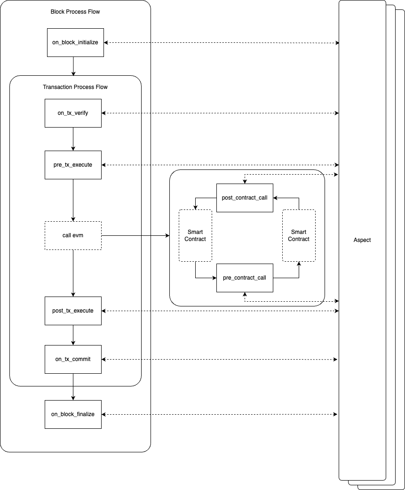

# Join Point

Each Join Point signifies a particular state transition function at a specific transaction lifecycle stage. These Join
Points are constructed from distinct metadata (outlining the triggering conditions, the system modules it can access,
and the runtime contexts it can leverage) and an entrypoint function (a method in your Aspect class, for
instance, `PreTxExecute`).

Join Points are categorized into:

- **Block Level Join Points**: Initiated by a new block event auto-generated by the blockchain.
- **Transaction Level Join Points**: Activated by EOA transactions.
- **Call Level Join Points**: Initiated by contract interactions. Notably, cross-contract interactions also activate
  these Join Points.

For a more visual representation, refer to the diagram below:

## Entry Point Function

Every join point has a dedicated entry point function interface that encompasses:

- A unique function name
- Related input parameters
- Anticipated output

For an aspect to be active within a join point, it must contain a function aligning with the given entry function,
initiating the aspect through the respective entry function.

## Interoperability Interfaces

Interoperability interfaces are instrumental in:

- Read & write runtime contexts
- Access base layer modules

With access to these interfaces, aspects can harness core blockchain capabilities. Some join points may provide multiple
system calls. These interfaces enable aspects to tailor transaction or block processing flows.

## Layout

In Aspect Programming, various join points are defined across blocks and transactions' lifecycle. This framework
empowers Aspect developers to create custom enhancements for dApps.

A comprehensive overview of each join point:

| Join Point        | Description                                                                                                                                                                                                                                                                                             |
|-------------------|---------------------------------------------------------------------------------------------------------------------------------------------------------------------------------------------------------------------------------------------------------------------------------------------------------|
| FilterTx          | Triggered when the RPC server receives this transaction, please note this join-point is outside consensus, so Aspect state is not allowed to be modified here.                                                                                                                                          |
| OnTxVerify        | Triggered when transaction signature is being verified, Aspect can replace the built-in secp256k1 signature verification with customized verification logic.                                                                                                                                            |
| OnBlockInitialize | Activated prior to the preparation of the block proposal. Automated transaction is allowed to be inserted at this point.                                                                                                                                                                                |
| PreTxExecute      | Triggered prior to the transaction execution. At this stage, the account state remains pristine, allowing Aspect to preload information as necessary.                                                                                                                                                   |
| PreContractCall   | Triggered before the execution of the cross-contract call. For example, during a TX execution, Uniswap contract calls into Maker contract, the Aspect will be executed.                                                                                                                                 |
| PostContractCall  | Triggered after the cross-contract call is executed. The Aspect can then inspect the post-call state of the contract and make subsequent execution decisions.                                                                                                                                           |
| PostTxExecute     | Activated once the transaction has been executed and the account states have been finalized. Subsequently, Aspect can conduct a comprehensive review of the final execution state.                                                                                                                      |
| OnTxCommitted     | Triggered after the transaction has been finalized, and the modified states induced by the transaction have already been flushed into the state database. At this stage, Aspect can conduct post-processing activities, such as initiating an asynchronous task that can be executed in a future block. |
| OnBlockFinalize   | Triggered after a block has been finalized. It permits the Aspect to submit an asynchronous task that can be executed in a future block.                                                                                                                                                                |

Notably join points provide an abstracted definition, accommodating diverse blockchain implementations, varying join
point exposures, and other platform-specific attributes.

## Context

The runtime context offers Aspects crucial insights on transactions and block processing, including smart contract state
updates, logged events, and transaction raw data.

Designed as key-value pair collections, the context serves the latest associated value when an Aspect queries with a
specific key. For instance, querying with `tx^content^nonce` will return the nonce field value of the initial
transaction. To maintain consensus mechanism alignment and consistency, all nodes within the blockchain network must
provide uniform values for a specific transaction key within a block.

### Context Subsets

The context comprises four main categories:

- **Block Information**: Immutable block details, like its hash or validator signatures.
- **Transaction Data**: Static transaction-related data, such as input data, receipts, and state changes during
  transaction execution.
- **Aspect Modifiable Data**: Data that Aspects can modify, with each Aspect functioning within its namespace, ensuring
  that data modifications do not overlap with other Aspects.
- **Environmental Data**: Node-associated environmental variables, including network configurations.

### Context Lifecycle

A context's lifespan is limited to a block's processing duration. As a block initiates processing, each transaction
within the block gets a fresh context, housing transaction-specific details and ensuring uniformity during transaction
execution.

Upon the block processing conclusion, the context terminates. It's vital to understand that this termination doesn't
impact the blockchain status or transaction outcomes, both permanently stored on the blockchain. The context primarily
holds temporary data that aids transaction processes and upholds state uniformity within a block.
