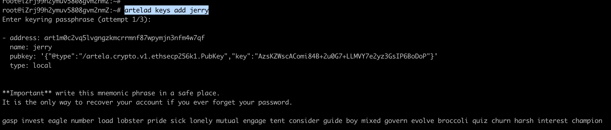
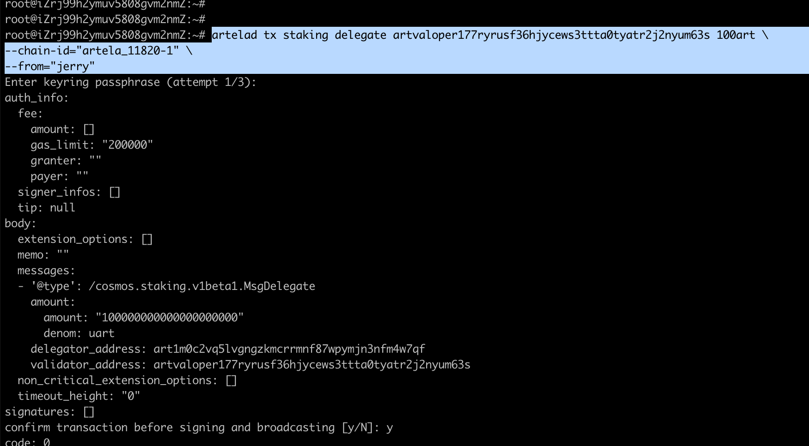
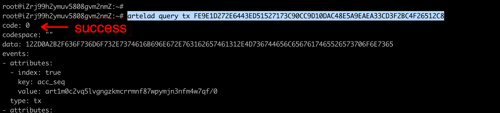
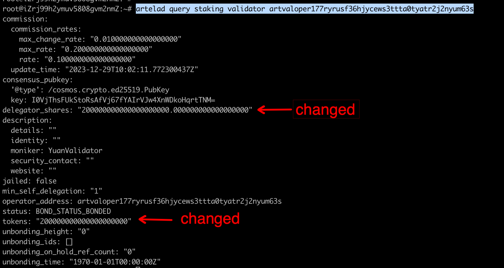
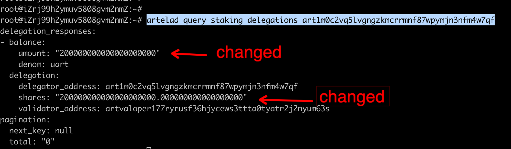
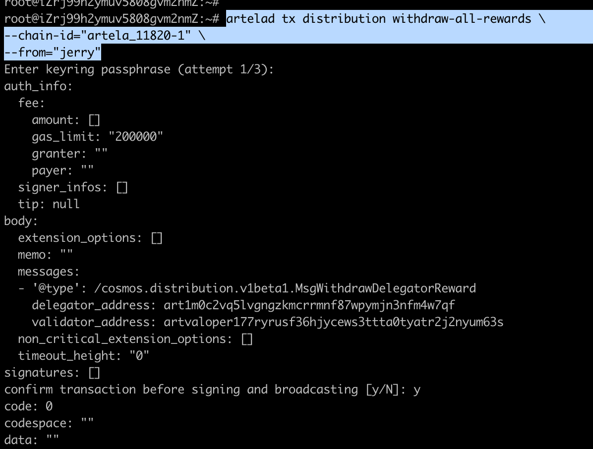

# Delegator Guide

This document contains all the necessary information for delegators to interact with the Artela Network through the Command-Line Interface (CLI).

## 1.Generate new delegator account
```bash
artelad keys add <account_name>
```


## 2.Delegate to a validator
```bash
artelad tx staking delegate <validator_operator> <amount> \
--chain-id=<chain_id> \
--from=<key_name>
```


## 3.Check the delegate tx status
```bash
artelad query tx <tx_hash>
```


## 4.Check validator staking balance
```bash
artelad query staking validator <validator_operator>
```


## 5.Query self current delegate status
```bash
artelad query staking delegations <delegator_addr>
```


## 6.Query self all rewards
```bash
artelad query distribution rewards <delegator_address> <validator_address>
```


## 7.Query target delegator rewards
```bash
artelad query distribution rewards <delegator_address>
```


## 8.Increase delegator amount
```bash
artelad tx staking delegate <validator_operator> <amount> \
--chain-id=<chain_id> \
--from=<key_name>
```


## 9.Claim rewards
```bash
artelad tx distribution withdraw-all-rewards \
  --chain-id=<chain_id> \
--from=<key_name>
```


## 10.Redelegate to other validator
```bash
artelad tx staking redelegate <srcValidatorAddress> <destValidatorAddress> <amountToRedelegate> 
--from <delegatorKeyName>
```


## 11.Undelegate from validator
```bash
artelad tx staking unbond <validatorAddress> <amountToUnbond> --from <delegatorKeyName>
```
