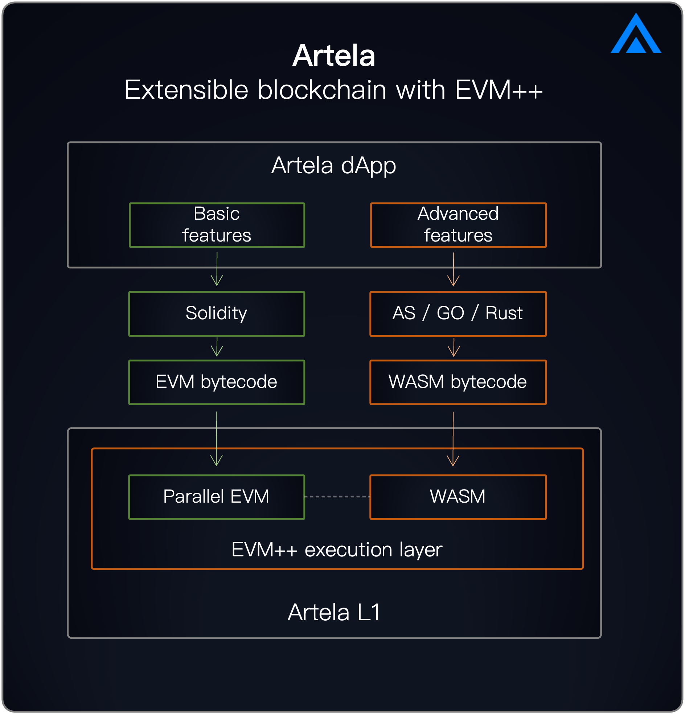

# Intro to Artela

Artela an extensible L1 blockchain with parallel execution and interoperable VMs. 

Artela's innovative technology is EVM++, the next-generation EVM execution layer technology. On one hand, it achieves on-chain native extensions through EVM + Aspect, unlocking blockchain extensibility; on the other hand, it supports parallel execution, realizing blockchain scalability.

Building applications on Artela comes with no performance or functionality limitations. Applications can have independent, high-performance, and predictably performant block spaces, and they can customize the underlying blockchain functionality through chain abstraction.

## What Artela is building:

### Artela Blockchain
    
Artela Blockchain is a layer 1 network that empowers developers to add user-defined native extensions and build high performance dApps. It offers extensibility that goes beyond EVM-equivalence, inter-domain interoperability, and boundless scalability with its elastic block space design.
  
**[Learn More](/main/Artela-Blockchain)**

### EVM++

EVM++ is the next-generation EVM execution layer technology which both unlock blockchain extensibility and scalability. 

EVM++ aims to push the boundaries of EVM to adapt to the evolving crypto world: As the productivity and innovation of web2 are being integrated, and useful technologies such as AI, DePIN, and DeFi Security are accelerating their integration into crypto applications.

**[Learn More](/main/Artela-Blockchain/EVM++)**

### Aspect Programming

:::tip
[Whitepaper Available](https://github.com/artela-network/aspect-whitepaper/blob/main/latex/build/whitepaper.pdf)
:::

Aspect Programming is a universal programming framework that supports the dynamic creation of native extension modules for blockchain at runtime. It offers a universal stack for all chains to build extension modules to enhance dApp functionality, providing a versatile framework for expanding functionality.

**[Learn More](/main/Aspect-Programming)**