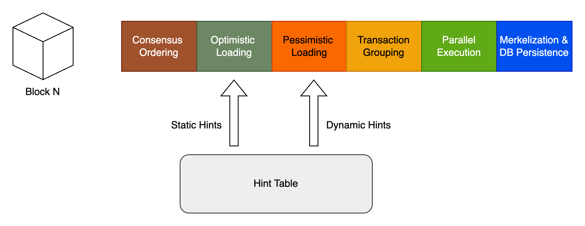

## Introduction

To maximize the use of the CPU's concurrent computational capabilities and prevent I/O from becoming the execution bottleneck, we propose "Async Preloading", which is based on a predictive algorithm. This approach proactively preloads the states required for transaction execution into memory beforehand, thereby eliminating the need for I/O access during transaction execution.

With the transition to parallel transaction execution, the potential bottleneck during execution shifts to states' I/O. The performance of a block is contingent on its slowest batch, which may suffer from higher computational demands or extended "waiting" times, primarily from disk reads for accounts and storage slots. In Artela, a predictive algorithm is designed to address computational bottlenecks by offering relatively optimal solutions, while I/O delays are mitigated through Async Preloading combined with the hint table, enhancing overall system performance. The working process of async preloading is illustrated in the following figure.

Before executing every transaction, **Optimistic Preloading** is initiated, loading only the specified storage into memory according to static hints. Following the Optimistic Preloading, **Pessimistic Preloading** commences, loading all potential storage into memory in accordance with dynamic hints.

After completing the async preloading, all the necessary state storage is loaded into memory. Subsequent execution will be entirely based on memory, which is expected to enhance I/O performance by a factor of **10 to 1,000 times**.

### Optimistic Preloading

When the transaction order is established within a single block, Optimistic Preloading assesses the essential key-values (KVs) of a smart contract and preloads the storage slots using static hints. This preloading process does not necessitate waiting for the transaction execution and can proceed asynchronously. The objective is to minimize I/O costs for each batch by ensuring that the necessary data is readily accessible. However, it is important to note that while optimistic preloading loads all the required storage slots, there may be misses. These misses will be addressed by pessimistic preloading.

### Pessimistic Preloading

Following the completion of optimistic preloading, pessimistic preloading employs a probabilistic model to predict which key-value pairs might be needed in upcoming transactions. This prediction, bolstered by Dynamic Hints, uses method signatures and call data to estimate potential read/write sets. Although these predictions may occasionally overestimate the needed data—due to transactions terminating early or other factors—this strategy aims to reduce execution times for each batch by utilizing additional I/O resources preemptively.
