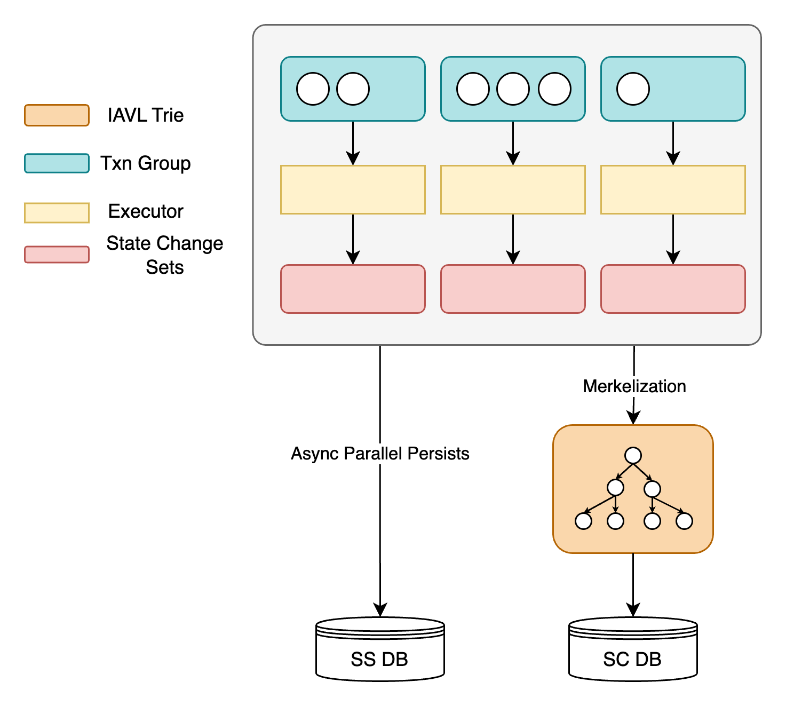
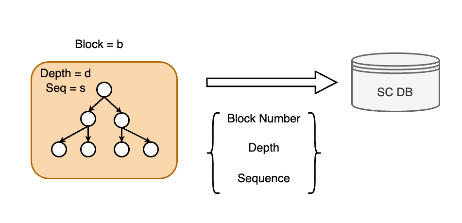
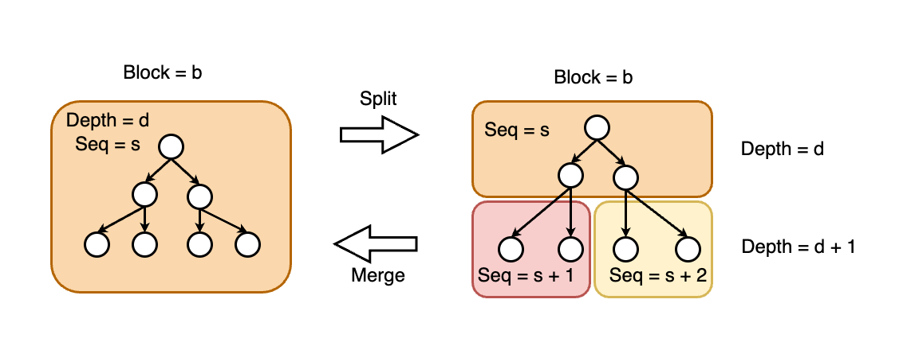

## Introduction

The parallel storage is designed to address the final two performance challenges encountered in blockchain execution: enabling parallelizable storage and enhancing the efficiency of persisting Merkelized world states into a database. By parallelizing storage, it aligns with the parallel execution capabilities, effectively leveraging multi-core processing benefits. As historical data accumulates, the storage layer faces escalating issues related to write amplification and compaction, which can significantly degrade Merkelization performance.

When transactions are executed in parallel, multi-core processing is utilized effectively. However, if data persistence lags behind transaction execution, storage becomes a bottleneck, hindering blockchain performance. Parallelizable storage is essential for maximizing transaction parallel execution efficiency.

Merkelization performance pertains to the throughput and latency of writing Merkle tree-based world states into the database. The primary issues are write amplification and database performance. Each state modification requires the Merkle tree to re-encode and rewrite from leaf nodes to the root in the KV database. The KV database itself also experiences write amplification, leading to significant overhead. As data accumulates, the Merkle tree depth increases, resulting in more key-value pairs being written. This intensifies database background activities such as compaction, which consume substantial disk and CPU resources. Consequently, the throughput and performance of writing world states degrade significantly.

The parallel storage serves as an optimized storage solution specifically engineered to augment the efficiency of state storage within the Cosmos SDK. This layer is crafted to ensure seamless compatibility with established Cosmos storage frameworks, such as LevelDB or RocksDB, as well as the IAVL trie. Notably, the existing implementation of Cosmos IAVL storage suffers from performance degradation as the blockchain state expands.

This layer addresses these challenges by optimizing I/O performance for extensive state manipulations and expediting the Merkelization process. It aims to rectify prevalent storage inefficiencies through a series of critical enhancements:

1. Separation of State Commitment (SC) and State Storage (SS)
2. K-Persist State Commitment Database

### Separation of State Commitment and State Storage

To achieve parallelizable storage, we have implemented a separation strategy between "State Commitment" (SC) and "State Storage" (SS). This approach allows us to distinctly categorize operations into parallelizable and non-parallelizable segments, enhancing system throughput and efficiency.

The storage architecture is organized as follows (shown in the figure below):

- SS DB is parallelizable and allows for asynchronous IO. It stores meta-information such as accounts and storage slots but does not retain any trie data. This approach prevents data redundancy and optimizes space utilization.
- SC DB is serial and uses synchronous IO. It records all trie information. Here, the leaf nodes retain only the hash information of accounts and storage slots, eschewing meta-information to avoid redundancy and streamline storage.

The design operates as follows:

- Once transactions are grouped by parallelization criteria, an async preloading mechanism triggers parallel asynchronous read operations to SS DB. This is aimed at maximizing disk IOPS and bandwidth.
- Once the execution of a transaction group has finished, the results of each execution group are directly written to disk.
- Disk writing operations and Merkelization processes run concurrently without interference. The former utilizes I/O resources, while the latter depends on CPU resources. During this phase, the modification set is transferred to SC DB to obtain the State Root and generate the Block Header.

To reduce compaction and improve performance of merkelization, SS DB's storage is composed of four database instances:

- **Index DB:** This database maps new addresses on the chain, converting 20-byte addresses into a 5-byte sequence to compress space, especially in databases like RocksDB/LevelDB that support prefix compression. Newly created addresses, likely to be active on the chain, are encoded in big-endian sequence. This positioning facilitates efficient querying as larger sequences are positioned towards the top of the database file.
- **Account DB:** Records information from sequence to account, where sequence is encoded in big-endian.
- **ContractDB:** Tracks information from sequence + storage slot to storage slot value.
- **Write Set DB (Optional):** Considering the different roles of Validators and Full Nodes in the network—Validators focus on consensus and transaction execution, while Full Nodes provide RPC services—special scenarios like SPV and State Sync require additional logging of each block's modifications in WriteSet DB.

This architecture effectively reduces the conflicts and resource wastage due to compaction in traditional LSM database designs, enhancing transaction execution efficiency by more than 60% as demonstrated in benchmarks.

### K-Persist SC Database

The following proposal outlines a universal persistent database design that supports more efficient Merkelization and the capability for multi-version data and SPV queries without compromising hash compatibility.

The main idea is to aggregate multiple small-sized nodes of a Merkle tree into a larger-sized node for persistence, shortening the IO path, reducing write amplification, and decreasing space usage. Additionally, this approach leverages disk characteristics to achieve high-performance read and write operations. This type of persistent node is called a k-layer node. It draws on the design principles of Bw-tree to optimize the efficiency of world state persistence. This involves batch updates and deferred writes, combining multiple small write operations into a single larger write operation, thereby reducing the number of writes and improving write efficiency.

Compared to 16-ary Merkle Patricia Tries (MPT) or Sparse Merkle Trees (SMT), binary structures like the IAVL exhibit significant read and write amplification issues. The deeper logical depth of binary trees, as opposed to 16-ary trees, results in more frequent disk I/O operations, which can become a critical issue during Merkelization.

The suboptimal performance of binary or even 16-ary Merkel Trees in blockchain systems is significantly due to frequent disk accesses, which increase the cost of read operations and thus create bottlenecks in the execution layer. This issue also poses one of the major shortcomings for Parallel EVM and Merkelization processes.

Considering that traditional hard disk sectors are typically 512 bytes, but modern drives—especially solid-state drives (SSDs)—feature a sector size of 4KB, we can leverage this characteristic for efficiency. Given that Merkel Trees in blockchain contexts are generally sparse, it's feasible to adjust the parameter $k$ so that $2^k$ nodes are compressed into a single minimal read/write unit, optimally around 3-4KB.

To maximize disk and I/O resource utilization for a Merkel Tree, each $k$-layer read/write operation is designed as follows:

1. **Load the Root Node:** Based on the block number, load the root node where the World State Root resides.
2. **Merkelization Process:** If Merkelization is necessary, load the corresponding Merkel Path's internal and leaf nodes according to the Write Set.
3. **Node Updates:** Update the leaf nodes along the Merkel Path from the bottom up to compute the new root hash value. Mark this node as dirty and tag the corresponding $k$-layer nodes along the Merkel Path as dirty.
4. **Persistence of $k$-Layer Nodes:** After computing the hash values, all $k$-layer nodes are persisted. The traditional Merkel node's primary bottleneck lies in its indexing information being hash values, which perform poorly in LSM databases. To circumvent this, we use the following encoding scheme to record all $k$-layer nodes:
   $$
   B + D + S = K
   $$

   In this context, $B$ represents the block number, $D$ denotes the depth of the $k$-layer node, $S$ indicates the sequence number, and $K$ is the encoded key. All numbers are stored in big-endian format to ensure compatibility with compaction processes.

   Depth refers to the depth of the $k$-layer node and sequence is an incremental unique index, the layout of $k$-layer node is shown as the figure below illustrates.

   

To better delineate the parent-child relationships among $k$-layer nodes, inspired by traditional database systems such as RocksDB and InnoDB, we record the following details in each parent $k$-layer node for all its child $k$-layer nodes (up to $2^k$ nodes):

1. **Version:** The version value of each child $k$-layer node at the time of its last modification.
2. **Sequence Number:** A unique identifier for each child node.
3. **Start Key and End Key:** These keys define the range of data that each child node covers.

While typical search trees, like in the IAVL, inherently contain start key and end key information within each node, the K-Persist SC Database is designed to address their persistence challenges. Consequently, when $k$ is chosen to be relatively large, there is a potential scenario where $2^k$ nodes exceed the 4KB sector size limit, escalating to sizes such as 40KB or even 400KB. Such sizes would make read-write operations less efficient.

To navigate this dilemma, we may adopt a split and merge design strategy (shown in the figure below). This would allow us to divide a large $k$-layer node into multiple smaller $k$-layer nodes and vice versa. It is important to note that:

- **Depth Consistency:** The split $k$-layer node still retains the original depth $d$, as the value $k$ remains unchanged in the definition of each node.
- **Node Design:** The structure of $k$-layer nodes is similar to the design seen in MySQL's InnoDB, where nodes are part of a B+ tree. This means that like InnoDB, our design involves a bottom-up construction process, but adapted to our specific context with the added complexity of managing the Merkel-based blockchain data.

By integrating this adaptive split and merge capability, the K-Persist SC DB can dynamically adjust to the size requirements of the data it stores, ensuring efficient use of storage space and maintaining optimal performance even under varying load conditions. This approach not only enhances the flexibility of the database but also ensures scalability and efficiency in handling large-scale blockchain data.
