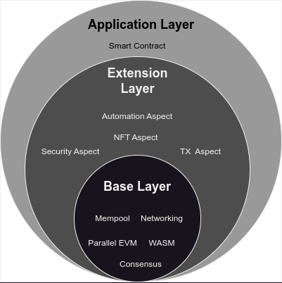

# Artela Blockchain

Artela Blockchain is a Layer 1 network that empowers developers to incorporate user-defined native extensions and develop feature-rich decentralized applications (dApps). It provides advanced extensibility beyond EVM-equivalence, inter-domain interoperability, and boundless scalability through its innovative Elastic Block Space design.

As the first Layer 1 network to integrate Aspects, Artela aims to **maximize the value of this technology, enabling developers to create feature-rich dApps.**

---

## Architecture Overview

- **Base Layer:** Launched by Artela, this layer offers fundamental functionalities including a consensus engine, networking, EVM environments for executing smart contracts, and WASM environments for executing Aspects. It forms the core infrastructure of the network.

- **Extension Layer:** Equipped with the Aspect SDK, this layer allows developers to create Aspects, which can access all APIs within the base layer and integrate seamlessly with smart contracts and other Aspects. Aspects are securely isolated from the Base Layer to prevent any impact on the core network’s security or availability.

- **Application Layer:** In this layer, developers can craft smart contracts using familiar tools. Initially, an EVM is provided to ensure easy adoption and integration for the majority of existing dApps in the crypto ecosystem.

## Core Characteristics

Artela aspires to be a truly boundless blockchain network:

- **Boundless Extensibility** — EVM-equivalence but not limited to EVM, enabling the native extension of blockchain base layer.

- **Boundless Composability** — Fully customizable and compatible with heterogeneous modular stacks, while maintaining native interoperability within the network.

- **Boundless Scalability** — By leveraging elastic block space design, Artela network can accommodate a great number of large-scale dApps that demand independent block spaces. This eliminates the need to abandon shared security in exchange for scalability performance.

## Scale-out Design

Artela's scale-out architecture is tailored to the specific needs of the Artela network, offering dApps enhanced extensibility and expandable block space while ensuring native composability with other network dApps.

Dynamic scalability within the Artela network is supported by elastic computing, highlighted by several key technical features:

- **Parallel Execution:** Transactions on Artela can be processed concurrently. The network groups transactions for parallel processing based on the analysis of transaction dependency conflicts.
- **Elastic Computing:** Validator nodes are capable of horizontal scaling. The network dynamically adjusts validator computation nodes based on current network load or demand. This scaling is managed by an elastic protocol that maintains an adequate number of elastic computation nodes within the consensus network.
- **Elastic Block Space:** Leveraging elastic computing, the network not only expands the public block space but also allows large-scale dApps to request dedicated elastic block spaces, ensuring tailored scalability solutions.

## Learn more

- [EVM++](/main/Artela-Blockchain/EVM++)
- [Aspect programming](/main/Aspect-Programming/Aspect)
- [Parallel execution](/main/Artela-Blockchain/Parallel%20execution)
- [Elastic block space](/main/Artela-Blockchain/Elastic%20Block%20Space)
