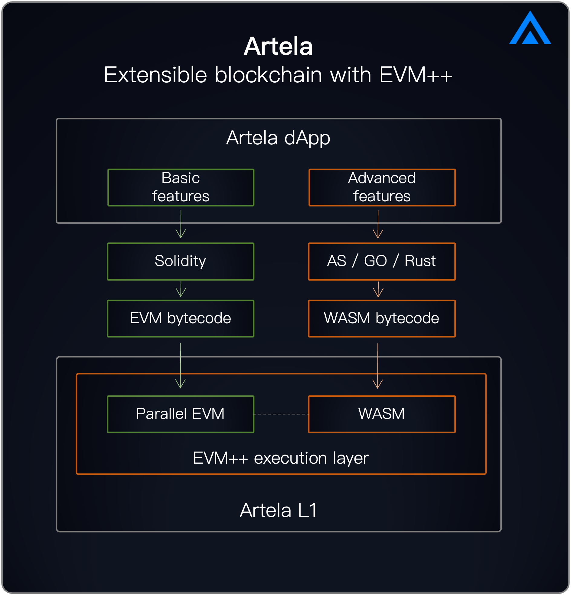

## Overview

Artela is an extensible L1 blockchain with parallel execution and modular VMs. With key innovation of EVM++, Artela enables modular, customizable, and scalable dApps.

At the core of Artela's technological advancements is EVM++ - the next-generation Ethereum Virtual Machine (EVM) execution layer. EVM++ enhances blockchain extensibility by facilitating on-chain native extensions through the innovative EVM + Aspect approach. Additionally, it supports parallel execution, which significantly contributes to blockchain scalability. This dual capability ensures that Artela not only extends functionality but also optimizes performance for diverse blockchain applications.

Developing applications on the Artela platform is unrestricted with regard to performance and functionality. Applications benefit from dedicated, high-performance block spaces that deliver consistent and predictable performance. Moreover, developers can tailor the foundational blockchain functionalities via chain abstraction, enabling greater flexibility and customization tailored to specific application needs.

## What Artela is building

### Artela Blockchain

The Artela Blockchain is an advanced Layer 1 (L1) network that enables developers to implement user-defined native extensions and develop high-performance decentralized applications (dApps). It surpasses EVM-equivalence with superior extensibility and inter-domain interoperability. Featuring an innovative elastic block space design, Artela ensures boundless scalability, allowing applications to scale seamlessly with demand, optimizing performance and development flexibility.

**[Learn More](intro-to-artela/artela-blockchain)**

### EVM++

EVM++ is the next-generation EVM execution layer technology that unlocks blockchain extensibility and scalability.

It aims to extend the capabilities of EVM to meet the demands of the evolving crypto world. As web2 productivity and innovation integrate, and as technologies such as AI, DePIN, and DeFi security rapidly become integral to crypto applications, EVM++ facilitates their seamless incorporation.

**[Learn More](intro-to-artela/EVM++)**

### Aspect Programming

:::tip
[Whitepaper Available](https://github.com/artela-network/aspect-whitepaper/blob/main/latex/build/whitepaper.pdf)
:::

Aspect Programming is a universal programming framework that enables the dynamic creation of native extension modules for blockchains at runtime. It provides a universal stack that all chains can use to build extension modules, enhancing dApp functionality. This framework offers a versatile solution for expanding capabilities across various blockchain platforms.

**[Learn More](intro-to-artela/EVM++/Aspect-Programming)**
