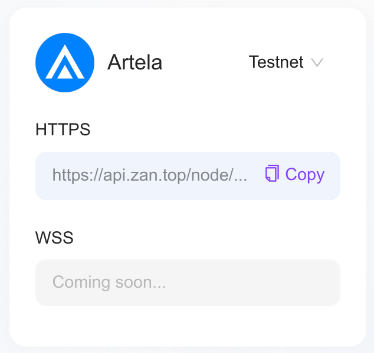

Here are some key resources for interacting with the Artela blockchain on the mainnet. These tools will help you explore transactions, monitor network activity, and connect to the network.

### Explorer

- [Artela Explorer](https://betanet-scan.artela.network/): Track transactions, blocks, accounts, and smart contracts on the Artela blockchain.

### RPC Endpoint

- **JSON-RPC:** [https://betanet-rpc1.artela.network/rpc](https://betanet-rpc1.artela.network/rpc)  
  Use this endpoint to connect your wallet or dApp to the Artela blockchain.

### Using Node Service on ZAN

1. Log in to https://zan.top/ and click "Get Started for Free" to access the dashboard.
2. Navigate to "Node Service" or visit https://zan.top/service/apikeys.
3. Create a new API key and input it when prompted.
4. Access Artela by using the URL provided below:
